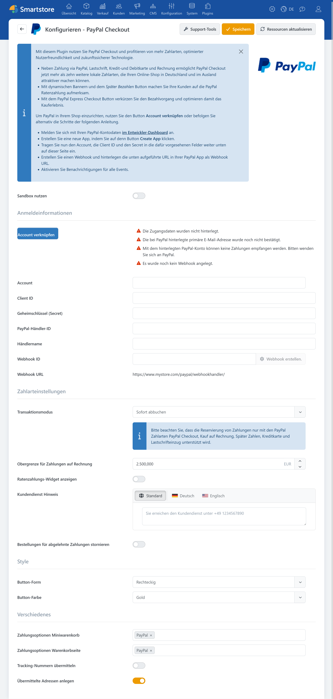

# PayPal

Das Plugin **PayPal** bindet PayPal Checkout und weitere von PayPal bereitgestellte Zahlungsarten in Smartstore ein. Neben der klassischen PayPal-Zahlung unterstützt es Express-Zahlungen im Warenkorb, lokale Zahlungsarten, Kredit- und Debitkarten, den Rechnungskauf sowie Apple Pay und Google Pay.

Abhängig von der Zahlungsart können Zahlungen sofort eingezogen oder zunächst autorisiert werden. Vollständige und teilweise Rückerstattungen sowie die Aktualisierung des Zahlungsstatus über PayPal-Webhooks werden ebenfalls unterstützt.


Welche Zahlungsarten tatsächlich angeboten werden, hängt unter anderem vom PayPal-Händlerkonto, dem Land, der Währung, dem Bestellwert, dem Endgerät und den Eigenschaften der jeweiligen Transaktion ab. Einen Vergleich mit weiteren Zahlungsplugins finden Sie unter [Zahlungsanbieter und Zahlungsarten](paymentproviders.md).


## Unterstützte Zahlungsarten

Die gewünschten Zahlungsarten müssen nach der Konfiguration unter **Konfiguration > Zahlungsarten** aktiviert werden. Die Aktivierung in Smartstore garantiert nicht, dass PayPal die Zahlungsart für jedes Händlerkonto und jede Transaktion freigibt.

Das Plugin stellt folgende Zahlungsarten bereit:

- PayPal Checkout
- Kauf auf Rechnung
- SEPA-Lastschrift
- PayPal „Später bezahlen“
- Kredit- und Debitkarte
- Google Pay
- Apple Pay
- Trustly
- Bancontact
- BLIK
- eps
- iDEAL
- MyBank
- Przelewy24

Weitere Informationen zur Aktivierung, Sortierung und Einschränkung von Zahlungsarten finden Sie unter [Zahlungsarten einrichten](../konfiguration/zahlungsarten-einrichten.md).

## Voraussetzungen

Für den produktiven Betrieb benötigen Sie ein geeignetes PayPal-Händlerkonto mit bestätigter primärer E-Mail-Adresse und der Berechtigung, Zahlungen zu empfangen. Außerdem werden die gültigen Zugangsdaten einer PayPal-App, ein eingerichteter Webhook und eine öffentlich erreichbare Shopdomain mit HTTPS und gültigem SSL-Zertifikat benötigt.


Für Einrichtung und Tests kann die PayPal-Sandbox verwendet werden. Sandbox und Livebetrieb besitzen getrennte Zugangsdaten und müssen unabhängig voneinander eingerichtet werden.


## Konfiguration

Die Konfiguration verbindet Smartstore mit Ihrem PayPal-Händlerkonto. Außerdem legen Sie hier das Zahlungsverhalten, die Darstellung der PayPal-Schaltflächen und weitere Funktionen wie die Übermittlung von Trackingnummern fest.

### Zugangsdaten und Kontoverknüpfung

| Einstellung | Beschreibung |
|---|---|
| **Sandbox nutzen** | Verwendet die PayPal-Testumgebung. Für den Livebetrieb muss die Option deaktiviert und die produktive PayPal-Verbindung hinterlegt werden. |
| **Account** | Bezeichnung beziehungsweise Kennung des angebundenen PayPal-Accounts. |
| **Client-ID** | Öffentliche Kennung der PayPal-App. Ohne Client-ID und Geheimschlüssel können die PayPal-Schaltflächen und Zahlungsformulare nicht geladen werden. |
| **Geheimschlüssel (Secret)** | Geheimschlüssel für die serverseitige Kommunikation mit PayPal. Behandeln Sie ihn vertraulich und veröffentlichen Sie ihn nicht. |
| **PayPal-Händler-ID** | Kennung des PayPal-Händlerkontos. Sie wird unter anderem von den Support-Tools und bei der Risikoprüfung verwendet. |
| **Händlername** | Wird insbesondere für den Rechnungskauf und die zugehörige Risikoprüfung benötigt. Das Feld ist erforderlich und darf keine Leerzeichen enthalten. |
| **Webhook-ID** | Kennung des bei PayPal eingerichteten Webhooks. Smartstore verwendet sie zur Prüfung eingehender PayPal-Benachrichtigungen. |
| **Webhook-URL** | Schreibgeschützte HTTPS-Adresse des PayPal-Endpunkts im Shop. Bei einer manuellen Einrichtung muss diese Adresse in der PayPal-App als Webhook-URL hinterlegt werden. |

Über **Account verknüpfen** starten Sie die geführte PayPal-Kontoverknüpfung. Nach erfolgreicher Anmeldung übernimmt das Plugin die erforderlichen Zugangsdaten. Die Schaltfläche wird angezeigt, solange noch keine Client-ID und kein Geheimschlüssel hinterlegt sind.

Über **Webhook erstellen** richtet das Plugin nach dem Speichern der Zugangsdaten einen Webhook für die angezeigte Shopadresse ein. Wird ein passender Webhook gefunden, übernimmt das Plugin dessen ID.


Sandbox- und Live-Zugangsdaten dürfen nicht miteinander kombiniert werden. Prüfen Sie vor der Liveschaltung außerdem, ob die primäre PayPal-E-Mail-Adresse bestätigt ist und das Händlerkonto Zahlungen empfangen darf.


### Zahlungseinstellungen

| Einstellung | Beschreibung |
|---|---|
| **Transaktionsmodus** | Bestimmt, ob die Zahlung unmittelbar eingezogen oder zunächst nur autorisiert wird. |
| **Obergrenze für Zahlungen auf Rechnung** | Obergrenze, bis zu der der Rechnungskauf angeboten werden kann. Zusätzlich muss der Bestellwert über 5 Euro liegen und die verwendete Währung EUR sein. Die endgültige Freigabe erfolgt durch PayPal beziehungsweise Ratepay. |
| **Ratenzahlungs-Widget anzeigen** | Zeigt auf Produktdetailseiten einen PayPal-Hinweis zu „Später bezahlen“ beziehungsweise zur Ratenzahlung an. |
| **Kundendiensthinweis** | Mehrsprachiger Hinweis zur Erreichbarkeit des Kundendienstes, beispielsweise eine Telefonnummer. Die Angabe wird insbesondere für den Rechnungskauf benötigt und muss ausgefüllt werden. |
| **Bestellungen für abgelehnte Zahlungen stornieren** | Storniert eine Bestellung, wenn PayPal die Zahlung ablehnt. Ohne diese Option setzt das Plugin den Zahlungsstatus auf **Ausstehend**. |

### Darstellung und weitere Einstellungen

| Einstellung | Beschreibung |
|---|---|
| **Button-Form** | Bestimmt die Form der PayPal-Schaltflächen. |
| **Button-Farbe** | Bestimmt die Farbe der PayPal-Schaltflächen. |
| **Zahlungsoptionen Miniwarenkorb** | Legt fest, welche Express-Zahlungsoptionen im ausklappbaren Miniwarenkorb erscheinen dürfen. |
| **Zahlungsoptionen Warenkorbseite** | Legt fest, welche Express-Zahlungsoptionen auf der vollständigen Warenkorbseite erscheinen dürfen. |
| **Trackingnummern übermitteln** | Übermittelt neue oder geänderte Trackingnummern von PayPal-Bestellungen an PayPal. Die Übertragung wird in den Auftragsnotizen dokumentiert. |
| **Übermittelte Adressen anlegen** | Übernimmt von PayPal zurückgegebene Rechnungs- und Lieferadressen in das Kundenkonto, sofern sie dort noch nicht vorhanden sind. |

Für Warenkorb und Miniwarenkorb können folgende Express-Zahlungsoptionen ausgewählt werden:

- PayPal
- SEPA
- „Später bezahlen“
- Google Pay
- Apple Pay

Die Auswahl erzwingt die Anzeige nicht. Die jeweilige Zahlungsart muss im Shop aktiviert und für die konkrete Transaktion, das Land und das verwendete Endgerät verfügbar sein.


Die Einstellungen können für einzelne Shops abweichend gespeichert werden. Wählen Sie bei einem Multi-Shop-System vor der Konfiguration den gewünschten Shop-Geltungsbereich aus. Weitere Informationen finden Sie unter [Multi-Shop Konfiguration](../konfiguration/einstellungen/den-einstellungsbereich-festlegen.md).


## Accountstatus und Support-Tools

Über die **Support-Tools** kann Smartstore den Status des verbundenen PayPal-Kontos abfragen. Die Ergebnisse werden in einem Pop-up angezeigt. Dazu gehören:

- Händlername und Händler-ID
- Status der primären E-Mail-Adresse
- Berechtigung zum Zahlungsempfang
- bei PayPal freigeschaltete Produkte
- verfügbare PayPal-Funktionen
- Status der jeweiligen Freigabe
- Vorhandensein einer gespeicherten Webhook-ID.

Für die Statusabfrage müssen Händler-ID, Client-ID und Geheimschlüssel hinterlegt sein.


Die Anzeige **Webhook wurde angelegt** bedeutet, dass eine Webhook-ID in der Plugin-Konfiguration gespeichert ist. Die Support-Tools prüfen nicht erneut, ob der Webhook bei PayPal noch aktiv ist.


## Automatische Abbuchung und Autorisierung

Bei **Sofort abbuchen** wird der Betrag während der Zahlungsabwicklung eingezogen. Diese Variante eignet sich für die meisten gewöhnlichen Bestellvorgänge.

Bei **Autorisieren** wird der Betrag zunächst reserviert. Der Händler kann ihn anschließend in der Smartstore-Auftragsverwaltung einziehen. Diese Variante kann beispielsweise verwendet werden, wenn eine Bestellung oder die Warenverfügbarkeit vor der Abbuchung geprüft werden soll.

Die Autorisierung wird vom Plugin für folgende Zahlungsarten unterstützt:

- PayPal Checkout
- Kauf auf Rechnung
- „Später bezahlen“
- Kredit- und Debitkarte
- SEPA-Lastschrift.

Andere lokale Zahlungsarten werden unmittelbar ausgeführt. Autorisierungen können außerdem nicht unbegrenzt aufrechterhalten werden. Die jeweils geltende Frist wird durch PayPal und die verwendete Zahlungsart bestimmt.

Weitere allgemeine Einstellungen zum automatischen Einzug finden Sie unter [Zahlung](../konfiguration/einstellungen/zahlung.md).

## „Später bezahlen“ auf Produktseiten

Ist die Einstellung **Ratenzahlungs-Widget anzeigen** aktiviert, kann PayPal auf der Produktdetailseite einen dynamischen Hinweis zu „Später bezahlen“ beziehungsweise zu verfügbaren Ratenzahlungsangeboten darstellen.

Ob und mit welchem Inhalt der Hinweis angezeigt wird, entscheidet PayPal anhand der Währung, des Betrags, des Landes und des Händlerkontos.

Nach einem kundenseitigen Sprachwechsel kann der eingebundene PayPal-Hinweis weiterhin in der zuvor verwendeten Sprache erscheinen. In diesem Fall muss die Seite vollständig neu geladen werden.

## Übermittelte Adressen

PayPal kann nach einer erfolgreichen Anmeldung Rechnungs- und Lieferadressen zurückgeben. Ist **Übermittelte Adressen anlegen** aktiviert, legt Smartstore diese Adressen im Kundenkonto an, sofern dort noch keine entsprechende Adresse vorhanden ist.

PayPal übermittelt möglicherweise nicht alle Felder, die im Shop für eine Adresse verlangt werden. Insbesondere kann eine Telefonnummer fehlen. Deaktivieren Sie die Option, wenn im Kundenkonto ausschließlich Adressen gespeichert werden sollen, die alle Validierungsanforderungen des Shops erfüllen.

Die für den aktuellen Auftrag erforderlichen Adressen können unabhängig davon im Bestellvorgang verarbeitet werden.

## Zahlungen bearbeiten

Das PayPal-Plugin unterstützt abhängig von der verwendeten Zahlungsart und dem aktuellen Zahlungsstatus folgende Aktionen in der Smartstore-Auftragsverwaltung:

- Einzug einer zuvor autorisierten Zahlung
- Stornierung beziehungsweise Aufhebung einer Autorisierung
- vollständige Rückerstattung
- teilweise Rückerstattung.

Nicht jede Aktion steht für jede PayPal-Zahlungsart zur Verfügung. Lokale Zahlungsarten werden beispielsweise unmittelbar ausgeführt und können nicht nachträglich eingezogen werden.

Weitere Informationen zur Auftragsansicht finden Sie unter [Aufträge verwalten](../../verwalten/verkauf/auftrage-verwalten.md). Eine allgemeine Übersicht enthält der Abschnitt [Funktionen von Zahlart-Plugins](../konfiguration/zahlungsarten-einrichten.md#funktionen-von-zahlart-plugins).

## Trackingnummern übermitteln

Ist **Trackingnummern übermitteln** aktiviert, sendet das Plugin neu eingetragene Trackingnummern für PayPal-Bestellungen an PayPal.

Wird eine Trackingnummer geändert, hebt das Plugin die bisherige Zuordnung auf und übermittelt anschließend die neue Nummer. Der Erfolg oder ein Fehler bei der Übertragung wird in den internen Auftragsnotizen protokolliert.

Berücksichtigen Sie die Übermittlung der Versand- und Trackinginformationen in Ihren Datenschutzhinweisen.

## Cookies und Datenschutz

Wenn eine entsprechende PayPal-Zahlungsart aktiv ist, meldet das Plugin den PayPal-Dienst im Smartstore-Cookie-Manager als **erforderlich** an. Der vorgesehene Hinweis erläutert, dass PayPal Cookies zur Darstellung und Abwicklung des Zahlungsvorgangs verwendet.

Abhängig von den aktivierten Zahlungsarten bindet das Plugin Inhalte folgender Anbieter ein:

| Anbieter oder Dienst | Zweck |
|---|---|
| `www.paypal.com` | PayPal JavaScript SDK für Schaltflächen, Zahlungsformulare, Verfügbarkeitsprüfungen, Kreditkartenfelder sowie PayPal-, SEPA- und Pay-Later-Funktionen. |
| `c.paypal.com` | PayPal FraudNet zur Betrugs- und Risikoprüfung beim Rechnungskauf. |
| `pay.google.com` | Google-Pay-Schnittstelle, wenn Google Pay aktiviert ist. |
| `applepay.cdn-apple.com` | Apple-Pay-Schnittstelle, wenn Apple Pay aktiviert ist. |

Diese Skripte werden durch das Plugin der Kategorie **Erforderlich** zugeordnet. Beim Rechnungskauf kann für Browser ohne JavaScript zusätzlich ein unsichtbares Bild von PayPal geladen werden.

Alternative lokale Zahlungsarten wie BLIK, iDEAL oder Przelewy24 benötigen laut Plugin auf der Shopseite selbst keine PayPal-Cookies. Nach der Weiterleitung gelten die Cookie- und Datenschutzbestimmungen des jeweiligen Zahlungsdienstleisters.

Bei der Zahlungsabwicklung können Kunden-, Adress-, Bestell-, Zahlungs- und technische Sitzungsdaten an PayPal sowie beteiligte Zahlungsdienstleister übertragen werden. Beim Rechnungskauf werden zusätzlich Geburtsdatum und Telefonnummer verarbeitet. Wenn die Übermittlung von Trackingnummern aktiviert ist, werden außerdem Versandinformationen an PayPal gesendet.

Bei Kreditkartenzahlungen werden Kartennummer, Gültigkeitsdatum und Prüfnummer in von PayPal bereitgestellten Feldern erfasst. Der Shop verarbeitet die eigentlichen Kartendaten nicht unmittelbar.


Die Einstufung als **erforderlich** ist die technische Vorgabe des Plugins. Prüfen Sie, ob diese Einordnung und die bereitgestellten Texte für den konkreten Shop und die angebotenen Zahlungsarten rechtlich ausreichen.


Berücksichtigen Sie PayPal, gegebenenfalls Ratepay, die eingesetzten externen Skripte, die übertragenen Datenkategorien und mögliche Drittlandübermittlungen in der Datenschutzerklärung des Shops.

Weitere Informationen zur Verwaltung von Cookie-Hinweisen finden Sie unter [Cookie-Manager](../konfiguration/cookie-manager.md).

## Weiterführende Informationen

- [Zahlungsanbieter und Zahlungsarten](paymentproviders.md)
- [Zahlungsarten einrichten](../konfiguration/zahlungsarten-einrichten.md)
- [Zahlungseinstellungen](../konfiguration/einstellungen/zahlung.md)
- [Aufträge verwalten](../../verwalten/verkauf/auftrage-verwalten.md)
- [Multi-Shop Konfiguration](../konfiguration/einstellungen/den-einstellungsbereich-festlegen.md)
- [Cookie-Manager](../konfiguration/cookie-manager.md)
