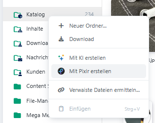
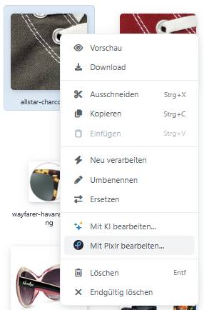
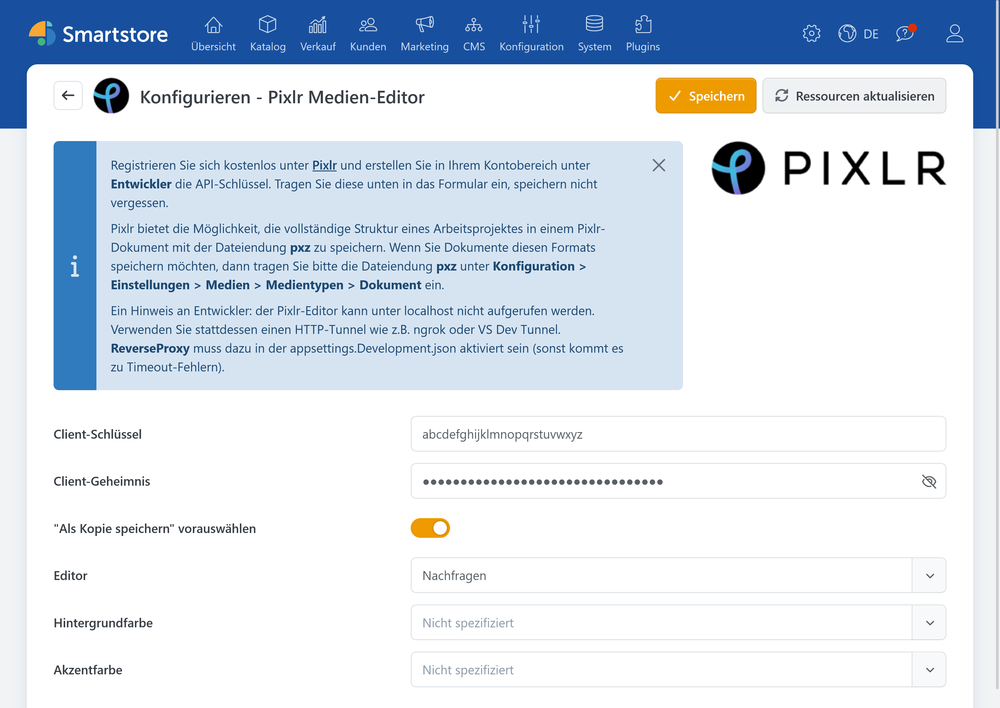

# Pixlr

Bietet die Möglichkeit Bilder direkt im [Medien-Manager](mediamanager.md) zu Erstellen und Bearbeiten.

## Benutzung im Medien-Manager

Die Pixlr Funktionalität ist ab Smartstore v6 im [Medien-Manager integriert](mediamanager/integrations.md). Dazu navigieren Sie im Backend zu **CMS** &rarr; **Medien**. Wir bieten zwei Möglichkeiten an, Pixlr zu benutzen:

* Mit der Option **Mit Pixlr erstellen**, die sich nach einem Rechtsklick auf einen Ordner öffnet, können neue Inhalte erstellt werden.

  

* Die Bearbeitung kann durch einen Rechtsklick auf ein Bild und der Auswahl von **Mit Pixlr bearbeiten** gestartet werden.

  

Beide Varianten öffnen den Pixlr-Editor, der eine Vielzahl von Editierungsmöglichkeiten zulässt.


Da der Editor von Pixlr selbst angeboten wird, können wir nicht alle Funktionen auflisten oder Fragen dazu beantworten. Informieren Sie sich bitte auf der [Pixlr-Webpage](https://pixlr.com/de/) und kontaktieren Sie den [Pixlr-Support](https://pixlr.com/support/) bei Fragen.


Nachdem Sie das Bild in Pixlr gespeichert haben, erscheint ein Smartstore-Dialog. Dieser bietet die Möglichkeit die alte Datei zu überschreiben, oder eine neue Datei unter neuem Namen anzulegen. Nachdem Sie eine Auswahl getroffen haben, befindet sich das bearbeitete Bild im Medien-Manager und kann überall verwendet werden.

## Konfiguration

| **Option**                         | **Beschreibung** |
| ---------------------------------- | ---------------- |
| Client-Schlüssel                   | Legt den zu verwendenden Pixlr Client-Schlüssel fest. |
| Client-Geheimnis                   | Legt das zu verwendende Pixlr Client-Geheimnis fest. |
| Editor                             | Legt fest, ob der erweiterte Pixlr Editor verwendet werden soll. |
| "Als Kopie speichern" vorauswählen | Wählt die Option „Als Kopie speichern“ im Speichern-Dialog standardmäßig vor. |
| Hintergrundfarbe                   | Legt die Hintergrundfarbe des Editors (Arbeitsbereich) fest. |
| Akzentfarbe                        | Legt die Akzentfarbe für bestimmte Elemente im Editor fest (z.B. Buttons und Tooltips). |

## Sie interessieren sich für dieses Plugin?

Gerne beraten wir Sie persönlich zu Funktionen, Einsatzmöglichkeiten und Lizenzoptionen. Gemeinsam klären wir, ob das Plugin zu Ihren Anforderungen passt, und begleiten Sie auf dem Weg zur passenden Kaufentscheidung.

<a href="https://smartstore.com/de/persoenliche-beratung/" class="button primary">Persönliche Beratung anfragen</a>