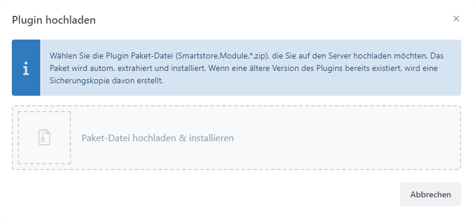
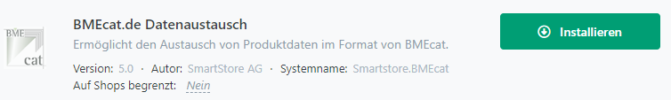

# Plugins installieren

Smartstore wird mit bereits installierten Plugins ausgeliefert. Weitere Plugins finden Sie auf dem [Smartstore Marketplace](http://community.smartstore.com/index.php?/files/) von Smartstore selbst und von Drittanbietern. Smartstore Plugin-Dateien haben das ZIP-Dateiformat und die Endung `.zip`.

## Wie man ein Plugin hochlädt und installiert

Wählen Sie den Menüpunkt **Plugins > Plugins verwalten** und klicken Sie auf die Schaltfläche **Plugin hochladen**. Wählen Sie die Zip-Datei aus, die das Plugin enthält.

Das Plugin wurde nun hochgeladen und kann im Bereich der Plugin-Verwaltung installiert und konfiguriert werden.

