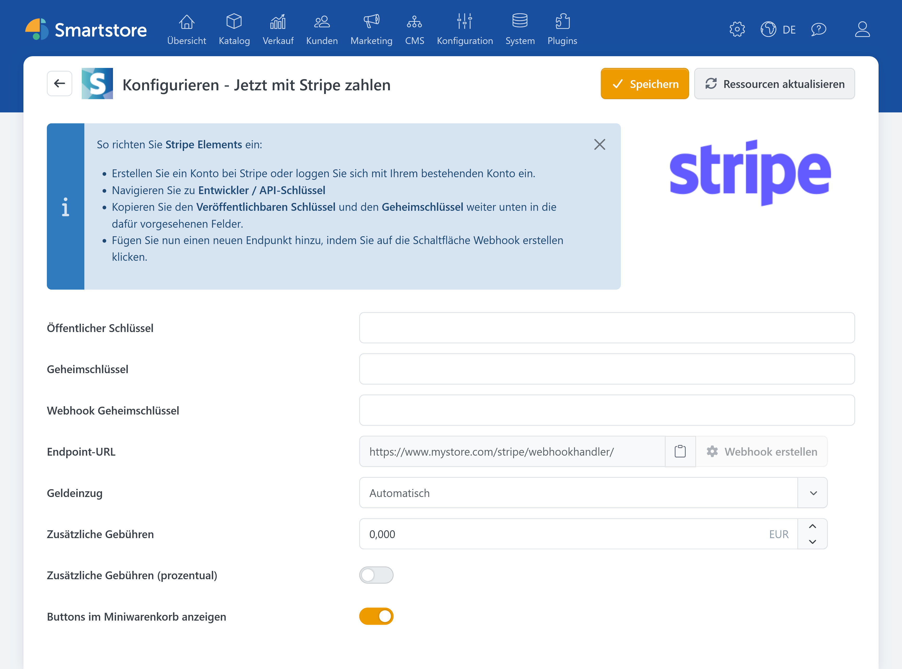

# Stripe

Das Plugin **Stripe** bindet den Zahlungsdienstleister Stripe in Smartstore ein. Kunden bezahlen über eine von Stripe bereitgestellte Zahlungsoberfläche. Unterstützt werden Stripe Elements, zusätzliche Kundenauthentifizierungen wie 3-D Secure, der Express-Checkout im Warenkorb, der automatischen oder manuellen Geldeinzug sowie vollständige und teilweise Rückerstattungen. Zahlungsstatus werden über Stripe-Webhooks mit Smartstore synchronisiert.


Welche Zahlungsarten tatsächlich angeboten werden, hängt unter anderem vom Stripe-Konto, dem Land, der Währung, dem Endgerät und den Eigenschaften der jeweiligen Transaktion ab. Einen Vergleich mit weiteren Zahlungsplugins finden Sie unter [Zahlungsanbieter und Zahlungsarten](paymentproviders.md).


Für den Betrieb benötigen Sie:

- ein aktives Stripe-Konto
- die zugehörigen API-Schlüssel
- ein Webhook-Signaturgeheimnis.

Der Shop muss öffentlich über HTTPS erreichbar und die Zahlungsart **Stripe Elements** in Smartstore aktiviert sein. Weitere Informationen zur Aktivierung, Sortierung und Einschränkung von Zahlungsarten finden Sie unter [Zahlungsarten einrichten](../konfiguration/zahlungsarten-einrichten.md).

## Konfiguration

Die Konfiguration verbindet Smartstore mit Ihrem Stripe-Konto und legt das grundlegende Zahlungsverhalten fest. Zu den Haupteinstellungen gehören die Stripe-Zugangsdaten, die Absicherung des Webhooks, die Art des Geldeinzugs und optionale Zahlungsgebühren. Außerdem bestimmen Sie hier, ob der Stripe-Button im Miniwarenkorb angezeigt werden soll.

| Einstellung | Beschreibung |
|---|---|
| **Öffentlicher Schlüssel** | Der veröffentlichbare Schlüssel aus dem Stripe-Dashboard. |
| **Geheimschlüssel** | Der geheime API-Schlüssel für die serverseitige Kommunikation zwischen Smartstore und Stripe. Behandeln Sie diesen Schlüssel vertraulich und veröffentlichen Sie ihn nicht. |
| **Webhook-Geheimschlüssel** | Das Signaturgeheimnis des in Stripe eingerichteten Webhook-Endpunkts. Damit kann Smartstore den Zahlungsstatus eines Auftrags aktualisieren, auch wenn die Rückmeldung nicht unmittelbar im Browser des Kunden erfolgt.|
| **Endpoint-URL** | Die von Smartstore bereitgestellte Adresse für Stripe-Webhooks. Hinterlegen Sie diese URL beim Webhook-Endpunkt im Stripe-Dashboard. |
| **Geldeinzug** | Bestimmt, ob erfolgreiche Zahlungen automatisch eingezogen oder zunächst nur autorisiert werden. |
| **Zusätzliche Gebühren** | Legt einen Zuschlag für Zahlungen mit Stripe fest. Die Gebühr wird dem Kunden im Bestellprozess als Bestandteil der Auftragsberechnung angezeigt. |
| **Zusätzliche Gebühren prozentual berechnen** | Berechnet den eingetragenen Gebührenwert prozentual auf Grundlage des Warenkorbs. Ohne Aktivierung wird der Wert als Festbetrag in der primären Shopwährung verwendet. |
| **Button im Miniwarenkorb anzeigen** | Zeigt den Stripe-Express-Checkout zusätzlich im seitlich eingeblendeten Miniwarenkorb an. |


Zahlungsaufschläge können abhängig von Land, Kundengruppe und Zahlungsmittel rechtlich eingeschränkt oder unzulässig sein. Prüfen Sie die für Ihren Shop geltenden Anforderungen, bevor Sie eine zusätzliche Gebühr aktivieren.


### Automatischer und manueller Geldeinzug

Bei der Einstellung **Automatisch** wird der Betrag nach erfolgreicher Zahlungsbestätigung unmittelbar eingezogen. Diese Variante eignet sich für die meisten gewöhnlichen Bestellvorgänge.

Bei der Einstellung **Manuell** autorisiert Stripe die Zahlung zunächst. Der Händler kann den Betrag anschließend in der Smartstore-Auftragsverwaltung einziehen. Diese Variante kann beispielsweise verwendet werden, wenn eine Bestellung vor dem Einzug geprüft werden soll. Autorisierungen können nicht unbegrenzt aufrechterhalten werden. Die jeweils geltende Frist wird durch Stripe und die verwendete Zahlungsart bestimmt.

Weitere allgemeine Einstellungen zum automatischen Einzug finden Sie unter [Zahlung](../konfiguration/einstellungen/zahlung.md).

## Zahlungen bearbeiten

Das Stripe-Plugin unterstützt die weitere Bearbeitung einer Zahlung direkt in der Smartstore-Auftragsverwaltung. Abhängig vom aktuellen Zahlungsstatus stehen folgende Aktionen zur Verfügung:

- Einzug einer zuvor autorisierten Zahlung,
- vollständige Rückerstattung,
- teilweise Rückerstattung,
- Stornierung einer noch nicht abgeschlossenen Zahlung.

Die Stripe-PaymentIntent-ID wird als Autorisierungstransaktions-ID am Auftrag gespeichert. Bei einer Rückerstattung kann zusätzlich die von Stripe erzeugte Refund-ID hinterlegt werden.

Rückerstattungen, die unmittelbar im Stripe-Dashboard ausgelöst werden, können über den entsprechenden Webhook an Smartstore zurückgemeldet werden.

Weitere Informationen zur Auftragsansicht finden Sie unter [Aufträge verwalten](../../verwalten/verkauf/auftrage-verwalten.md). Eine Übersicht der von Zahlungsplugins bereitgestellten Verwaltungsfunktionen enthält der Abschnitt [Funktionen von Zahlart-Plugins](../konfiguration/zahlungsarten-einrichten.md#funktionen-von-zahlart-plugins).

## Cookies und Datenschutz

Wenn Stripe als Zahlungsprovider aktiv ist, bindet Smartstore das externe Stripe-JavaScript unter `https://js.stripe.com/v3/` ein. Der zugehörige Dienst wird im Cookie-Manager als technisch erforderlich behandelt, da er für die Darstellung und Abwicklung der Zahlung benötigt wird.

Bei der Zahlungsabwicklung werden Daten an Stripe übertragen. Berücksichtigen Sie Stripe deshalb in der Datenschutzerklärung Ihres Shops und informieren Sie Kunden über Art und Zweck der Datenübermittlung.

Weitere Informationen zur Verwaltung von Cookie-Hinweisen finden Sie unter [Cookie-Manager](../konfiguration/cookie-manager.md).

## Weiterführende Informationen

- [Zahlungsanbieter und Zahlungsarten](paymentproviders.md)
- [Zahlungsarten einrichten](../konfiguration/zahlungsarten-einrichten.md)
- [Zahlungseinstellungen](../konfiguration/einstellungen/zahlung.md)
- [Aufträge verwalten](../../verwalten/verkauf/auftrage-verwalten.md)
- [Cookie-Manager](../konfiguration/cookie-manager.md)
- [Von Stripe unterstützte Zahlungsarten](https://docs.stripe.com/payments/payment-methods)
