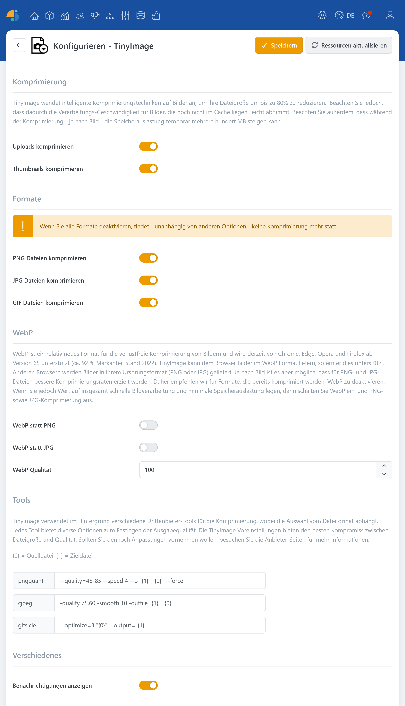

# TinyImage

> Bildkomprimierung bis zu 80 %

TinyImage ist ein Plugin, das die Dateigröße hochgeladener Bilder deutlich reduzieren kann, ohne dass Sie dabei manuell jedes Bild neu komprimieren müssen. Sie bekommen schlankere Mediendateien, geringere Ladezeiten und dadurch ein insgesamt flüssigeres Nutzererlebnis, insbesondere auf Seiten mit vielen Bildern (z. B. Produktlisten, Blogs oder Content-Seiten).

Im Hintergrund arbeitet TinyImage mit intelligenten Komprimierungsstrategien: Je nach Bildformat und Bildinhalt werden passende Verfahren eingesetzt, um die Speichermenge zu verringern. Dadurch kann die Bilddateigröße, je nach Ausgangsbild, spürbar reduziert werden. Dabei werden auch dynamisch generierte Thumbnails berücksichtigt, damit die Optimierung nicht nur für hochgeladene Originale, sondern auch für die in der Darstellung verwendeten Vorschaubilder greift.

## Einsatzbereiche

* **Uploads komprimieren**: Komprimiert Bilder direkt beim Hochladen.
* **Thumbnails komprimieren**: Optimiert dynamisch erzeugte Thumbnails.

## Formate

TinyImage arbeitet formatabhängig und unterstützt die Bildformate [PNG](https://de.wikipedia.org/wiki/Portable_Network_Graphics), [JPG](https://de.wikipedia.org/wiki/JPEG) und [GIF](https://de.wikipedia.org/wiki/Graphics_Interchange_Format).

### WebP

[WebP](https://de.wikipedia.org/wiki/WebP) ist ein modernes Bildformat, das relativ effizient komprimiert und je nach Anwendungsfall gute Ergebnisse bei Dateigröße und Qualität liefern kann. TinyImage kann WebP als Ausgabe erzeugen, sodass WebP-fähige Browser die optimierten Versionen erhalten.


Browser, die WebP nicht unterstützen, erhalten weiterhin Bilder im Originalformat (PNG oder JPG).


## Konfiguration

| **Option**                  | **Beschreibung**                                                                                                                                                                                                                                                                                                                                                                                                                                                                                                                                                                                                                                                                                                                     |
| --------------------------- | ------------------------------------------------------------------------------------------------------------------------------------------------------------------------------------------------------------------------------------------------------------------------------------------------------------------------------------------------------------------------------------------------------------------------------------------------------------------------------------------------------------------------------------------------------------------------------------------------------------------------------------------------------------------------------------------------------------------------------------ |
| **Komprimierung**           | TinyImage wendet intelligente Komprimierungstechniken auf Bilder an, um ihre Dateigröße um bis zu 80% zu reduzieren. Beachten Sie jedoch, dass dadurch die Verarbeitungs-Geschwindigkeit für Bilder, die noch nicht im Cache liegen, leicht abnimmt. Beachten Sie außerdem, dass während der Komprimierung - je nach Bild - die Speicherauslastung temporär mehrere hundert MB steigen kann.                                                                                                                                                                                                                                                                                                                                         |
| Uploads komprimieren        | Wendet Komprimierung auf hochgeladene Bilder an.                                                                                                                                                                                                                                                                                                                                                                                                                                                                                                                                                                                                                                                                                     |
| Thumbnails komprimieren     | Wendet Komprimierung auf dynamisch generierte Thumbnails an.                                                                                                                                                                                                                                                                                                                                                                                                                                                                                                                                                                                                                                                                         |
| **Formate**                 | 
<strong>Info</strong> Wenn Sie alle Formate deaktivieren, findet - unabhängig von anderen Optionen - keine Komprimierung mehr statt.
                                                                                                                                                                                                                                                                                                                                                                                                                                                                                                                                                                                       |
| PNG Dateien komprimieren    | Reduziert die Größe von PNG-Dateien, indem die Anzahl der Farben selektiv verringert wird.                                                                                                                                                                                                                                                                                                                                                                                                                                                                                                                                                                                                                                           |
| JPG Dateien komprimieren    | Reduziert die Größe von JPG-Dateien. Generiert außerdem 'progressive' JPEGs, wenn die Quelldatei größer als 10 KB ist.                                                                                                                                                                                                                                                                                                                                                                                                                                                                                                                                                                                                               |
| GIF Dateien komprimieren    | Reduziert die Größe von (animierten) GIF-Dateien.                                                                                                                                                                                                                                                                                                                                                                                                                                                                                                                                                                                                                                                                                    |
| **WebP**                    | WebP ist ein relativ neues Format für die verlustfreie Komprimierung von Bildern und wird derzeit von Chrome, Chrome Mobile und Opera unterstützt (ca. 70 % Markanteil Stand 2018). TinyImage kann dem Browser Bilder im WebP Format liefern, sofern er dies unterstützt. Anderen Browsern werden Bilder in ihrem Ursprungsformat (PNG oder JPG) geliefert. Je nach Bild ist es aber möglich, dass für PNG- und JPG-Dateien bessere Komprimierungsraten erzielt werden. Daher empfehlen wir für Formate, die bereits komprimiert werden, WebP zu deaktivieren. Wenn Sie jedoch Wert auf insgesamt schnelle Bildverarbeitung und minimale Speicherauslastung legen, dann schalten Sie WebP ein, und PNG- sowie JPG-Komprimierung aus. |
| WebP statt PNG              | Generiert und liefert WebP- statt PNG-Dateien an WebP-fähige Browser aus.                                                                                                                                                                                                                                                                                                                                                                                                                                                                                                                                                                                                                                                            |
| WebP statt JPG              | Generiert und liefert WebP- statt JPG-Dateien an WebP-fähige Browser aus.                                                                                                                                                                                                                                                                                                                                                                                                                                                                                                                                                                                                                                                            |
| **Tools**                   | TinyImage verwendet im Hintergrund verschiedene Drittanbieter-Tools für die Komprimierung, wobei die Auswahl vom Dateiformat abhängt. Jedes Tool bietet diverse Optionen zum Festlegen der Ausgabequalität. Die TinyImage Voreinstellungen bieten den besten Kompromiss zwischen Dateigöße und Qualität. Sollten Sie dennoch Anpassungen vornehmen wollen, besuchen Sie die Anbieter-Seiten für mehr Informationen.                                                                                                                                                                                                                                                                                                                  |
| **Verschiedenes**           |                                                                                                                                                                                                                                                                                                                                                                                                                                                                                                                                                                                                                                                                                                                                      |
| Benachrichtigungen anzeigen | Blendet nach einem Datei-Upload eine kurze Zusammenfassung über die erzielte Komprimierungs-Rate ein.                                                                                                                                                                                                                                                                                                                                                                                                                                                                                                                                                                                                                                |
