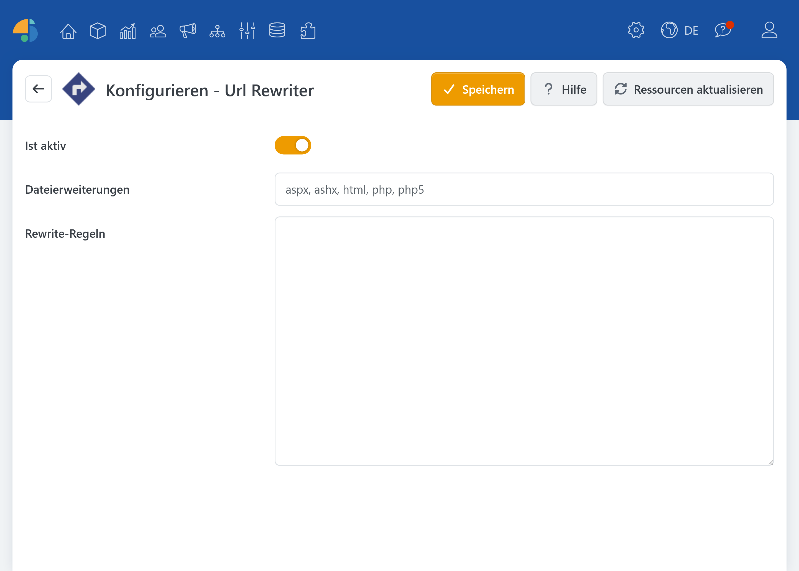

# UrlRewriter

Mit dem UrlRewriter-Plugin definieren Sie im Shop-Backend gezielt URL-Weiterleitungsregeln. Das ist besonders nützlich, wenn Seiten umgezogen sind, Produkt- oder Kategorie-URLs sich geändert haben oder wenn Sie für bestimmte Domains bzw. Stores abweichende Ziele ansteuern möchten (z. B. in einer Multistore-Umgebung).

Das Plugin verwendet eine an **Apache mod\_rewrite** angelehnte Syntax mit reduziertem Funktionsumfang. So können Sie pro Zeile eine klare Regel hinterlegen und steuern das Verhalten der Weiterleitung über optionale Schalter.

## Regeln

Die Regeln werden im Plugin-Config-Bereich eingetragen und sind zeilenweise aufgebaut:

* Pro Zeile **genau eine** Rewrite-Regel (ohne die `RewriteRule`-Anweisung).
* Kommentare sind erlaubt und beginnen mit `#` oder `//` am Zeilenanfang.

Das Plugin unterstützt eine `mod_rewrite`-kompatible Syntax, jedoch ohne die folgenden Anweisungen: `RewriteBase`, `RewriteCond`, `RewriteRule`, `RewriteMap`, `RewriteEngine`.

Das macht das Tool besonders geeignet für typische Use-Cases wie **301-Weiterleitungen**, **Musterersetzungen** (z. B. Ordner/Unterbereiche) und **host-spezifische Regeln**.

### Beispiele

Typische Regeln bestehen aus Muster (wie eine eingehende URL erkannt wird) und Ziel (auf welche URL umgeleitet werden soll).

* **Einfaches Redirect**: Alte URL → neue URL `/alte-seite /neue-seite [R=301,NC]`
* **Muster mit Pfadanteilen**: z. B. für Kategorien/Ordner, sodass der Teil nach dem Ordner beibehalten wird `/pdfs/(.*)$ /dokumente/pdfs/$1 [R=301,NC]`
* **Host-abhängige Regeln**: In Multistore-Setups kann die Ziel-URL je nach Domain variieren `/old-url$ /new-url [R=301, NC, H=myshop1.de]`

### Erweiterte Nutzung

Die weiteren Details zu den **Schaltern**, zum **Escaping** (welche Zeichen bei der Eingabe als Sonderzeichen zu behandeln sind) sowie zur Möglichkeit, Rewrite-Regeln **zusätzlich/optional in externen Dateien** bereitzustellen, finden Sie direkt im **Hilfe-Button (Konfiguration → Hilfe)**, da dort die relevanten Optionen, Dateinamen (für mod\_rewrite bzw. IIS Rewrite) sowie das Regel-Vorrangprinzip zwischen Plugin-Regeln und Datei-Regeln verständlich zusammengefasst sind.

## Konfiguration

| **Option**         | **Beschreibung**                                                                                                                                          |
| ------------------ | --------------------------------------------------------------------------------------------------------------------------------------------------------- |
| Ist aktiv          | Legt fest, ob die Umleitungsregeln aktuell wirksam sind. Deaktivieren Sie diese Option, um Änderungen vorübergehend auszuschalten.                        |
| Dateierweiterungen | Für statische Dateien: kommagetrennte Liste mit Dateierweiterungen (ohne Punkt), die bei der Abarbeitung der Rewrite-Regeln berücksichtigt werden sollen. |
| Rewrite-Regeln     | Tragen Sie hier pro Zeile die Regeln ein, mit denen eingehende URLs gematcht und auf Ziel-URLs umgeleitet werden.                                         |
