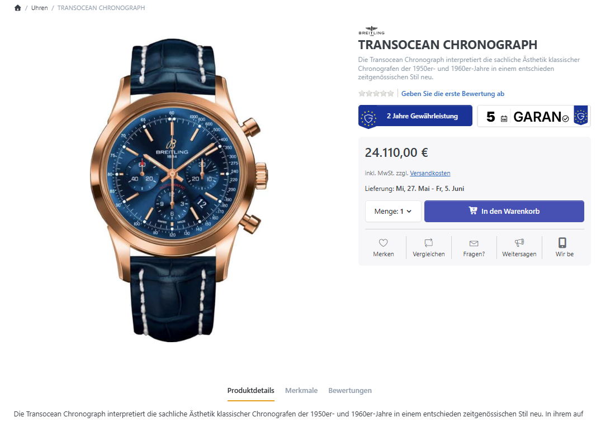
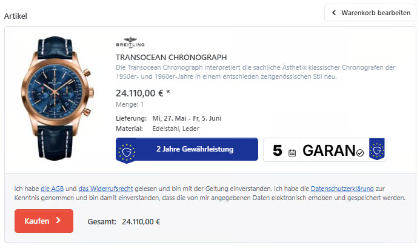
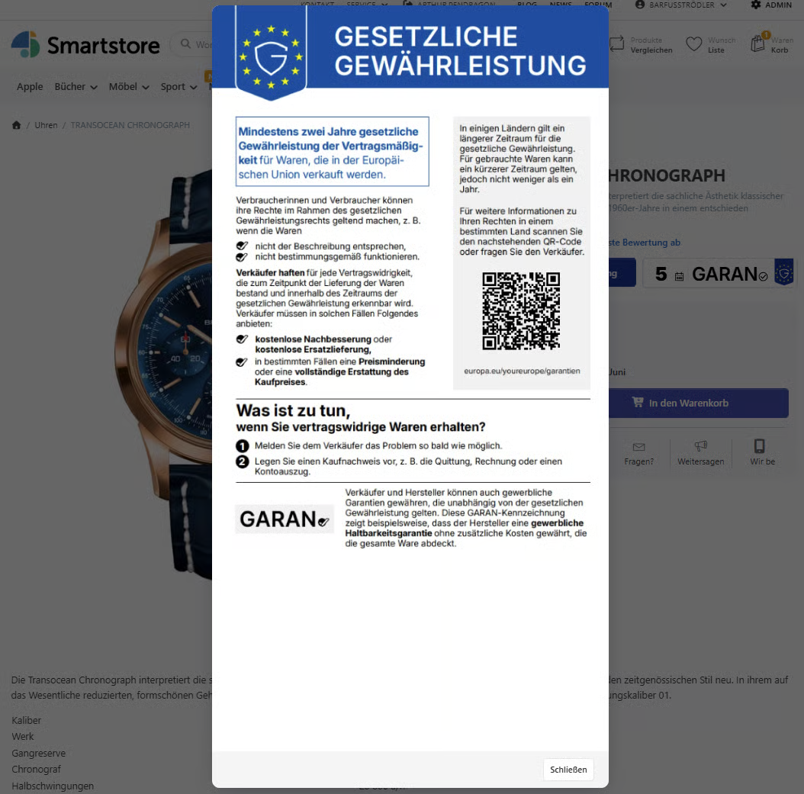
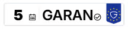
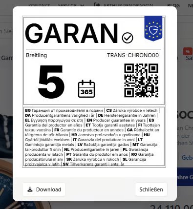
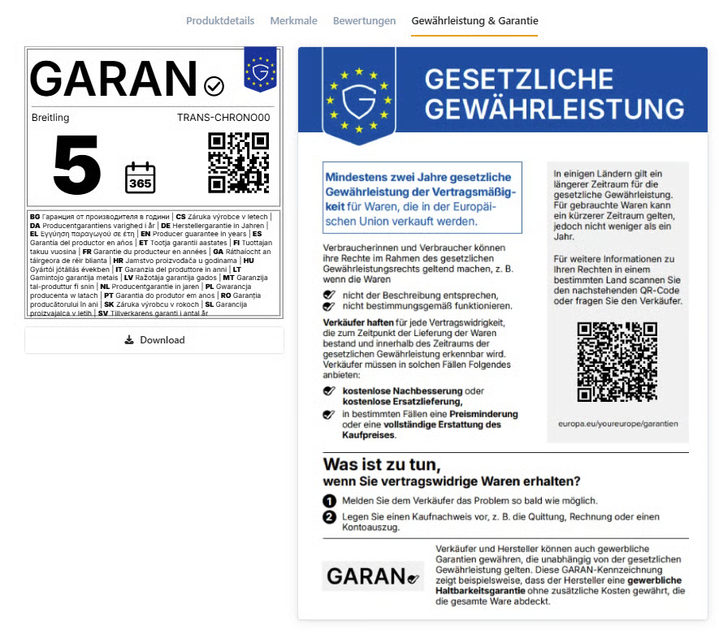
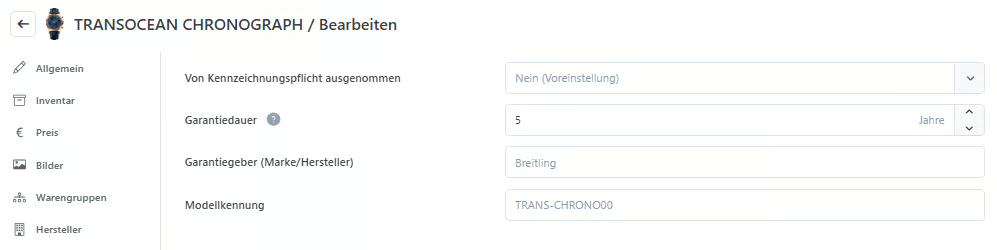

# EU-Garantiekennzeichnung

Mithilfe dieses Plugins können die harmonisierten EU-Label für Gewährleistung und Garantie sowohl auf der Produktdetailseite als auch bei Bedarf im Checkout konfiguriert und angezeigt werden.

## Gewährleistung

Je nach Konfiguration des Plugins wird das Gewährleistungslabel entweder auf der Produktdetailseite oder auf der Seite zum Bestellabschluss im Checkout-Prozess angezeigt. Beide Bereiche sind separat [steuerbar](warranty.md#plugin-konfiguration).

Bei Klick auf das Gewährleistungslabel öffnet sich ein Pop-Up mit Informationen zur gesetzlichen Gewährleistung.

## Garantie

Das Garantielabel wird nur ausgegeben, wenn für die Felder Garantiegeber und Modellkennung Daten hinterlegt sind und eine Garantiedauer von mehr als zwei Jahren festgelegt wurde.

Genau wie beim Gewährleistungslabel wird auch beim Klick auf das Garantielabel ein Pop-up mit Informationen angezeigt. Das Label wird automatisch aus den [im Produkt-Editor hinterlegten Daten](warranty.md#produkt-editor) generiert.


Die Anzeige der **Download** und **Drucken** Schaltflächen kann [separat gesteuert](warranty.md#plugin-konfiguration) werden.


## Einstellungen

### Plugin-Konfiguration

Die Voreinstellungen für die Labels sowie deren Platzierung und die optionalen Schaltflächen können in der Konfiguration festgelegt werden.


Weitere Informationen zur Einrichtung sowie allgemeine Hinweise und Informationen zum Import sind im blauen Kasten zu finden.


#### Darstellung als Tab

Wird „Eigenes Tab” als Position auf der Produktdetailseite ausgewählt, wird je nach Produktdaten das Tab „Gewährleistung” oder „Gewährleistung & Garantie” hinzugefügt. Dieses enthält den Inhalt der entsprechenden Pop-ups.

### Produkt-Editor

Im Produkt-Tab „EU-Garantielabel” können produktspezifische Garantiewerte hinterlegt werden. Auf dieser Grundlage wird das Label anschließend im Frontend generiert.

Die Voreinstellungen der einzelnen Felder lauten wie folgt:

| Option                           | Beschreibung                                                                          |
| -------------------------------- | ------------------------------------------------------------------------------------- |
| Von Kennzeichnung ausgenommen    | Die Einstellung **Standardmäßig sind alle Produkte...** aus der Plugin-Konfiguration. |
| Garantiedauer                    | Leeres Feld → Das Garantielabel wird nicht angezeigt.                                 |
| Garantiegeber (Marke/Hersteller) | Der Hersteller des Produkts.                                                          |
| Modellkennung                    | Die Herstellerproduktnummer (MPN) des Produkts.                                       |

## Import

Die Daten zur Garantiekennzeichnung lassen sich auch per Produktimport importieren.

In der Importdatei müssen das Schlüsselfeld „SKU” sowie die Felder „DurabilityGuaranteeIssuer”, „DurabilityGuaranteeDurationYears” und „ModelIdentifier” enthalten sein.


Im Hinweiskasten der Plugin-Konfiguration steht eine Beispieldatei zum Download bereit.

