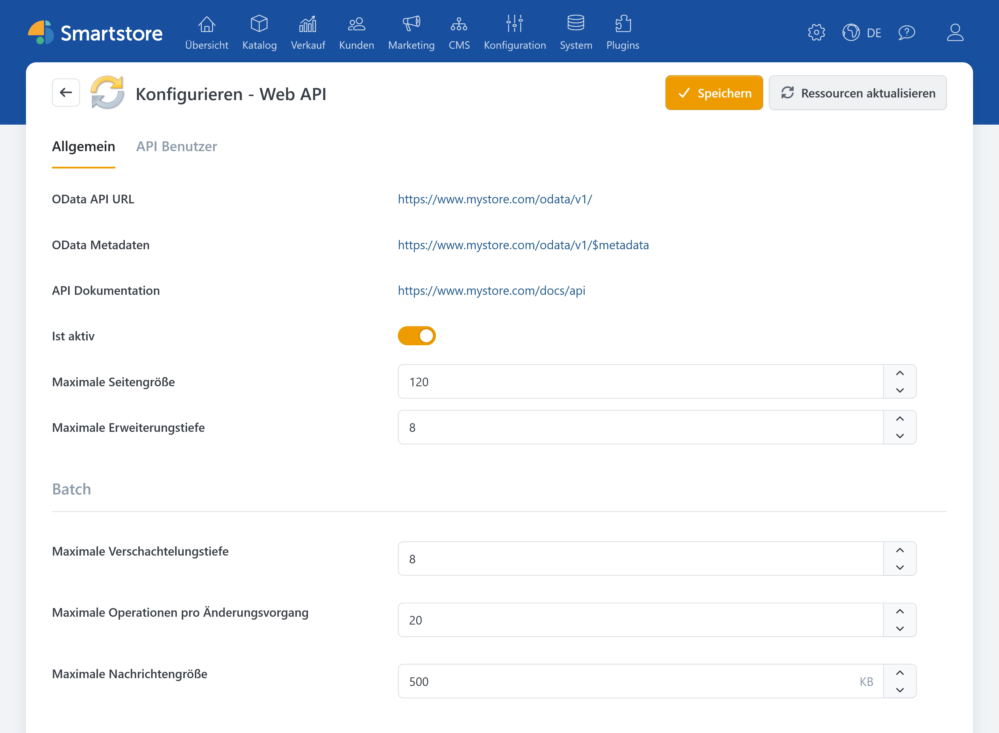
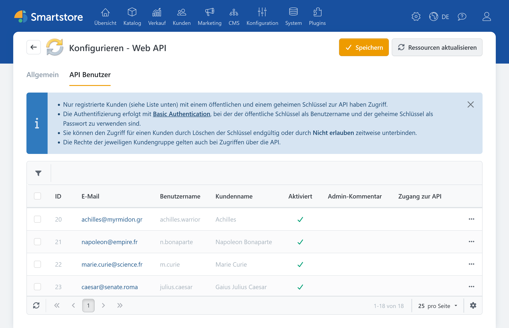
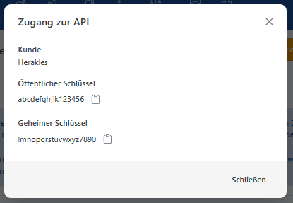

# Web API einrichten und verwalten

Mit der **Smartstore Web API** können externe Anwendungen Daten Ihres Shops abrufen und bearbeiten. Typische Einsatzbereiche sind die Anbindung von Warenwirtschaftssystemen, mobilen Anwendungen, Marktplätzen oder individuellen Integrationen.

Die Web API basiert auf **OData**. Welche Daten und Funktionen verfügbar sind, hängt von der Smartstore-Version und den installierten Plugins ab.


Diese Seite beschreibt die Einrichtung und Verwaltung der Web API im Administrationsbereich. Informationen zur Entwicklung eines API-Clients finden Sie in der [Web-API-Entwicklerdokumentation](https://docs.smartstore.com/developer/framework/web-api).


## Voraussetzungen

Bevor externe Anwendungen auf die Web API zugreifen können, müssen folgende Voraussetzungen erfüllt sein:

- Die Web API ist in der Plugin-Konfiguration aktiviert.
- Für einen registrierten Kunden wurde ein API-Schlüsselpaar erstellt.
- Der API-Zugriff dieses Kunden ist erlaubt.
- Die Kundengruppen des Kunden verfügen über die benötigten Zugriffsrechte.
- Produktive Anfragen werden über HTTPS gesendet.

Informationen zur Installation und Verwaltung von Plugins finden Sie unter [Plugins installieren](plugins-installieren.md) und [Plugins verwalten](plugins-verwalten.md).

## Web API öffnen

Öffnen Sie im Administrationsbereich **Plugins > Plugins verwalten**. Suchen Sie nach dem Plugin **Web API** und klicken Sie auf **Konfigurieren**.

Die Konfigurationsseite besteht aus zwei Registerkarten:

| Registerkarte | Aufgabe |
|---|---|
| **Allgemein** | Web API aktivieren, Adressen anzeigen und Abfragegrenzen konfigurieren |
| **API Benutzer** | API-Schlüssel erstellen und den Zugang einzelner Kunden verwalten |

## Allgemeine Einstellungen

Auf der Registerkarte **Allgemein** finden Sie die Adressen der Web API sowie die Einstellungen für OData-Abfragen und Batch-Anfragen.

### API-Adressen

Smartstore zeigt die vollständigen Adressen für Ihre Installation an. Standardmäßig werden folgende Pfade verwendet:

| Anzeige | Standardpfad | Bedeutung |
|---|---|---|
| **OData API URL** | `/odata/v1/` | Basisadresse für API-Anfragen |
| **OData Metadaten** | `/odata/v1/$metadata` | Maschinenlesbare Beschreibung des verfügbaren Datenmodells |
| **API Dokumentation** | `/docs/api` | Interaktive Swagger-Dokumentation der verfügbaren Endpunkte |
| **OData Endpunkte** | `/$odata` | Technische Übersicht der OData-Zuordnungen, wird nur in Entwicklungsumgebungen angezeigt |

Über **OData Metadaten** können Anwendungen das aktuelle Entity Data Model, kurz EDM, auslesen. Die Metadaten eignen sich unter anderem zur Erzeugung von Client-Code.

Die **API Dokumentation** zeigt die auf Ihrer Installation verfügbaren Endpunkte. Sie ist deshalb zuverlässiger als eine statische Liste, da weitere Plugins zusätzliche API-Ressourcen bereitstellen können.

Weitere Informationen finden Sie unter [Metadaten, Swagger und Werkzeuge](https://docs.smartstore.com/developer/framework/web-api/help-and-tools).

### Web API aktivieren

Mit **Ist aktiv** legen Sie fest, ob die Web API Anfragen entgegennimmt.

Ist die Einstellung deaktiviert, werden API-Anfragen abgewiesen. Der normale Betrieb des Shops ist davon nicht betroffen.


Aktivieren Sie die Web API erst, nachdem Sie die benötigten API-Benutzer und Zugriffsrechte vorbereitet haben.


### Abfragegrenzen festlegen

Die Abfragegrenzen schützen den Shop vor übermäßig umfangreichen oder tief verschachtelten API-Anfragen.

| Einstellung | Standardwert | Bedeutung |
|---|---:|---|
| **Maximale Seitengröße** | 120 | Maximale Anzahl von Datensätzen, die mit der OData-Option `$top` angefordert werden kann |
| **Maximale Erweiterungstiefe** | 8 | Maximale Verschachtelungstiefe für Beziehungen, die mit `$expand` eingebunden werden |

Wird bei einer Listenabfrage kein `$top` angegeben, begrenzt Smartstore die Antwort automatisch auf die konfigurierte maximale Seitengröße.

Eine Erhöhung der Grenzwerte kann die Datenbank, den Arbeitsspeicher und die Antwortzeiten stärker belasten. Ändern Sie die Werte deshalb nur, wenn die angeschlossene Anwendung dies benötigt, und prüfen Sie anschließend die Auswirkung unter realistischen Bedingungen.

Technische Informationen zu `$filter`, `$select`, `$expand`, `$skip`, `$top` und weiteren OData-Optionen finden Sie unter [Web API im Detail](https://docs.smartstore.com/developer/framework/web-api/web-api-in-detail).

### Batch-Anfragen begrenzen

Mit Batch-Anfragen kann eine Anwendung mehrere API-Operationen in einer gemeinsamen Anfrage übertragen.

| Einstellung | Standardwert | Bedeutung |
|---|---:|---|
| **Maximale Verschachtelungstiefe** | 8 | Begrenzt die Verschachtelung rekursiver Batch-Inhalte |
| **Maximale Operationen pro Änderungsvorgang** | 20 | Begrenzt die Anzahl der Schreiboperationen in einem Changeset |
| **Maximale Nachrichtengröße** | 500 KB | Begrenzt die Größe einer eingehenden Batch-Anfrage |


Die Batch-Grenzwerte gelten global für die gesamte Installation.


## API-Benutzer einrichten

Die Web API verwendet keine eigenständigen technischen Benutzer. Stattdessen wird einem registrierten Smartstore-Kunden ein öffentlicher und ein geheimer API-Schlüssel zugeordnet.

Für jede externe Anwendung sollte ein eigener Kunde angelegt werden. So können Sie Zugriffe gezielt berechtigen, sperren und anhand des letzten Zugriffs kontrollieren.

Informationen zum Anlegen und Bearbeiten eines Kunden finden Sie unter [Kunden verwalten](../kunden/kunden-verwalten.md).

### Empfohlene Vorgehensweise

1. Legen Sie einen eigenen registrierten Kunden für die anzubindende Anwendung an.
2. Ordnen Sie dem Kunden eine oder mehrere passende Kundengruppen zu.
3. Erteilen Sie diesen Kundengruppen nur die benötigten Zugriffsrechte.
4. Öffnen Sie in der Web-API-Konfiguration die Registerkarte **API Benutzer**.
5. Suchen Sie den zuvor angelegten Kunden.
6. Klicken Sie auf **Schlüssel erstellen**.
7. Übergeben Sie den öffentlichen und den geheimen Schlüssel über einen sicheren Kommunikationsweg an die verantwortliche Person oder Anwendung.
8. Testen Sie den Zugang zunächst mit einer lesenden Anfrage.
9. Prüfen Sie anschließend nur die tatsächlich benötigten Schreiboperationen.


Verwenden Sie für Integrationen möglichst keine persönlichen Administratorkonten. Ein eigener Kunde pro Anwendung erleichtert die Vergabe minimaler Rechte und das spätere Sperren einzelner Zugänge.


### Schlüssel erstellen

Klicken Sie beim gewünschten Kunden auf **Schlüssel erstellen**. Smartstore erzeugt daraufhin:

- einen **öffentlichen Schlüssel**,
- einen **geheimen Schlüssel**.

Der öffentliche Schlüssel wird bei der Basic Authentication als Benutzername verwendet. Der geheime Schlüssel wird als Passwort verwendet.

Besitzt der Kunde bereits ein Schlüsselpaar, werden die bisherigen Schlüssel beim Neuerstellen ersetzt. Eine Anwendung mit den alten Schlüsseln kann sich anschließend nicht mehr authentifizieren.


Behandeln Sie den geheimen Schlüssel wie ein Passwort. Speichern Sie ihn nicht in öffentlich zugänglichen Dateien, Quelltexten, Tickets oder ungeschützten Protokollen.


### API-Zugänge verwalten

Für jeden Kunden stehen abhängig vom aktuellen Zustand folgende Aktionen zur Verfügung:

| Aktion | Wirkung |
|---|---|
| **Schlüssel erstellen** | Erstellt ein neues Schlüsselpaar und aktiviert den API-Zugang |
| **Schlüssel anzeigen** | Zeigt den öffentlichen und den geheimen Schlüssel an |
| **Nicht erlauben** | Sperrt den vorhandenen API-Zugang vorübergehend |
| **Erlauben** | Aktiviert einen zuvor gesperrten Zugang wieder |
| **Schlüssel löschen** | Entfernt das Schlüsselpaar und entzieht den Zugang dauerhaft |

In der Spalte **Letzter Zugriff** sehen Sie, wann die Zugangsdaten zuletzt erfolgreich verwendet wurden. Kontrollieren Sie diese Angabe regelmäßig, um nicht mehr benötigte oder unerwartet verwendete Zugänge zu erkennen.


Ein gesperrter Zugang behält sein Schlüsselpaar und kann später wieder erlaubt werden. Beim Löschen der Schlüssel muss für eine erneute Verwendung ein neues Schlüsselpaar erstellt werden.


## Zugriffsrechte festlegen

Ein gültiges Schlüsselpaar gewährt keinen uneingeschränkten Zugriff auf sämtliche Shopdaten. Smartstore berücksichtigt bei API-Anfragen die Kundengruppen und Zugriffsrechte des zugeordneten Kunden.

Der Zugriff wird in drei Stufen geprüft:

| Stufe | Prüfung |
|---|---|
| **Web API** | Ist das Plugin installiert und die Web API aktiviert? |
| **API-Benutzer** | Besitzt der Kunde gültige Schlüssel und ist sein API-Zugang erlaubt? |
| **Endpunkt** | Besitzen die Kundengruppen des Kunden das für die konkrete Operation erforderliche Zugriffsrecht? |

Ein Kunde kann beispielsweise Produkte lesen, aber nicht bearbeiten, wenn seiner Kundengruppe nur das entsprechende Leserecht erteilt wurde.

Gehen Sie bei der Rechtevergabe nach dem Prinzip der minimalen Berechtigung vor:

- Erteilen Sie nur Rechte, die für die Integration benötigt werden.
- Trennen Sie Lese- und Schreibzugriffe, wenn unterschiedliche Anwendungen verwendet werden.
- Verwenden Sie für jede Integration einen eigenen Kunden.
- Entfernen Sie nicht mehr benötigte Kundengruppen und Rechte.
- Sperren Sie ungenutzte API-Zugänge oder löschen Sie deren Schlüssel.

Weitere Informationen finden Sie unter [Kundengruppen verwalten](../kunden/kundengruppen-verwalten.md) und [Zugriffsrechte kontrollieren](../konfiguration/zugriffsrechte-kontrollieren.md).

## Authentifizierung

Smartstore verwendet für die Web API **Basic Authentication**:

- Der öffentliche Schlüssel dient als Benutzername.
- Der geheime Schlüssel dient als Passwort.
- Beide Werte werden bei jeder Anfrage im `Authorization`-Header übertragen.
- Produktive Anfragen müssen über HTTPS erfolgen.


Basic Authentication verschlüsselt die Zugangsdaten nicht. Die Sicherheit entsteht durch die verschlüsselte HTTPS-Verbindung. Verwenden Sie die Web API außerhalb einer lokalen Entwicklungsumgebung niemals über unverschlüsseltes HTTP.


Details zum Aufbau des Headers, zur Base64-Kodierung und zu den zurückgegebenen Authentifizierungsfehlern finden Sie unter [Authentifizierung](https://docs.smartstore.com/developer/framework/web-api/authentication) in der Entwicklerdokumentation.

## Verbindung mit Swagger testen

Die integrierte Swagger-Oberfläche eignet sich für einen ersten Verbindungstest.

1. Öffnen Sie die auf der Konfigurationsseite angezeigte **API Dokumentation**.
2. Wählen Sie einen Bereich wie **Catalog**, **Content**, **Identity** oder **Checkout**.
3. Klicken Sie auf **Authorize**.
4. Tragen Sie den öffentlichen Schlüssel als Benutzername ein.
5. Tragen Sie den geheimen Schlüssel als Passwort ein.
6. Bestätigen Sie die Anmeldung.
7. Öffnen Sie zunächst einen lesenden `GET`-Endpunkt.
8. Klicken Sie auf **Try it out** und anschließend auf **Execute**.
9. Prüfen Sie Statuscode und Antwortinhalt.


Swagger sendet reale Anfragen an Ihren Shop. Verwenden Sie `POST`, `PUT`, `PATCH` oder `DELETE` nur, wenn die dadurch ausgelöste Änderung ausdrücklich beabsichtigt ist.


Welche Bereiche und Endpunkte angezeigt werden, hängt von Ihrer Installation ab. Installierte Plugins können die Web API um weitere Ressourcen ergänzen.

## Schlüssel wechseln oder Zugang entziehen

Erstellen Sie ein neues Schlüsselpaar, wenn:

- ein Schlüssel möglicherweise bekannt geworden ist,
- ein Mitarbeiter oder Dienstleister keinen Zugriff mehr erhalten soll,
- Zugangsdaten versehentlich veröffentlicht wurden,
- eine Integration auf ein neues System umgezogen ist,
- ein regelmäßiger Schlüsselwechsel vorgesehen ist.

Soll der Zugang nur vorübergehend gesperrt werden, wählen Sie **Nicht erlauben**. Soll er dauerhaft entzogen werden, wählen Sie **Schlüssel löschen**.

## Fehler beheben

| Symptom | Mögliche Ursache und Prüfung |
|---|---|
| `401 Unauthorized` | Prüfen Sie, ob die Web API aktiviert ist, die Schlüssel korrekt übertragen werden und der API-Zugang des Kunden erlaubt ist. |
| `403 Forbidden` | Die Authentifizierung war möglicherweise erfolgreich, aber der Kundengruppe fehlt das für den Endpunkt erforderliche Zugriffsrecht. |
| `421 Misdirected Request` | Die Anfrage wurde über HTTP gesendet. Verwenden Sie HTTPS. |
| Kunde erscheint nicht unter **API Benutzer** | Prüfen Sie, ob es sich um einen registrierten, aktiven und nicht gelöschten Kunden handelt. |
| Anfrage mit `$top` wird abgelehnt | Der angeforderte Wert überschreitet die konfigurierte maximale Seitengröße. |
| Anfrage mit `$expand` wird abgelehnt | Die angeforderte Verschachtelung überschreitet die maximale Erweiterungstiefe. |
| Batch-Anfrage wird abgelehnt | Prüfen Sie Nachrichtengröße, Verschachtelungstiefe und Anzahl der Operationen im Änderungsvorgang. |
| Ein erwarteter Endpunkt fehlt | Prüfen Sie die Swagger-Dokumentation Ihrer Installation und ob das zuständige Plugin installiert ist. |
| Alte Schlüssel funktionieren nicht mehr | Für denselben Kunden wurde möglicherweise ein neues Schlüsselpaar erstellt oder das bisherige Paar wurde gelöscht. |
| Zugang funktioniert nur bei einzelnen Endpunkten | Vergleichen Sie die Zugriffsrechte der Kundengruppen mit den benötigten Operationen. |

Ausführliche Informationen zu Authentifizierungsantworten und Fehlercodes finden Sie in der [Entwicklerdokumentation zur Authentifizierung](https://docs.smartstore.com/developer/framework/web-api/authentication).

## Weiterführende Dokumentation

### Benutzerhandbuch

- [Plugins installieren](plugins-installieren.md)
- [Plugins verwalten](plugins-verwalten.md)
- [Kunden verwalten](../kunden/kunden-verwalten.md)
- [Kundengruppen verwalten](../kunden/kundengruppen-verwalten.md)
- [Zugriffsrechte kontrollieren](../konfiguration/zugriffsrechte-kontrollieren.md)
- [Multi-Shop-Konfiguration](../konfiguration/einstellungen/den-einstellungsbereich-festlegen.md)

### Entwicklerdokumentation

- [Web API: Übersicht](https://docs.smartstore.com/developer/framework/web-api)
- [Voraussetzungen](https://docs.smartstore.com/developer/framework/web-api/prerequisites)
- [Authentifizierung](https://docs.smartstore.com/developer/framework/web-api/authentication)
- [Web API im Detail](https://docs.smartstore.com/developer/framework/web-api/web-api-in-detail)
- [Metadaten, Swagger und Werkzeuge](https://docs.smartstore.com/developer/framework/web-api/help-and-tools)
- [Beispiele](https://docs.smartstore.com/developer/framework/web-api/examples)
- [Breaking Changes in Web API 5](https://docs.smartstore.com/developer/framework/web-api/breaking-changes-in-web-api-5)