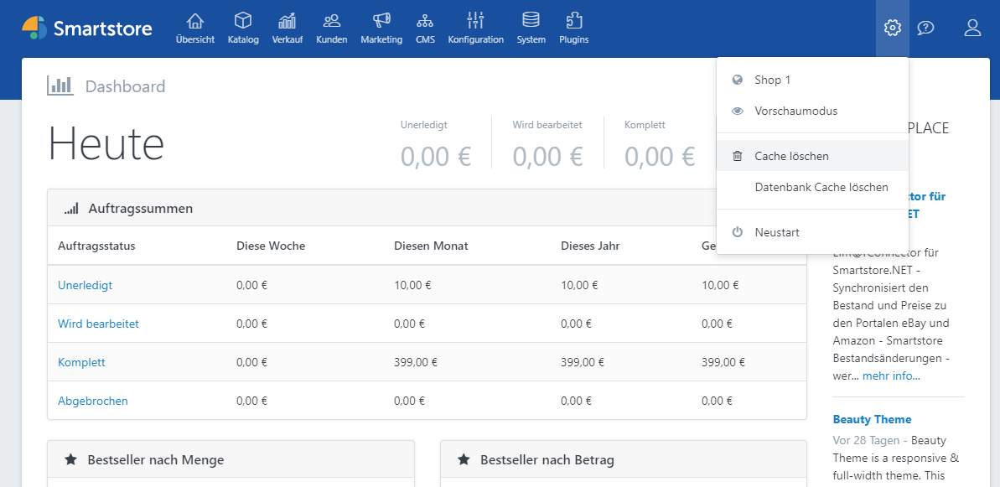

# Cache bereinigen

Es gibt unterschiedliche Elemente im Frontend Ihres Shops, die aus Performance-Gründen im Cache zwischengespeichert werden. Der Cache wird automatisch aktualisiert, wenn Sie etwas im Administrations-Bereich Ihres Shops verändern. Wenn Sie die Datenbank jedoch direkt verändert haben, müssen Sie den Cache bereinigen, um die Änderungen sehen zu können. Sie können den Cache bereinigen, indem Sie auf das Zahnrad-Symbol im Administrationsbereich klicken und **Cache löschen** auswählen.

> 
> Folgende Cache-Typen gibt es zusätzlich in Smartstore.
  

### Datenbank Cache

Sie können den Cache bereinigen, indem Sie auf das Zahnrad-Symbol im Administrationsbereich klicken und **Datenbank Cache löschen** auswählen. Wenn Sie den Datenbank Cache manuell löschen möchten, finden Sie die entsprechenden Dateien in Ihrem Shop-Verzeichnis unter **App\_Data > EfCache**.

### Output Cache

Weitere Informationen zum Output Cache finden Sie [hier](../../benutzer-handbuch/plugins-designs/output-cache-ausgabecache.md).

### Bilder Cache

Der Bilder Cache kann bei Bedarf unter **System > Wartung** gelöscht werden.

### Redis