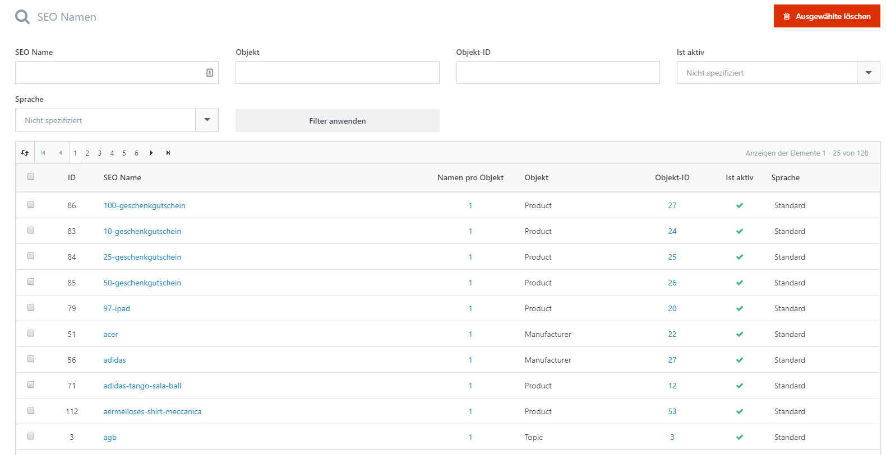

# SEO Namen verwalten

In diesem Bereich erhalten Sie einen Überblick über alle zugewiesenen SEO-freundliche Seitennamen. Sie können einen oder mehrere davon löschen, indem Sie ihn/sie auswählen und auf **Ausgewählte löschen** drücken.

