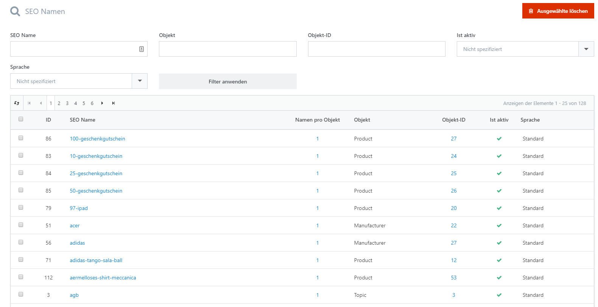

# SEO Namen verwalten

In diesem Bereich erhalten Sie einen Überblick über alle zugewiesenen SEO-freundlichen Seitennamen. Sie können einen oder mehrere Einträge löschen, indem Sie diese auswählen und auf **Ausgewählte löschen** klicken.

