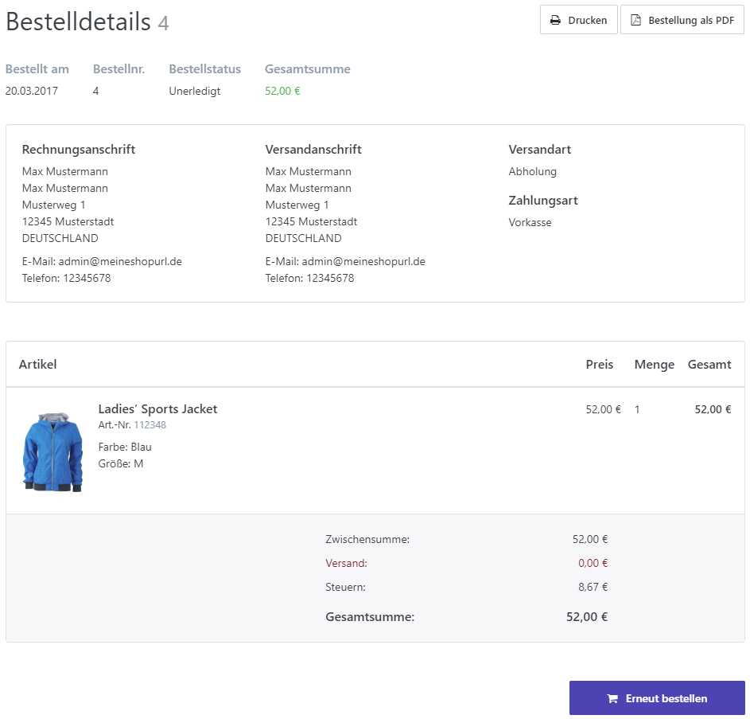

# Aufträge verwalten

Um Ihre Aufträge zu verwalten, navigieren Sie im Administrationsbereich Ihres Shops zu **Verkauf > Aufträge**. Die hier angezeigte Tabelle können Sie nach Datum, Kundennamen, Kunden-E-Mail-Adressen, Auftragsstatus, Zahlungsstatus, Lieferstatus, Shop, Auftrags-GUID und Auftragsnummer sortieren. Wenn Sie die Auftragsnummer der Bestellung kennen, die Sie sich ansehen möchten, können Sie direkt in die Detailansicht eines Auftrags wechseln, indem Sie die Nummer in das dafür vorgesehene Feld eingeben und auf **Ausführen** klicken. Sie können auch alle Aufträge oder nur ausgewählte Aufträge in unterschiedliche Formate (PDF, Excel und XML) exportieren. 

## Ansicht Auftragsdetails

### 

 

### Allgemein

In dieser Registerkarte können Sie grundlegende Informationen über den Auftrag einsehen, z. B. den Auftragsstatus und den Auftragswert. Sie können auch den Auftragsstatus und die Auftragssumme bearbeiten.

### Rechnung & Versand

In dieser Registerkarte können Sie die Rechnungsadresse und  die Lieferadresse der Bestellung einsehen und bearbeiten. Weiterhin werden Ihnen die Versandart und der Lieferstatus angezeigt. Lieferung (oder eine Teillieferung) kann über die Tabelle **Lieferungen** verwaltet werden. Für weitere Informationen zum Versand lesen Sie bitte [Sendungen verwalten](../verkauf/sendungen-verwalten.md).

### Produkte

In dieser Registerkarte können Sie alle Produkte finden, die mit dieser Bestellung in Verbindung stehen. Sie können hier Rückrufe steuern und die Preise und Rabatte für die bestellten Produkte bearbeiten. Für weitere Informationen über Retouren lesen Sie bitte [Retourenwünsche verwalten](../verkauf/retourenwunsche-verwalten.md).

### Auftragsnotizen

In dieser Registerkarte können Sie Auftragsnotizen einsehen und hinzufügen. Auftragsnotizen sind so etwas wie ein Log, bei dem jeder Schritt des Bestellvorgangs aufgezeichnet wird (z. B. wann ein Auftrag getätigt oder zu welchem Zeitpunkt die Lieferung verschickt wurde). Sie können im Bereich **Notiz zum Auftrag hinzufügen** Notizen erstellen, die im Login-Bereich für den Kunden sichtbar werden. Um dies zu tun, wählen Sie die Option **Für den Benutzer sichtbar,** damit der Kunde die gewünschte Anmerkung einsehen kann.

### Attribute

In dieser Registerkarte sehen Sie alle Attribute, die für diese Bestellung angelegt wurden. Der Administrator des Shops kann hier zwar Werte hinzufügen, doch wurde diese Funktion ursprünglich dafür entwickelt, dass Entwickler Auftragsdaten speichern können (z. B.: Daten über die Zahlungsabwicklung über Gateways wie beispielsweise PayPal oder Sofortüberweisung).

### Andere Registerkarten

Abhängig von den in Ihrem Shop installierten Plugins kann es weitere Registerkarten geben. Für weitere Informationen zu diesen Registerkarten wenden Sie sich bitte an den Entwickler des Plugins.

## Die Kundenansicht

Ihre Kunden können die Details einer Bestellung im Login-Bereich einsehen, indem sie zu Mein Konto > Bestellungen navigieren. Hier können sie alle Auftragsdetails einsehen, sie ausdrucken, als PDF herunterladen oder die Bestellung erneut ausführen.

