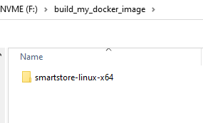
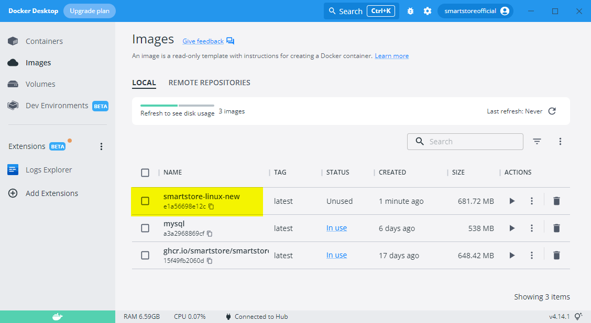

# Modifiziertes Docker-Image erstellen

### Software-Voraussetzungen

- Installiertes Docker oder Docker Desktop
- Ausführen von Shell-Skripten

Nehmen wir an, wir möchten das [Smartstore Community Edition Docker Image](https://github.com/smartstore/Smartstore/pkgs/container/smartstore-linux) verwenden, haben aber ein selbst entwickeltes Plugin oder ein Plugin eines Drittanbieters, das wir ebenfalls verwenden möchten. Wie bekommen wir das neue Plugin in das Docker-Image?

> [!INFO]
> Das Beispiel wird unter Windows ausgeführt, aber unter Linux wird es ähnlich sein.

### Download der Community Edition

Wir laden die Smartstore Community Edition von [GitHub](https://github.com/smartstore/Smartstore/releases) herunter. Es ist wichtig, dass die Versionen des Smartstore Releases und des Plugins identisch sind.

Für das Docker-Image benötigen wir die Linux-Version von Smartstore.


Wir **erstellen einen Unterordner**, der Name ist nicht relevant, ich habe den Ordner einfach `build_my_docker_image` genannt. Hier **erstellen wir einen weiteren Ordner** namens `smartstore-linux-x64` und **entpacken den Inhalt der Datei** in diesen Ordner.



Wir **platzieren unser eigenes oder fremdes Plugin** im Ordner `\Modules` im Ordner `\smartstore-linux-x64`. **Nicht als Zip-Datei, sondern entpackt**.


Nun benötigen wir die **Dockerdatei** und die **Skriptdatei** mit den Anweisungen zur **Erstellung des Docker-Images**.

Wir **erstellen eine leere Textdatei** im Ordner `\build_my_docker_image` mit dem Dateinamen `Dockerfile` (ohne Erweiterung, nur Dockerfile), **kopieren den folgenden Inhalt hinein** und **speichern die Datei**.

```
# -----------------------------------------------------------
# Creates a Docker image from an existing build artifact
# -----------------------------------------------------------

ARG ASPNET_TAG=7.0

FROM mcr.microsoft.com/dotnet/aspnet:${ASPNET_TAG}
EXPOSE 80
EXPOSE 443
ENV ASPNETCORE_URLS "http://+:80;https://+:443"

# Copy
ARG SOURCE=/smartstore-linux-x64

WORKDIR /app
COPY ${SOURCE} ./

# Install wkhtmltopdf
RUN apt update &&\
	apt -y install wget &&\
	wget https://github.com/wkhtmltopdf/packaging/releases/download/0.12.6-1/wkhtmltox_0.12.6-1.buster_amd64.deb &&\ 
	apt -y install ./wkhtmltox_0.12.6-1.buster_amd64.deb &&\
	rm ./wkhtmltox_0.12.6-1.buster_amd64.deb

ENTRYPOINT ["./Smartstore.Web", "--urls", "http://0.0.0.0:80"]
```

Wir wiederholen das Ganze für die Datei `dockerize.linux.nobuild.sh`. Wir erstellen also eine neue Textdatei, kopieren den folgenden Inhalt hinein und speichern die Datei.

```
docker build -t smartstore-linux-image -f Dockerfile .
echo 'Press enter to exit...'; read dummy;
```

Mit dem Schalter `-t` wird das Image "**getaggt**", d.h. mit einem Namen versehen. Diese können **nach Belieben geändert** werden.

Das Ergebnis sollte wie folgt aussehen:


Durch **Ausführen** der Datei `dockerize.linux.nobuild.sh` können wir **das neue Image erstellen**.

