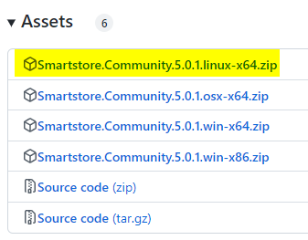
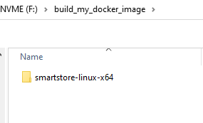
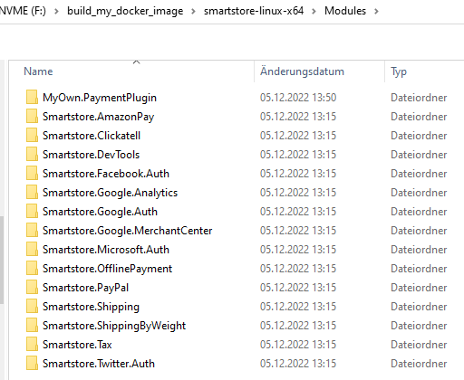
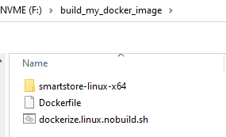
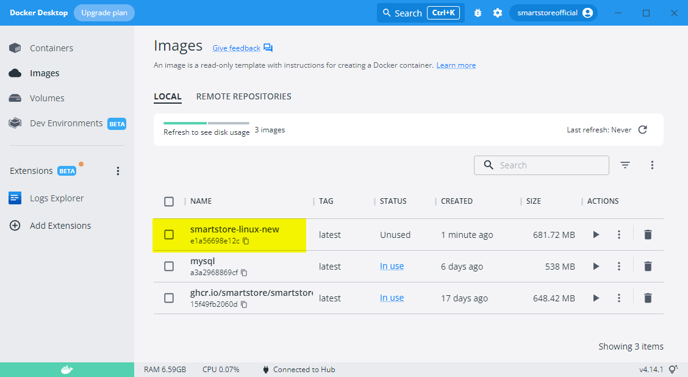

# Modifiziertes Docker-Image erstellen

### Softwarevoraussetzungen

* Docker Engine oder Docker Desktop ist installiert und gestartet.
* Das Linux-x64-Artefakt eines bestimmten Smartstore-Releases wurde heruntergeladen.
* Das Plugin liegt vollständig entpackt vor und ist mit diesem Smartstore-Release kompatibel.
* Unter Windows steht eine Shell wie Git Bash oder WSL zum Ausführen des Skripts zur Verfügung.

Mit diesem Ablauf erstellen Sie aus einem offiziellen [Smartstore Community Edition Docker Image](https://github.com/smartstore/Smartstore/pkgs/container/smartstore-linux) und einem zusätzlichen Plugin ein eigenes Docker-Image. Prüfen Sie vorab die Plugin-Lizenz, erforderliche Abhängigkeiten und die unterstützte Smartstore-Version.


Das Beispiel wird unter Windows mit einer Unix-kompatiblen Shell ausgeführt. Unter Linux ist das Vorgehen identisch.


### Smartstore und Plugin vorbereiten

Laden Sie die passende Smartstore Community Edition von [GitHub](https://github.com/smartstore/Smartstore/releases) herunter. Verwenden Sie für Smartstore, Dockerdateien und Plugin denselben kompatiblen Releasestand.

Für das Docker-Image benötigen Sie das Linux-x64-Artefakt von Smartstore.



1. Erstellen Sie den Arbeitsordner `build_my_docker_image`.
2. Erstellen Sie darin den Unterordner `smartstore-linux-x64`.
3. Entpacken Sie das Smartstore-Linux-x64-Artefakt vollständig in diesen Unterordner.



Entpacken Sie das Plugin in den Ordner `smartstore-linux-x64/Modules`. Legen Sie dort den vollständigen Pluginordner ab, nicht die ZIP-Datei.



### Dockerdateien erstellen

Kopieren Sie zusätzlich `install-wkhtmltopdf.sh` aus dem Quellarchiv desselben Smartstore-Releases in den Ordner `build_my_docker_image`. Das Skript installiert die native Bibliothek, die Smartstore für die PDF-Erzeugung benötigt.

Erstellen Sie anschließend in diesem Ordner eine Datei namens `Dockerfile`. Das folgende Beispiel verwendet ASP.NET Core 10. Prüfen Sie beim nächsten Smartstore-Release, ob der Runtime-Tag weiterhin zum Release passt.

```
# Creates a Docker image from an existing Smartstore Linux artifact
ARG ASPNET_TAG=10.0

FROM mcr.microsoft.com/dotnet/aspnet:${ASPNET_TAG}
EXPOSE 80
EXPOSE 443
ENV ASPNETCORE_URLS="http://+:80;https://+:443"

WORKDIR /app
COPY smartstore-linux-x64 ./

COPY install-wkhtmltopdf.sh /tmp/
RUN chmod +x /tmp/install-wkhtmltopdf.sh && \
    /tmp/install-wkhtmltopdf.sh && \
    rm /tmp/install-wkhtmltopdf.sh

ENTRYPOINT ["./Smartstore.Web", "--urls", "http://0.0.0.0:80"]
```

Erstellen Sie anschließend im selben Ordner die Datei `dockerize.linux.nobuild.sh`. Ersetzen Sie `<SMARTSTORE-VERSION>` durch die Version des verwendeten Artefakts.

```
docker build \
  -t smartstore-linux-custom:<SMARTSTORE-VERSION> \
  -f Dockerfile .
```

Der Schalter `-t` vergibt einen eindeutigen Namen und Tag. Verwenden Sie für jeden Smartstore- oder Pluginstand einen neuen Tag, damit Builds unterscheidbar und reproduzierbar bleiben.

Der Arbeitsordner sollte anschließend wie folgt aussehen:



### Image erstellen und prüfen

Führen Sie `dockerize.linux.nobuild.sh` im Ordner `build_my_docker_image` aus. Prüfen Sie danach mit `docker image ls smartstore-linux-custom`, ob das neue Image mit dem erwarteten Tag vorhanden ist.



Starten Sie das Image zunächst in einer Testumgebung und prüfen Sie, ob Smartstore und das Plugin geladen werden. Für eine vollständige Installation benötigen Sie außerdem eine erreichbare Datenbank und persistent eingebundene Shopdaten. Bei einem Smartstore- oder Plugin-Update erstellen und testen Sie ein neues Image; verändern Sie keinen bereits laufenden Container nachträglich.
