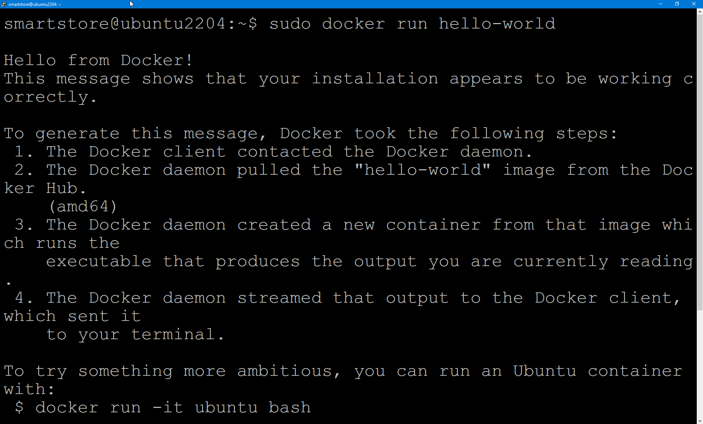
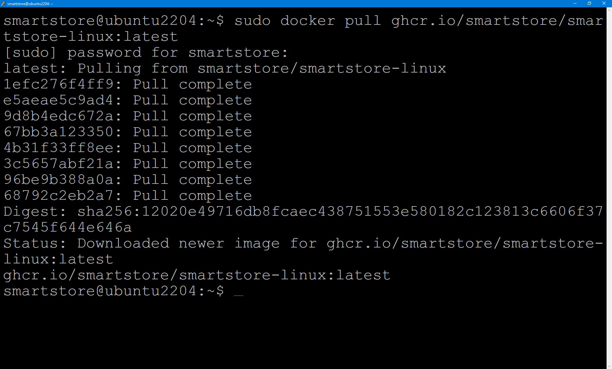
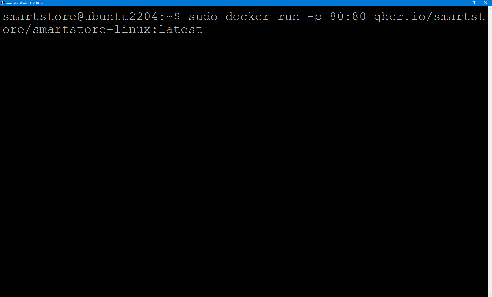

# Smartstore Docker-Images unter Linux ausführen

## Docker-Engine auf Ubuntu installieren

Installieren Sie die Docker-Engine gemäß den Anweisungen unter [https://docs.docker.com/engine/install/ubuntu/](https://docs.docker.com/engine/install/ubuntu/). Verwenden Sie anschließend den folgenden Befehl, um zu prüfen, ob die Docker-Engine korrekt installiert ist:

`sudo docker run hello-world`

Mit dem folgenden Befehl laden Sie das aktuelle Smartstore-Docker-Image von [https://github.com/orgs/smartstore/packages](https://github.com/orgs/smartstore/packages) herunter.

`sudo docker pull ghcr.io/smartstore/smartstore-linux:latest`

Anschließend können Sie das Image ausführen. Dabei wird der Container-Port 80 auf den lokalen Port 80 abgebildet.

`sudo docker run -p 80:80 ghcr.io/smartstore/smartstore-linux`

Öffnen Sie einen beliebigen Browser und geben Sie **localhost** oder die **lokale IP-Adresse** in die Adresszeile ein. Die Installationsstartseite von Smartstore öffnet sich.

Jetzt können Sie Smartstore installieren. Dazu benötigen Sie jedoch noch eine erreichbare MS-SQL-Server- oder MySQL-Instanz. Wenn Sie die Datenbankinstanz zusammen mit Smartstore als Docker-Container ausführen möchten, gehen Sie wie [hier](smartstore-und-datenbank-zusammen-als-docker-container-betreiben.md) vor.
