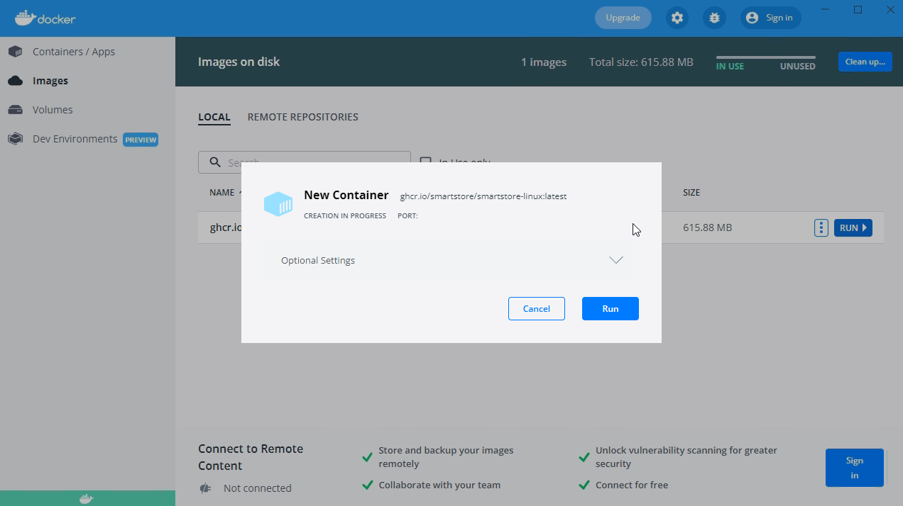
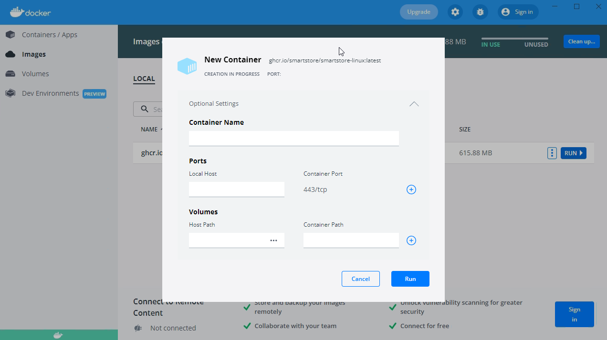
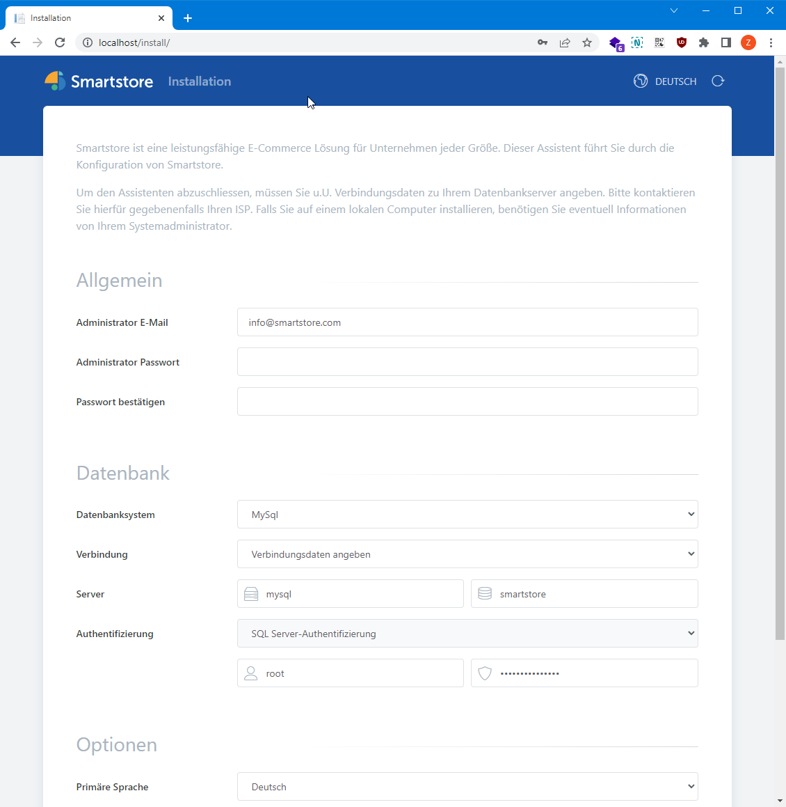

# Smartstore Docker-Images unter Windows ausführen

Es gibt mehrere Möglichkeiten, Docker-Images unter Windows auszuführen. Am einfachsten geht dies mit Docker Desktop für Windows.

Laden Sie [Docker Desktop für Windows](https://www.docker.com/products/docker-desktop/) herunter und installieren Sie die Anwendung.

Öffnen Sie mit der Tastenkombination `Windows-Taste + R` das Dialogfeld **Ausführen**, geben Sie `cmd` ein und bestätigen Sie mit der `Eingabetaste`.

Geben Sie den folgenden Befehl in die Befehlszeile ein und bestätigen Sie die Ausführung mit der `Eingabetaste`:

`docker pull ghcr.io/smartstore/smartstore-linux:latest`

Das Smartstore-Docker-Image ist nun in Docker Desktop unter **Images** verfügbar. Um das Image zu starten, bewegen Sie den Mauszeiger über den Eintrag und klicken Sie rechts auf **Run**.

Der Dialog zum Erstellen eines neuen Containers wird geöffnet:

Klicken Sie auf den Abwärtspfeil, um die optionalen Einstellungen einzublenden. Klicken Sie anschließend auf das Pluszeichen und ordnen Sie den lokalen Port 80 dem Container-Port 80 zu.

Starten Sie den Container mit einem Klick auf **Run**.

Öffnen Sie einen beliebigen Browser und geben Sie `localhost` oder die lokale IP-Adresse in die Adresszeile ein. Daraufhin wird die Startseite der Smartstore-Installation geöffnet.

