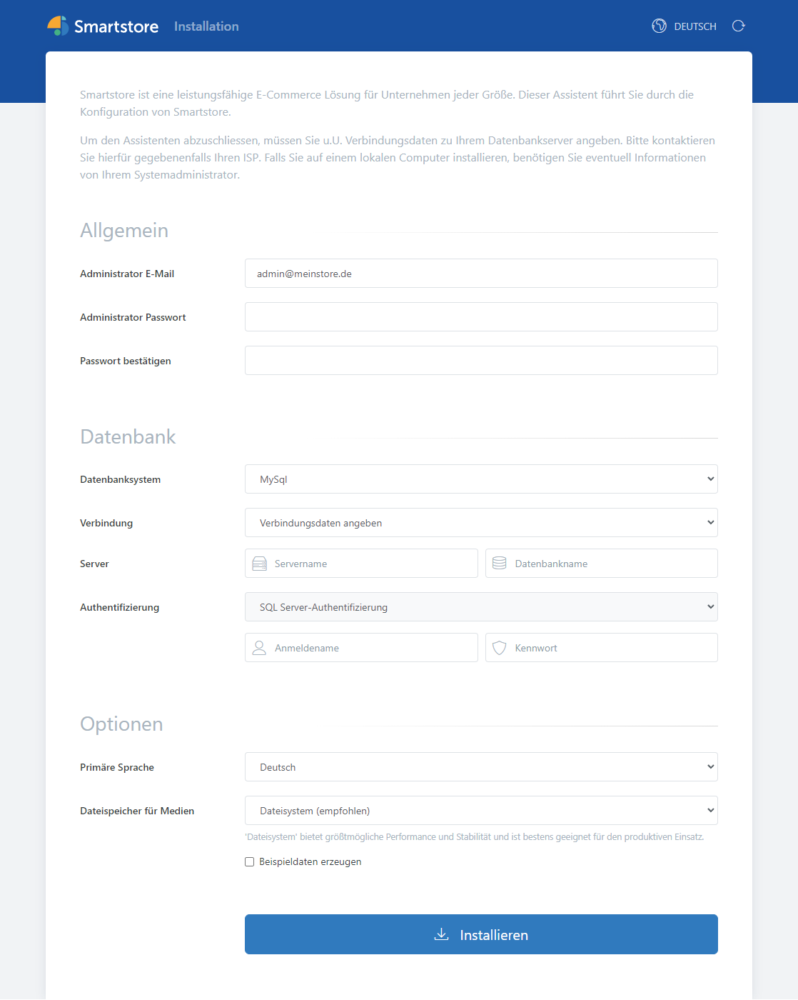

# Smartstore installieren

Öffnen Sie die Smartstore-Installationsseite, indem Sie `<Server-IP>` oder `localhost` in die Adresszeile Ihres Browsers eingeben.

Oben rechts auf der Seite können Sie die _Sprache_ ändern, _die für die Installation verwendet werden soll_.

Unten auf der Seite können Sie die _Sprache des installierten Shops auswählen_. Weitere Sprachen können nach der Installation im Backend hinzugefügt werden.

| **Feldname**             | **Beschreibung**                                                                                                                                                                                                                                                                                                                                                                                                                                                                                                                                          |
| ------------------------ | --------------------------------------------------------------------------------------------------------------------------------------------------------------------------------------------------------------------------------------------------------------------------------------------------------------------------------------------------------------------------------------------------------------------------------------------------------------------------------------------------------------------------------------------------------- |
| Administrator E-Mail     | Die E-Mail-Adresse des Admin-Benutzers.                                                                                                                                                                                                                                                                                                                                                                                                                                                                                                                   |
| Administrator Passwort   | Das Kennwort des Admin-Benutzers.                                                                                                                                                                                                                                                                                                                                                                                                                                                                                                                         |
| Passwort bestätigen      | Bestätigen Sie das Kennwort des Admin-Benutzers.                                                                                                                                                                                                                                                                                                                                                                                                                                                                                                          |
| Datenbanksystem          | Wählen Sie hier das Zieldatenbanksystem aus. Derzeit werden MS SQL Server und MySQL unterstützt.                                                                                                                                                                                                                                                                                                                                                                                                                                                          |
| Verbindung               | 
Wählen Sie hier, ob Sie die Verbindungsdaten einzeln oder als Connectionstring eingeben möchten.  <strong>Beispiel:</strong> <em>MS-SQL-Server-Daten einzeln:</em> Servername: mssqlexpress Datenbankname: smartstore SQL-Server-Authentifizierung Anmeldename: dbuser_smartstore Kennwort: smartstore  <em>Connectionstring:</em> DataConnectionString: Data Source=mssqlexpress;Initial Catalog=smartstore;Integrated Security=False;Persist Security Info=False;User ID=dbuser_smartstore;Password=smartstore;
 |
| Servername               | Geben Sie hier den Namen oder die IP-Adresse ein (je nachdem, wie der Datenbankserver erreicht werden kann und eingerichtet ist).                                                                                                                                                                                                                                                                                                                                                                                                                         |
| Datenbankname            | Geben Sie hier den Namen der Datenbank ein. Falls noch keine Datenbank mit diesem Namen vorhanden ist, wird sie erstellt.                                                                                                                                                                                                                                                                                                                                                                                                                                 |
| Authentifizierung        | Wählen Sie aus, wie die Authentifizierung am Datenbankserver erfolgen soll. Je nach Datenbankserver und Betriebssystem stehen unterschiedliche Optionen zur Verfügung.                                                                                                                                                                                                                                                                                                                                                                                    |
| Anmeldename              | Geben Sie hier den Benutzernamen für die Authentifizierung am Datenbankserver ein.                                                                                                                                                                                                                                                                                                                                                                                                                                                                        |
| Kennwort                 | Geben Sie hier das Kennwort für die Authentifizierung am Datenbankserver für die Datenbank ein.                                                                                                                                                                                                                                                                                                                                                                                                                                                           |
| Primäre Sprache          | Wählen Sie hier die Hauptsprache des Shops. Sie können nach der Installation weitere Sprachen hinzufügen und auch die primäre Sprache ändern.                                                                                                                                                                                                                                                                                                                                                                                                             |
| Dateispeicher für Medien | Wählen Sie aus, wo die Mediendateien gespeichert werden sollen.                                                                                                                                                                                                                                                                                                                                                                                                                                                                                           |
| Beispieldaten erzeugen   | Wählen Sie aus, ob Demodaten erstellt werden sollen. Die Demodaten umfassen einige Produkte, Kategorien, Hersteller usw.                                                                                                                                                                                                                                                                                                                                                                                                                                  |

Wenn Sie die vollständigen Datenbankinformationen eingegeben haben, klicken Sie auf **„Installieren“**. Bestätigen Sie anschließend in der angezeigten Meldung, dass Sie die Installation starten möchten. Nachdem Sie bestätigt haben, beginnt Smartstore mit der Installation Ihres Shops. Sobald die Datenbank erstellt und alle Plugins installiert wurden, ist die Installation abgeschlossen und eine Erfolgsmeldung wird angezeigt.
