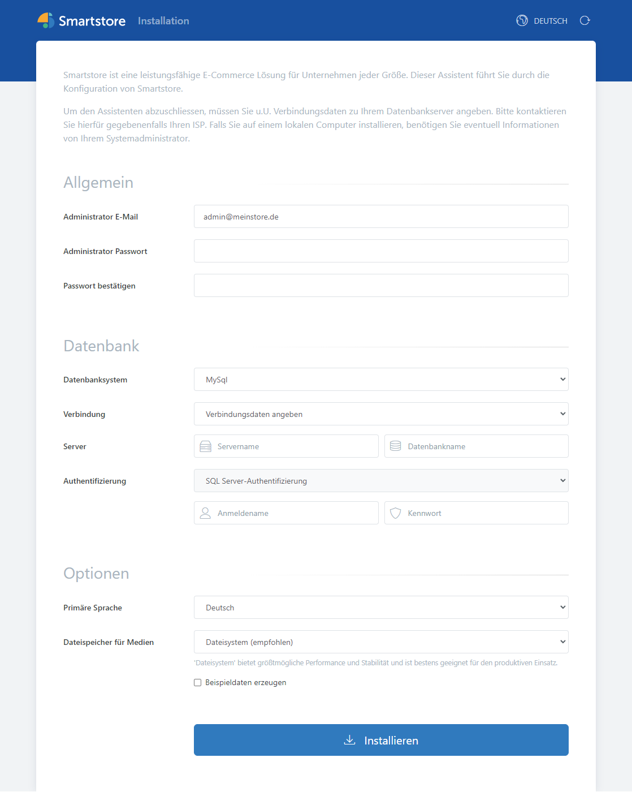

# Smartstore installieren

Rufen Sie die Webadresse Ihres Shops auf. Alternativ können Sie `<Server-IP>` verwenden. `localhost` funktioniert nur, wenn der Browser auf demselben Server läuft. Geben Sie gegebenenfalls den konfigurierten Port an.

Oben rechts auf der Seite können Sie die _Sprache_ ändern, _die für die Installation verwendet werden soll_.

Unten auf der Seite können Sie die _Sprache des installierten Shops auswählen_. Weitere Sprachen können nach der Installation im Backend hinzugefügt werden.

| **Feldname**             | **Beschreibung**                                                                                                                                                                                                                                                                                                                                                                                                                                                                                                                    |
| ------------------------ | ----------------------------------------------------------------------------------------------------------------------------------------------------------------------------------------------------------------------------------------------------------------------------------------------------------------------------------------------------------------------------------------------------------------------------------------------------------------------------------------------------------------------------------- |
| Administrator E-Mail     | Die E-Mail-Adresse des Admin-Benutzers.                                                                                                                                                                                                                                                                                                                                                                                                                                                                                             |
| Administrator Passwort   | Das Kennwort des Admin-Benutzers.                                                                                                                                                                                                                                                                                                                                                                                                                                                                                                   |
| Passwort bestätigen      | Bestätigen Sie das Kennwort des Admin-Benutzers.                                                                                                                                                                                                                                                                                                                                                                                                                                                                                    |
| Datenbanksystem          | Wählen Sie das Datenbanksystem aus. Zur Auswahl stehen Microsoft SQL Server, MySQL, PostgreSQL und SQLite. SQLite ist für den produktiven Einsatz ungeeignet.                                                                                                                                                                                                                                                                                                                                                                       |
| Verbindung               | 
Wählen Sie hier, ob Sie die Verbindungsdaten einzeln oder als Connectionstring eingeben möchten.  <strong>Beispiel:</strong> <em>MS-SQL-Server-Daten einzeln:</em> Servername: mssqlexpress Datenbankname: smartstore SQL-Server-Authentifizierung Anmeldename: dbuser_smartstore Kennwort: smartstore  <em>Connectionstring:</em> Data Source=mssqlexpress;Initial Catalog=smartstore;Integrated Security=False;Persist Security Info=False;User ID=dbuser_smartstore;Password=smartstore;
 |
| Servername               | Geben Sie hier den Namen oder die IP-Adresse ein (je nachdem, wie der Datenbankserver erreicht werden kann und eingerichtet ist).                                                                                                                                                                                                                                                                                                                                                                                                   |
| Datenbankname            | Geben Sie hier den Namen der Datenbank ein. Falls sie noch nicht vorhanden ist, legt Smartstore sie an, sofern das Datenbankkonto dazu berechtigt ist.                                                                                                                                                                                                                                                                                                                                                                              |
| Authentifizierung        | Bei Microsoft SQL Server wählen Sie zwischen SQL Server- und Windows-Authentifizierung. Bei MySQL und PostgreSQL geben Sie Anmeldename und Kennwort an. SQLite benötigt keine Anmeldung an einem Datenbankserver.                                                                                                                                                                                                                                                                                                                   |
| Anmeldename              | Geben Sie hier den Benutzernamen für die Authentifizierung am Datenbankserver ein.                                                                                                                                                                                                                                                                                                                                                                                                                                                  |
| Kennwort                 | Geben Sie hier das Kennwort für die Authentifizierung am Datenbankserver für die Datenbank ein.                                                                                                                                                                                                                                                                                                                                                                                                                                     |
| Primäre Sprache          | Wählen Sie hier die Hauptsprache des Shops. Sie können nach der Installation weitere Sprachen hinzufügen und auch die primäre Sprache ändern.                                                                                                                                                                                                                                                                                                                                                                                       |
| Dateispeicher für Medien | Wählen Sie aus, wo die Mediendateien gespeichert werden sollen.                                                                                                                                                                                                                                                                                                                                                                                                                                                                     |
| Beispieldaten erzeugen   | Wählen Sie aus, ob Demodaten erstellt werden sollen. Die Demodaten umfassen einige Produkte, Kategorien, Hersteller usw.                                                                                                                                                                                                                                                                                                                                                                                                            |

Wenn Sie die vollständigen Datenbankinformationen eingegeben haben, klicken Sie auf **„Installieren“**. Bestätigen Sie die Rückfrage. Smartstore richtet die Datenbank und den Shop ein. Nach erfolgreichem Abschluss erscheint ein Hinweis; anschließend wird der Shop gestartet und die Startseite geöffnet.
