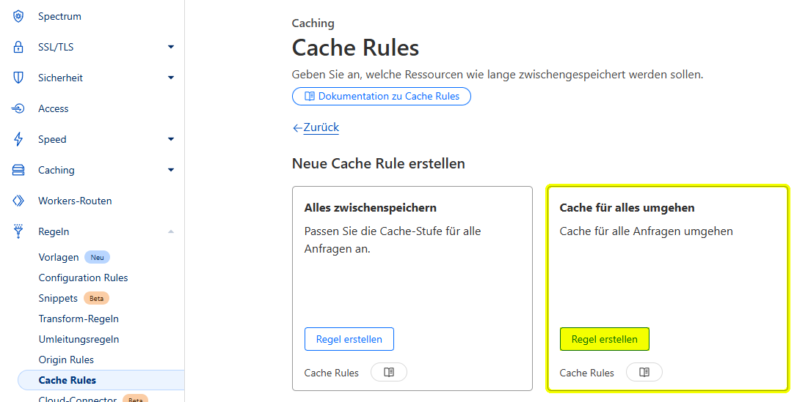
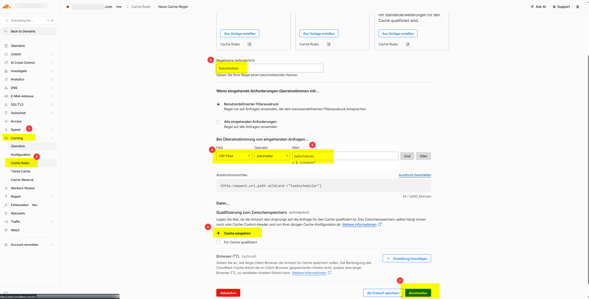
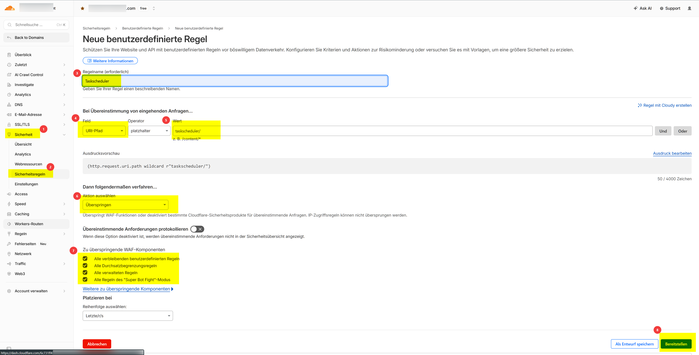

# Cloudflare

Cloudflare kann als Reverse-Proxy vor Smartstore betrieben werden und bietet Schutz vor Bots, DDoS-Angriffen sowie zusätzliche Performance-Optimierungen. Damit Smartstore und Cloudflare optimal zusammenarbeiten, sind einige Konfigurationsschritte erforderlich. Auf dieser Seite finden Sie die empfohlenen Einstellungen.

## Vorteile

Der Einsatz von Cloudflare bietet unter anderem folgende Vorteile:

* Schutz vor Bot- und DDoS-Angriffen
* Filterung schädlicher Anfragen
* Verbesserte Performance durch das globale Cloudflare-Netzwerk
* SSL/TLS-Terminierung und zusätzliche Sicherheitsfunktionen

## Cache-Regeln konfigurieren

Bei aktivierter Cloudflare-Nutzung sollte das Caching entsprechend konfiguriert werden, um Darstellungsprobleme zu vermeiden.

Cloudflare kann standardmäßig CSS-Dateien und andere statische Inhalte zwischenspeichern. Nach Änderungen am Shop können dadurch veraltete Stylesheets ausgeliefert werden, sodass Designänderungen nicht sofort sichtbar sind.

Erstellen Sie deshalb eine Cache-Regel, welche das Zwischenspeichern der entsprechenden Inhalte verhindert.

1. Öffnen Sie in Cloudflare **Regeln → Cache Rules**.
2. Erstellen Sie eine neue Regel.
3. Wählen Sie **Cache für alles umgehen**.
4. Speichern Sie die Regel.



Dadurch werden stets die aktuellen Dateien vom Webserver geladen, während die übrigen Cloudflare-Funktionen weiterhin zur Verfügung stehen.

## Task Scheduler zulassen

Cloudflare darf die automatisierten Aufgaben von Smartstore nicht blockieren.

Stellen Sie sicher, dass folgende URLs unverändert an den Shop weitergeleitet werden:

* `https://www.meinshop.com/taskscheduler`
* `https://www.meinshop.com/taskscheduler/poll`


Ersetzen Sie `https://www.meinshop.com` durch die URL Ihres Shops.


Die folgenden Beispiele zeigen die erforderliche Konfiguration in Cloudflare.





## Echte Client-IP übernehmen

Nach der Aktivierung von Cloudflare wird im Shop nicht mehr die IP-Adresse des Besuchers angezeigt. Stattdessen erscheint die IP-Adresse eines Cloudflare-Servers.

### Ursache

Die Standardkonfiguration von Smartstore ist für allgemeine Reverse-Proxy-Szenarien ausgelegt. Sie funktioniert insbesondere dann, wenn sich der Reverse Proxy lokal befindet oder bereits als vertrauenswürdig eingestuft ist.

Da Cloudflare als öffentlicher Reverse Proxy vor dem Shop betrieben wird, übernimmt Smartstore die Client-IP aus den Forwarded-Headern nur, wenn die Cloudflare-IP-Netzwerke explizit als vertrauenswürdig konfiguriert sind. Fehlen diese Einträge unter `ReverseProxy:KnownNetworks`, wird weiterhin die Cloudflare-IP als Remote-Adresse verwendet.

Cloudflare unterstützt zwar den Header `X-Forwarded-For`, empfohlen wird jedoch die Verwendung von `CF-Connecting-IP` als `ForwardedForHeaderName`, da dieser Header eindeutig die ursprüngliche Besucher-IP enthält.

### Konfiguration

Erstellen Sie im Web-Ordner einen Unterordner `Config` (falls noch nicht vorhanden) und legen Sie darin die Datei `usersettings.json` an.

```json
{
  "Smartstore": {
    "ReverseProxy": {
      "Enabled": true,

      "ForwardForHeader": true,
      "ForwardProtoHeader": true,
      "ForwardHostHeader": true,
      "ForwardPrefixHeader": false,

      "ForwardedForHeaderName": "CF-Connecting-IP",
      "ForwardedProtoHeaderName": "X-Forwarded-Proto",
      "ForwardedHostHeaderName": "X-Forwarded-Host",
      "ForwardedPrefixHeaderName": null,

      "KnownProxies": null,
      "KnownNetworks": [
        "103.21.244.0/22",
        "103.22.200.0/22",
        "103.31.4.0/22",
        "104.16.0.0/13",
        "104.24.0.0/14",
        "108.162.192.0/18",
        "131.0.72.0/22",
        "141.101.64.0/18",
        "162.158.0.0/15",
        "172.64.0.0/13",
        "173.245.48.0/20",
        "188.114.96.0/20",
        "190.93.240.0/20",
        "197.234.240.0/22",
        "198.41.128.0/17",
        "2400:cb00::/32",
        "2606:4700::/32",
        "2803:f800::/32",
        "2405:b500::/32",
        "2405:8100::/32",
        "2a06:98c0::/29",
        "2c0f:f248::/32"
      ],

      "AllowedHosts": [
        "www.meinshop.com",
        "meinshop.com"
      ],

      "ForwardLimit": null,
      "RequireHeaderSymmetry": false
    }
  }
}
```


Tragen Sie unter `AllowedHosts` die Hostnamen Ihres Shops ein. Bei Multishop-Installationen müssen alle verwendeten Hostnamen aufgeführt werden.



Rufen Sie für eine stets aktuelle Liste mit bekannten Cloudflare-`KnownNetworks` [https://www.cloudflare.com/ips-v4](https://www.cloudflare.com/ips-v4) bzw. [https://www.cloudflare.com/ips-v6](https://www.cloudflare.com/ips-v6) auf.


Nach dem Anlegen der Konfiguration und einem Neustart der Anwendung übernimmt Smartstore die tatsächliche Besucher-IP aus dem `CF-Connecting-IP`-Header, sofern die Anfrage über ein als vertrauenswürdig konfiguriertes Cloudflare-IP-Netz eingeht.
