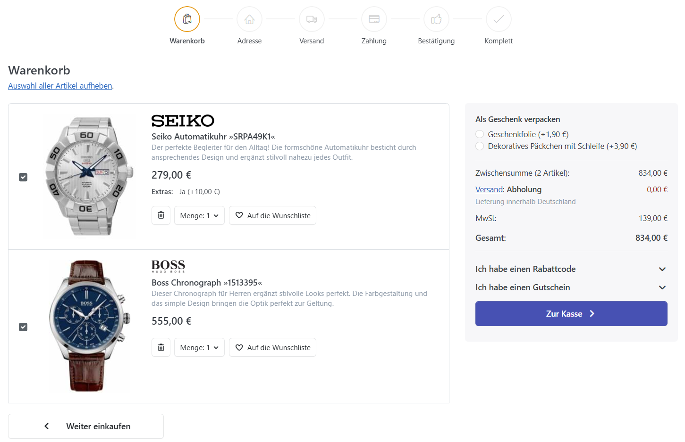
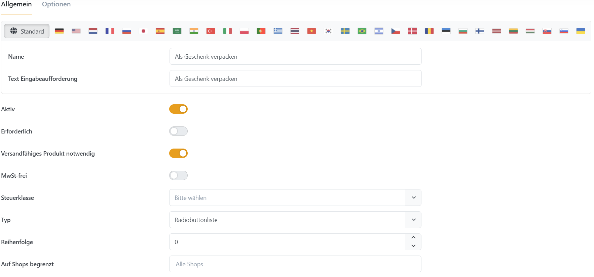

# Checkout Attribute verwalten

Checkout-Attribute erfassen zusätzliche Angaben oder kostenpflichtige Optionen für den gesamten Warenkorb. Sie verwalten sie unter **Katalog > Checkout Attribute**.

## Anwendungsszenario

Verkaufen Sie häufig Produkte, die verschenkt werden, können Sie beispielsweise eine systemweite Geschenkverpackung anbieten. Ein **Checkout-Attribut** erscheint bereits in der Warenkorbübersicht, sodass Kunden die Option vor Beginn des eigentlichen Checkout-Vorgangs auswählen können.

## Ein Checkout Attribut erstellen

Konfigurieren Sie zunächst das Checkout-Attribut und legen Sie anschließend die auswählbaren Werte fest. Diese Werte stehen Kunden im Checkout zur Verfügung.

### Allgemein Eigenschaften

| **Feld**                          | **Beschreibung**                                                                                   |
| --------------------------------- | -------------------------------------------------------------------------------------------------- |
| Name                              | Der Name des Checkout-Attributs.                                                                   |
| Anzeigename                       | Anzeigename.                                                                                       |
| Aktiv                             | Legt fest, ob das Checkout-Attribut in Ihrem Shop aktiv ist.                                       |
| Erforderlich                      | Legt fest, ob ein Kunde einen Wert angeben muss, bevor der Bestellprozess fortgesetzt werden kann. |
| Versandfertiges Produkt notwendig | Legt fest, ob zur Anzeige des Attributs versandfähige Produkte im Warenkorb liegen müssen.         |
| MwSt.-frei                        | Bestimmt, ob diese Option steuerfrei ist (beim Checkout an der Kasse wird keine Steuer berechnet)  |
| Typ                               | Bestimmt den Steuerelementtyp für die Erfassung der Attribut-Werte.                                |
| Reihenfolge                       | Legt die Anzeige-Priorität fest (1 steht für das erste Element in der Liste)                       |

### Attribut-Wert Eigenschaften

| **Feld**           | **Beschreibung**                                                                                                         |
| ------------------ | ------------------------------------------------------------------------------------------------------------------------ |
| Name               | Der Name des Checkout-Attributwerts.                                                                                     |
| Preis anpassen     | Die Preisanpassung, die durchgeführt wird, wenn man diesen Attributwert auswählt, z. B. „10“, um 10 Dollar hinzuzufügen. |
| Gewicht anpassen   | Die Gewichtsanpassung, die durchgeführt wird, wenn man diesen Attributwert auswählt.                                     |
| Ist Voreinstellung | Legt fest, ob dieser Attributwert für den Kunden vorausgewählt wird.                                                     |
| Reihenfolge        | Die Anzeigenreihenfolge des Attributwerts. 1 steht für das erste Objekt in der Attributwertliste.                        |
