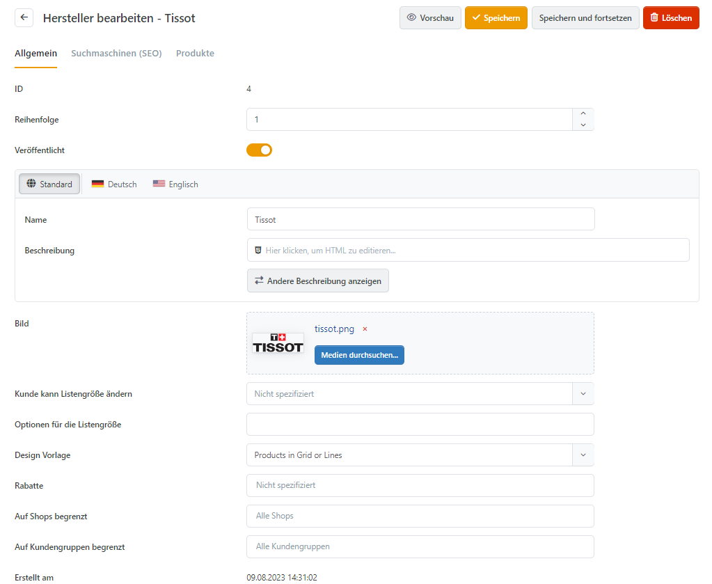

# Hersteller verwalten

Hersteller lassen sich Produkten zuordnen und auf der Produktdetailseite anzeigen. Jeder Hersteller erhält außerdem eine eigene Seite mit Beschreibung und zugeordneten Produkten. Eine nach Reihenfolge sortierte Auswahl wichtiger Hersteller kann auf der Startseite erscheinen. Kunden können den Katalog zudem nach Herstellern filtern; weitere Informationen dazu finden Sie unter [Mit dem Filter Sidebar Widget arbeiten](produkte-verwalten/mit-dem-filter-sidebar-widget-arbeiten.md).

Öffnen Sie **Admin > Katalog > Hersteller**, um Hersteller anzulegen oder zu bearbeiten. Über **Bearbeiten** gelangen Sie zur jeweiligen Detailansicht.

## Allgemein

| **Eingabefeld**               | **Beschreibung**                                                                      |
| ----------------------------- | ------------------------------------------------------------------------------------- |
| Rabatte                       | Legt auf das Objekt anzuwendende Rabatte fest.                                        |
| Auf Shop begrenzt             | Legt fest, ob der Eintrag nur für bestimmte Shops verfügbar ist.                      |
| Design Vorlage                | Bestimmt eine Vorlage, mit der der Hersteller und seine Produkte dargestellt werden.  |
| Kunde kann Listengröße ändern | Kunden können die Listengröße mithilfe einer vorgegebenen Optionsliste ändern.        |
| Listengröße                   | Listengröße für Produkte dieses Herstellers festlegen (z. B. '12' Produkte pro Seite) |
| Reihenfolge                   | Legt die Anzeige-Priorität fest (1 steht bspw. für das erste Element in der Liste)    |

## Suchmaschinen (SEO)

| **Eingabefeld**  | **Beschreibung**                                                                                                                                                         |
| ---------------- | ------------------------------------------------------------------------------------------------------------------------------------------------------------------------ |
| Meta Keywords    | Meta-Schlüsselwörterliste, kommagetrennt. Wird von Suchmaschinen ausgewertet.                                                                                            |
| Meta Description | Meta-Beschreibung. Wird von Suchmaschinen ausgewertet.                                                                                                                   |
| Meta Title       | Überschreibt den Seitentitel. Standard ist der Herstellername.                                                                                                           |
| URL Alias        | Legt einen suchmaschinenfreundlichen Seitennamen für den Hersteller fest. 'Super Hersteller' resultiert bspw. in '\~/super-hersteller'. Standard ist der Herstellername. |

## Produkte

Diese Registerkarte listet alle dem Hersteller zugeordneten Produkte auf. Über **Produkt hinzufügen** ergänzen Sie weitere Produkte.

## Rabatte

Bereits eingerichtete Rabatte können Sie dem Hersteller zuordnen. Weitere Informationen finden Sie unter [Mit Rabatten arbeiten](../../benutzer-handbuch/marketing-promotion/rabatte-verwalten.md).

## Shops

Über **Auf Shops begrenzt** ordnen Sie den Hersteller einem oder mehreren Shops zu. Weitere Informationen finden Sie unter [Mit mehreren Shops arbeiten](../../benutzer-handbuch/allgemeine-konzepte/mit-mehreren-shops-arbeiten.md).
