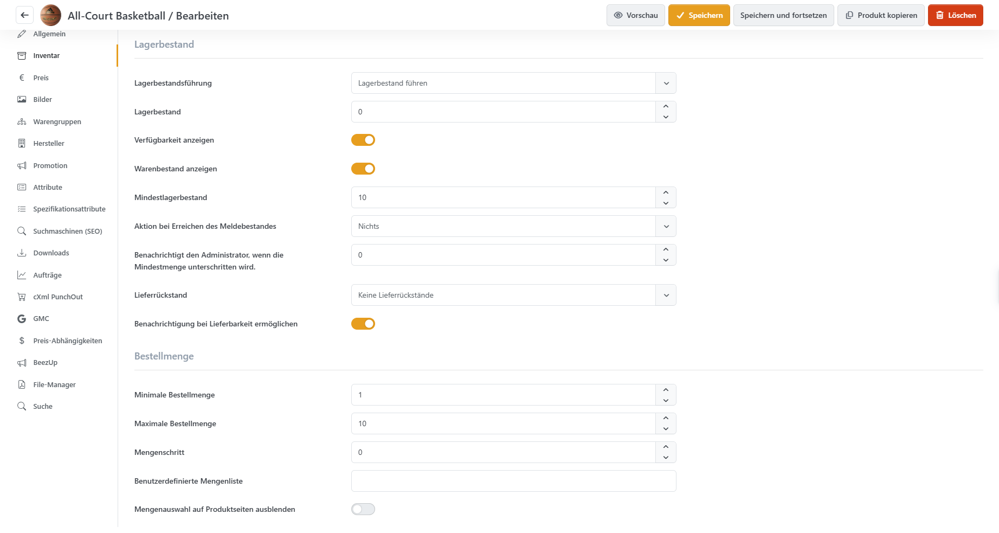
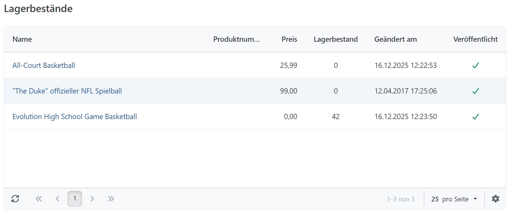

# Lagerbestände ansehen

Smartstore kann Lagerbestände nach einem Kauf automatisch aktualisieren und bei Unterschreitung eines festgelegten Werts konfigurierte Aktionen ausführen, beispielsweise den Kauf-Button deaktivieren. Eine automatisch erzeugte Übersicht zeigt Ihnen, welche Produkte nachbestellt werden müssen.

Die Übersicht öffnen Sie über **Katalog > Lagerbestände** navigieren. Hier werden alle Produkte dargestellt, bei denen **Lagerbestand führen** aktiviert ist und der **Mindestlagerbestand** den gegenwärtigen **Lagerbestand** übersteigt. Diese Einstellungen können in der Registerkarte [Inventar](produkte-verwalten/lagerbestand-fuhren.md) für das jeweilige Produkt konfiguriert werden.

