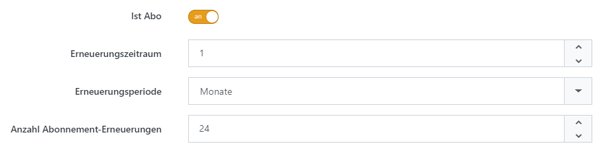

# Mit Abonnements umgehen

Mit Abonnements verkaufen Sie Produkte, die in festgelegten Abständen bezahlt und ausgeliefert werden.

## Anwendungsszenario

Angenommen, Ihr Buchladen verkauft ein Zeitschriftenabonnement, das regelmäßig bezahlt und ausgeliefert wird. Aktivieren Sie dafür die Option **Ist Abo** auf der Registerkarte **Allgemein** der Produktkonfiguration. Wählen Sie anschließend die Zeiteinheit (**Erneuerungsperiode**), legen Sie die Dauer (**Erneuerungszeitraum**) fest und geben Sie die Anzahl der **Abonnement-Erneuerungen** ein. Für ein sechsmonatiges, monatlich erscheinendes Magazin setzen Sie den **Erneuerungszeitraum** auf 1, die **Erneuerungsperiode** auf _Monat_ und die Anzahl der **Abonnement-Erneuerungen** auf 6.

Für weitere Informationen zur Produktkonfiguration lesen Sie bitte [Produkte erstellen und bearbeiten](produkte-erstellen-und-bearbeiten.md). Für weitere Informationen zum Umgang mit wiederkehrenden Zahlungen lesen Sie bitte [Wiederkehrende Zahlungen verwalten](../../verkauf/wiederkehrende-zahlungen-verwalten.md).
