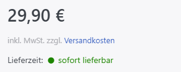
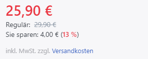
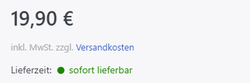
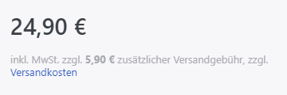
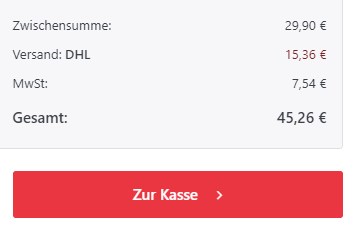
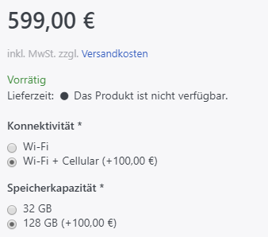
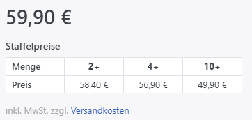

# Preisregeln verstehen

Der im Shop angezeigte Produktpreis entsteht aus mehreren Einstellungen. Ausgangspunkt ist der Preis in der Registerkarte [Preis](produktpreis-festlegen.md); weitere Regeln können ihn überschreiben oder ergänzen.

## Preis

Der unter [Produktdetails](produktpreis-festlegen.md) in der Registerkarte **Preis** eingetragene Wert bildet den Ausgangspreis.

Im selben Bereich können Sie einen **Alten Preis** hinterlegen. Dieser wird durchgestrichen neben dem aktuellen Preis angezeigt.

## Aktionspreis

Ein **Aktionspreis** ersetzt innerhalb des festgelegten Gültigkeitszeitraums den regulären Preis.

## Transportzuschlag

Den **Transportzuschlag** hinterlegen Sie unter [Produktdetails](produkte-erstellen-und-bearbeiten.md) in der Registerkarte **Allgemein**. Er wird bei der Versandauswahl und in der Auftragszusammenfassung zusätzlich zu den Versandkosten ausgewiesen.

## Produktattribute

Für Produktattributwerte können Sie eine positive oder negative **Preisanpassung (Mehr-/Minderpreis)** festlegen. Sie wird zum aktuellen Preis addiert oder davon abgezogen.

Alternativ können Sie für eine Attributkombination einen Fixpreis festlegen. Dieser überschreibt den Ausgangspreis, sofern keine **Preisanpassung** für einzelne Attributwerte definiert ist.

## Staffelpreise

**Staffelpreise** ersetzen ab der jeweils festgelegten Bestellmenge den Ausgangspreis. So können Sie für größere Mengen günstigere Stückpreise anbieten. Die Einrichtung ist unter [Produktpreis festlegen](produktpreis-festlegen.md) beschrieben.

## Rabatte

**Rabatte** werden auf den Preis angewendet, der sich aus den zuvor beschriebenen Regeln ergibt. Weitere Informationen finden Sie unter [Rabatte verwalten](../../../benutzer-handbuch/marketing-promotion/rabatte-verwalten.md).

## Steuern

Die gewählten Steuereinstellungen beeinflussen ebenfalls den angezeigten Endpreis. Weitere Informationen finden Sie unter [Steuerberechnung einrichten](../../../benutzer-handbuch/konfiguration/steuerberechnung-einrichten.md).

## Grundpreis gemäß PAnGV berechnen

Der Grundpreis gemäß PAngV verändert die Preiskalkulation nicht. Er informiert Kunden über den Preis je vorgegebener Mengeneinheit. Die Konfiguration ist unter [Produktpreis festlegen](produktpreis-festlegen.md) beschrieben.

## PAngV und Omnibus Richtlinie

Seit Mai 2022 sieht die erweiterte PAngV (Preisangabenverordnung) u. a. vor, dass bei der Darstellung von Streichpreisen der niedrigste Verkaufspreis der letzten 30 Tage herangezogen werden muss. Zusätzlich gibt es neue Regeln für Produktrezensionen.\
Smartstore setzt diese neuen Regeln seit der Version 5.x um.
