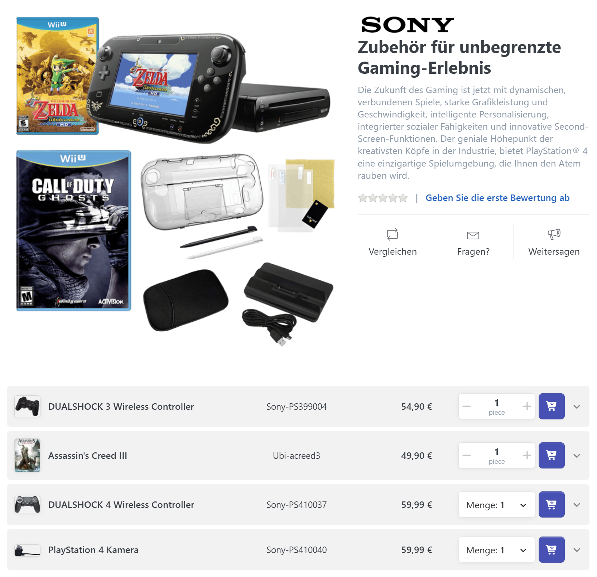

# Wie funktionieren Gruppenprodukte?

Mit Gruppenprodukten präsentieren Sie zusammengehörige Einzelprodukte auf einer gemeinsamen Produktdetailseite. Jedes verknüpfte Produkt bleibt dabei ein eigener Warenkorb-Bestandteil. Das bietet folgende Vorteile:

* Bessere, kundenfreundlichere Strukturierung Ihrer Katalogdaten.
* Leichteres Auffinden ähnlicher Produkte und somit mehr Verkäufe.
* Mehr Verkäufe, wenn der Kunde nützliche, notwendige oder wünschenswerte Produkte auf der gleichen Seite entdeckt.


Wenn Sie ein Einzelprodukt mit einem Gruppenprodukt verbinden, können Sie festlegen, ob das Einzelprodukt **individuell** (oder lediglich auf der Gruppenproduktseite) sichtbar ist. Ein Produkt, das nicht **individuell sichtbar** ist, wird weder in Suchergebnissen noch in Produktlisten von Warengruppen angezeigt.


## Anwendungsszenario

Stellen Sie sich vor, Sie möchten eine Videospielkonsole verkaufen. Wenn jemand daran interessiert ist, diese online zu kaufen, ist er vielleicht auch an folgenden Produkten interessiert:

* Ein oder mehrere Spiele
* Ein Gamepad
* Ein Headset
* Ein USB-Ladekabel

## Ein Gruppenprodukt hinzufügen

1. Gehen Sie zu **Katalog > Produktverwaltung** und klicken Sie auf **Neu**.
2. Wählen Sie **Gruppenprodukt** als **Produkttyp**.
3. Geben Sie einen **Produktnamen** ein und klicken Sie auf **Speichern und fortsetzen.** 

Produkte einem Gruppenprodukt zuweisen

1. Gehen Sie zur Registerkarte **Verknüpfte Produkte** Ihres Gruppenprodukts und klicken Sie auf **Verknüpftes Produkt hinzufügen**.
2. Wählen Sie eines oder mehrere Produkte mit einem Mausklick aus. Sie können die Suche nutzen, um Produkte, die Sie verknüpfen wollen, schneller zu finden.
3. Klicken Sie auf **Übernehmen**. Die ausgewählten Produkte erscheinen nun in der Tabelle der verknüpften Produkte.
4. Um eine Verknüpfung aufzuheben, klicken Sie beim entsprechenden Produkt in der Tabelle auf **Löschen**.
5. Um die Anzeigereihenfolge auf der Gruppenproduktseite zu ändern, klicken Sie auf **Bearbeiten** und passen die Reihenfolge an.


Ein Produkt kann nur mit einem Gruppenprodukt verbunden werden.

