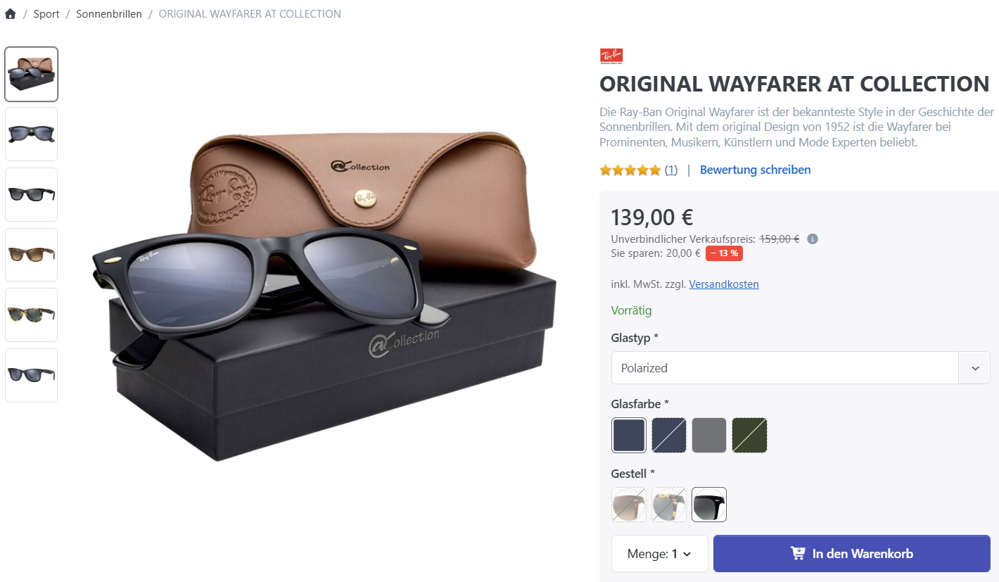

# Wie funktionieren Produktvarianten?

Mit Produktvarianten verwalten Sie unterschiedliche Ausführungen desselben Produkts, beispielsweise verschiedene Farben oder Größen. Legen Sie die Varianten in der Produktkonfiguration unter **Attribute** an.

## Anwendungsszenario

Angenommen, Sie verkaufen ein T-Shirt in mehreren Farben und Größen. Fügen Sie dem Produkt unter **Attribute** die Merkmale Farbe und Größe hinzu. Für Farbe eignet sich der Typ **Farbflächen**, für Größe beispielsweise **Dropdown-Liste**. Öffnen Sie anschließend **Attributwerte bearbeiten/ansehen** und hinterlegen Sie Werte wie S, M, L und XL. Wenn einzelne Varianten eigene Produktdaten wie Lagerbestand, Preis, SKU oder Bild benötigen, erstellen Sie zusätzlich Attributkombinationen.

## Attribute

Bevor Sie einem Produkt Attribute zuweisen, legen Sie diese unter **Katalog > Produktattribute** an. Der interne Name identifiziert das Attribut eindeutig. Für jede konfigurierte Shopsprache können Sie anschließend eigene Namen und Beschreibungen hinterlegen.

Wenn Sie ein Produktattribut zu Ihrem Produkt hinzufügen, können Sie die folgenden Werte konfigurieren:

| Feld             | Beschreibung                                                                                                                                                                                      |
| ---------------- | ------------------------------------------------------------------------------------------------------------------------------------------------------------------------------------------------- |
| Attribut         | Legt das Produktattribut fest.                                                                                                                                                                    |
| Anzeigetext      | Legt einen textuellen Wert fest, der in Ihrem Shop neben dem Attribut angezeigt wird. Der Zweck dieses Wertes ist, dem Kunden einen zusätzlichen Hinweis über die Nutzung des Attributs zu geben. |
| Ist erforderlich | Legt fest, ob die Auswahl eines Attributwerts durch den Kunden zwingend erforderlich ist, bevor der Kunde das Produkt dem Warenkorb hinzufügen kann.                                              |
| Typ              | Legt den Steuerelement-Typ fest, der im Frontend erzeugt wird. Sie können unter den folgenden Typen auswählen (siehe Tabelle unten).                                                              |
| Reihenfolge      | Legt die Reihenfolge der Anzeige im Frontend fest.                                                                                                                                                |
| Werte            | Enthält die Attributwerte.                                                                                                                                                                        |

### Verfügbare Typen

| Typ                 | Beschreibung                                                                                              |
| ------------------- | --------------------------------------------------------------------------------------------------------- |
| Dropdown-Liste      | Erzeugt eine Dropdown-Liste, um Kunden einen der hinterlegten Attributwerte wählen zu lassen.             |
| Radiobuttonliste    | Erzeugt eine Radiobuttonliste, um Kunden einen der hinterlegten Attributwerte wählen zu lassen.           |
| Kontrollkästchen    | Erzeugt Kontrollkästchen für jeden Wert, um Kunden einen der hinterlegten Attributwerte wählen zu lassen. |
| Textbox             | Erzeugt eine Textbox.                                                                                     |
| Mehrzeilige Textbox | Erzeugt eine mehrzeilige Textbox.                                                                         |
| Kalender            | Erzeugt einen Kalender, mit welchem Kunden ein Datum wählen können.                                       |
| Datei-Upload        | Erzeugt ein Datei-Upload-Feld, mit welchem Kunden Dateien hochladen können.                               |
| Farbflächen         | Erzeugt Farbflächen, um Kunden eine Farbe auswählen zu lassen.                                            |

## Attributwerte

Abhängig vom ausgewählten Typ können Sie unterschiedliche Felder oder keines bearbeiten. Wenn Sie die Typen **Textbox, Mehrzeilige Textbox, Kalender** oder **Datei-Upload** auswählen, können Sie keine Werte hinzufügen, da der Wert dieser Typen von den Kunden bestimmt wird, da sie frei mit diesen Steuerelementen interagieren können. Für den Typ **Farbflächen** können Sie Farbwerte angeben, die als Flächen erzeugt werden und von Ihren Kunden auf der Produktdetailseite ausgewählt werden können, indem sie darauf klicken. Farbflächen können auch in der Produktbox aus Produktlisten angezeigt werden, wenn die folgende Option aktiviert ist: **Konfiguration > Einstellungen > Katalog-Einstellungen > Produktlisten > Zeige Farbvarianten in Produktlisten**.

Wenn Sie Werte zu einem Attribut hinzufügen, können Sie die folgenden Daten dafür spezifizieren:

| Feld                | Beschreibung                                                                                                                                                                                                                                      |
| ------------------- | ------------------------------------------------------------------------------------------------------------------------------------------------------------------------------------------------------------------------------------------------- |
| Name                | Name des Attributwerts, wie er im Frontend angezeigt wird. Erlaubt unterschiedliche Werte für jede angelegte Sprache.                                                                                                                             |
| RGB-Farbe           | Der RGB-Wert der Farbe, die im Frontend erzeugt wird. Nur für den Typ **Farbflächen** verfügbar.                                                                                                                                                  |
| Alias               | Zur internen Verwendung (Entwicklerfunktion).                                                                                                                                                                                                     |
| Verknüpftes Produkt | Wenn Sie den Werttyp **Produkt** anstelle von **Einfach** benutzen, können Sie ein Produkt als Variantenwert hinzufügen, das automatisch zum Warenkorb hinzugefügt wird, sobald der Kunde das Attribut wählt.                                     |
| Mehr-/Minderpreis   | Der Wert wird auf der Produktdetailseite neben dem Wert angezeigt, wenn die folgende Option aktiviert ist: **Konfiguration > Einstellungen > Katalog-Einstellungen > Produktdetail > Mehr- und Minderpreise bei Variant-Kombinationen anzeigen**. |
| Mehr-/Mindergewicht | Passt das Gewicht für dieses Attribut an.                                                                                                                                                                                                         |
| Vorausgewählt       | Spezifiziert, ob der Wert vorausgewählt ist, wenn der Kunde die Produktdetailseite betritt.                                                                                                                                                       |
| Reihenfolge         | Legt die Reihenfolge der Anzeige fest.                                                                                                                                                                                                            |

## Attribut-Kombinationen

Erstellen Sie **Attribut-Kombinationen**, wenn Varianten eigene Daten wie SKU, Preis oder Lagerbestand benötigen. Mit **Alle Kombinationen erstellen** erzeugen Sie sämtliche Kombinationen automatisch; über **Hinzufügen** legen Sie einzelne Kombinationen manuell an. Klicken Sie anschließend auf eine Tabellenzeile, um die folgenden Daten zu bearbeiten. Smartstore lädt die passenden Werte auf der Produktdetailseite, sobald der Kunde die zugehörigen Attribute auswählt.

| Feld                                 | Beschreibung                                                                                                                                                                                                                                                                                                                                                                                                                                                                                                                   |
| ------------------------------------ | ------------------------------------------------------------------------------------------------------------------------------------------------------------------------------------------------------------------------------------------------------------------------------------------------------------------------------------------------------------------------------------------------------------------------------------------------------------------------------------------------------------------------------ |
| Aktiv                                | Gibt an, ob die Kombination aktiv ist und durch Ihre Kunden ausgewählt werden kann.                                                                                                                                                                                                                                                                                                                                                                                                                                            |
| Bilder                               | Aktivieren Sie die Bilder, die diese Attribut-Kombination zeigen. Die ausgewählten Bilder werden angezeigt, wenn ein Kunde die zugehörigen Attributwerte auswählt. Die ausgewählten Bilder werden von der Produktdetailseite ausgeschlossen, sobald die Anzahl der Produktbilder die Anzahl der möglichen Bilder, die mit folgender Einstellung festgelegt wurde, übersteigt: **Konfiguration > Einstellungen > Katalog-Einstellungen > Produktdetail > Anzahl, ab der Bilder nur noch bei Variantenwechsel angezeigt werden** |
| #                                    | Die SKU/Produktnummer.                                                                                                                                                                                                                                                                                                                                                                                                                                                                                                         |
| Hersteller-Produktnummer             | Produktnummer des Herstellers.                                                                                                                                                                                                                                                                                                                                                                                                                                                                                                 |
| EAN                                  | EAN (Europa), GTIN (Global Trade Item Number), UPC (USA), JAN (Japan) oder ISBN (Bücher).                                                                                                                                                                                                                                                                                                                                                                                                                                      |
| Preis                                | Legt den Preis für die Attribut-Kombination fest.                                                                                                                                                                                                                                                                                                                                                                                                                                                                              |
| Lieferzeit                           | Legt die Lieferzeit für die Attribut-Kombination fest.                                                                                                                                                                                                                                                                                                                                                                                                                                                                         |
| Grundeinheit                         | Der Bezugswert für den Grundpreis (z. B. "1 Liter"). Formel: {Grundeinheit} {Maßeinheit} = {Verkaufspreis} / {Menge}.                                                                                                                                                                                                                                                                                                                                                                                                          |
| Menge                                | Tatsächliche Menge des Produkts pro Verpackungseinheit in der angegebenen Maßeinheit (z. B. 250 ml Duschgel entspricht "0,25", wenn {Maßeinheit}=Liter und {Grundeinheit}=1).                                                                                                                                                                                                                                                                                                                                                  |
| Länge                                | Die Länge des Produkts.                                                                                                                                                                                                                                                                                                                                                                                                                                                                                                        |
| Breite                               | Die Breite des Produkts.                                                                                                                                                                                                                                                                                                                                                                                                                                                                                                       |
| Höhe                                 | Die Höhe des Produkts.                                                                                                                                                                                                                                                                                                                                                                                                                                                                                                         |
| Lagerbestand                         | Gibt den Lagerbestand an. Beachten Sie, dass der Lagerbestand einer Kombination nur dann automatisch reduziert wird, wenn die Option **Lagerbestandsführung** in der Registerkarte **Inventar** in der Produktdetailkonfiguration mit **Lagerbestand mit Attributen führen** belegt ist.                                                                                                                                                                                                                                       |
| Bestellung ohne Lagerbestand möglich | Legt fest, ob das Produkt auch bei einem Lagerbestand <=0 bestellt werden kann.                                                                                                                                                                                                                                                                                                                                                                                                                                                |


Wenn Sie neue Attributwerte hinzufügen, müssen Sie die Kombinationen neu erstellen, um alle aktuellen Werte Ihren Kombinationen zuzuweisen.

