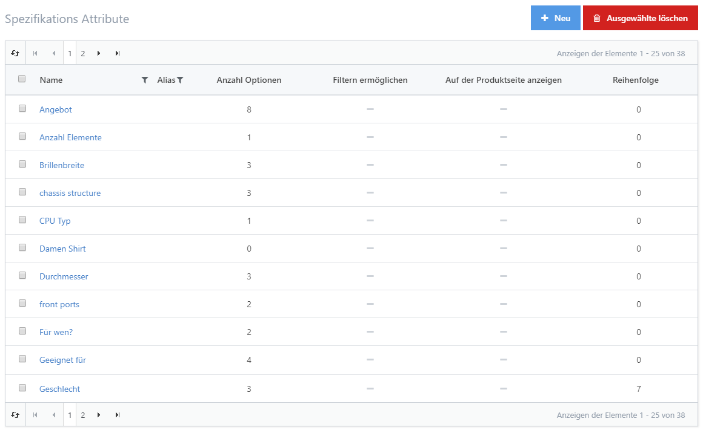
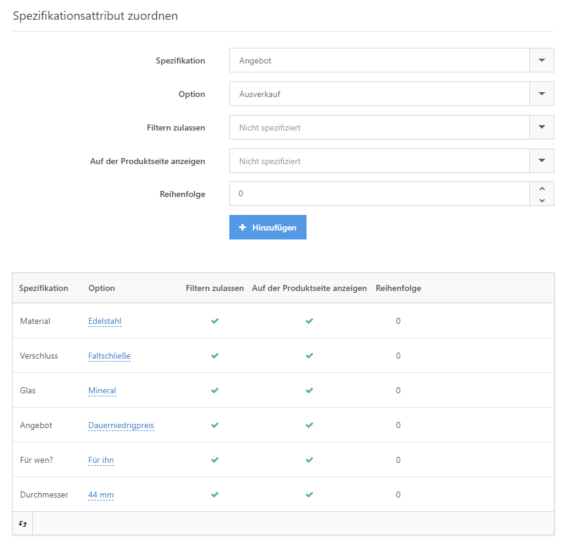
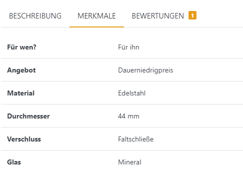
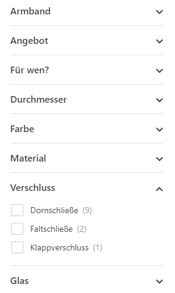

# Spezifikationsattribute verwalten

Spezifikationsattribute bilden standardisierte Produkteigenschaften ab. Sie erleichtern Kunden das Vergleichen, Filtern und Auffinden von Produkten und vermeiden mehrfach gepflegte Angaben. Daraus ergeben sich folgende Vorteile:

* Spezifikationsattribute werden als Tabellendaten auf der Produktdetailseite in Form eines **Datenblatts** dargestellt, das die Eigenschaften Ihres Produkts im Detail anzeigt.
* Wenn Käufer in Ihrem Shop **Produkte vergleichen**, zeigt die Vergleichstabelle nicht nur Bilder, Namen und Preise, sondern auch die Schnittmenge aller Spezifikationsattribute, die mit den zu vergleichenden Produkten verbunden sind.
* Jedes Attribut kann für die Darstellung im **Filter Sidebar Widget** aktiviert werden, das auf allen Übersichtsseiten für Warengruppen sichtbar ist. Dieses Widget ermöglicht es Ihren Käufern, Produkte über ihre Merkmale zu finden, statt sich durch die statisch aufgebaute Baumansicht hangeln zu müssen. Für weitere Informationen über das Filter Sidebar Widget lesen Sie bitte [Mit dem Filter Sidebar Widget arbeiten](produkte-verwalten/mit-dem-filter-sidebar-widget-arbeiten.md).

## Anwendungsszenario

Stellen Sie sich vor, Sie betreiben einen Shop für Drucker. Dann dürften Käufer erwarten, dass Sie sie über die folgenden Spezifikationen eines Druckers informieren:

* **Die Technologie des Druckers:** Inkjet, Laser
* **Internetverbindung:** Wireless, Memory Card, USB
* **Ausdruck:** S/W, Farbe
* **Doppelseitiger Druck:** Ja, Nein
* **Auflösung:** 600 dpi, 1200 dpi, ...
* **Unterstützte Papierformate:** A3, A4, A5, B5, Umschläge, ...

In einer freien Produktbeschreibung wären diese Angaben weder für Filter noch für Produktvergleiche strukturiert nutzbar. Als globale Spezifikationsattribute pflegen Sie Namen und Optionen zentral und ordnen sie anschließend den betreffenden Produkten zu.

|                                                                                                                                                        |                                                                                                                                                        |
| ------------------------------------------------------------------------------------------------------------------------------------------------------ | ------------------------------------------------------------------------------------------------------------------------------------------------------ |
| 
<strong>Alle Spezifikationsattribute</strong>  
           | 
<strong>Attribute mit einem Produkt verknüpfen</strong>  
 |
| 
<strong>Datenblatt in der Produktdetailansicht</strong>  
 | 
<strong>Filter Sidebar Widget</strong>  
                  |

## Spezifikationsattribute hinzufügen

Öffnen Sie **Katalog > Spezifikations Attribute**, um ein global verfügbares Attribut anzulegen. In der Produktdetailansicht können Sie es anschließend jedem gewünschten Produkt zuweisen. Legen Sie den **Anzeigenamen** und die Reihenfolge für jede aktive Sprache fest. Wechseln Sie danach zur Registerkarte **Optionen** und wählen Sie **Option hinzufügen**, um lokalisierte Optionsnamen und deren Reihenfolge zu definieren.


**Tipp**

Wenn Sie mehrere Werte auf einmal hinzufügen möchten, trennen Sie diese durch ein Semikolon und klicken Sie auf das Kästchen **Mehrere, durch Semikolon (;) getrennte Optionsnamen eingeben**. Wenn Sie Ihre Optionen speichern, wird eine Option für jeden durch Semikolon getrennten Wert erstellt.


## Spezifikationsattribute Produkten zuordnen

Nach der Einrichtung ordnen Sie die Attribute in der Produktdetailkonfiguration über die Registerkarte **Spezifikations Attribute** zu.

### **Fields Reference**

| **Felder**                  | **Beschreibung**                                                                                                                                                |
| --------------------------- | --------------------------------------------------------------------------------------------------------------------------------------------------------------- |
| **Attribut**                | Wählen Sie das Spezifikationsattribut, das Sie dem Produkt zuweisen möchten, z. B. _Drucktechnologie._                                                          |
| **Attributsoption**         | Wählen Sie eine der Optionen, die Sie für das jeweilige Attribut angegeben haben, z. B. _Inkjet._                                                               |
| **Filtern zulassen**        | Klicken Sie diese Box an, wenn Sie das Filtern nach diesem Produktattribut erlauben möchten (funktioniert nur, wenn das _Filter Sidebar Widget_ aktiviert ist). |
| **Auf Produktseite zeigen** | Klicken Sie diese Box an, um das Produktattribut auf der öffentlichen Produktdetailansicht anzuzeigen.                                                          |
| **Reihenfolge**             | Anzeigenreihenfolge des Spezifikationsattributs. 1 bedeutet den ersten Platz in der Liste.                                                                      |

Klicken Sie auf **Speichern**, um die Zuordnung anzulegen. Wählen Sie anschließend weitere Werte aus und speichern Sie erneut, wenn Sie zusätzliche Zuordnungen benötigen.

### Mehrfache Wert-Zuweisung

In der Bearbeitungsansicht unter **Katalog > Spezifikations Attribute > Attribut** können Sie Einstellungen eines Attributs für alle zugeordneten Produkte gemeinsam ändern. Dadurch müssen die Produkte nicht einzeln geöffnet und gespeichert werden.

| **Mehrfache Wert-Zuweisung**                 | **Beschreibung**                                                                                                                                                                                                                                                                                       |
| -------------------------------------------- | ------------------------------------------------------------------------------------------------------------------------------------------------------------------------------------------------------------------------------------------------------------------------------------------------------ |
| 
Auf der Produktseite anzeigen  
 | Legt fest, ob das Attribut auf der Produktdetailseite angezeigt werden soll.                                                                                                                                                                                                                           |
| Filtern ermöglichen                          | Legt fest, ob Suchergebnisse nach diesem Attribut gefiltert werden können. Diese Einstellung ist nur mit dem kostenpflichtigen Enterprise-Plugin **MegaSearchPlus** wirksam. Änderungen werden nach der nächsten Aktualisierung des Suchindex wirksam.                                                 |
| Darstellung der Suchfilter                   | Legt die Darstellung der Suchfilter fest. Diese Einstellung ist nur mit dem kostenpflichtigen Enterprise-Plugin **MegaSearchPlus** wirksam. Änderungen werden nach der nächsten Aktualisierung des Suchindex wirksam.                                                                                  |
| 
Sortierung der Suchfilter  
     | Legt die Sortierung der Suchfilter fest. Diese Einstellung ist nur mit dem kostenpflichtigen Enterprise-Plugin **MegaSearchPlus** wirksam. Änderungen werden nach der nächsten Aktualisierung des Suchindex wirksam.                                                                                   |
| Optionsnamen indexieren                      | Legt fest, ob Optionsnamen mit in den Suchindex aufgenommen werden sollen, damit Produkte über sie gefunden werden können. Diese Einstellung ist nur mit dem kostenpflichtigen Enterprise-Plugin **MegaSearchPlus** wirksam. Änderungen werden nach der nächsten Aktualisierung des Suchindex wirksam. |
