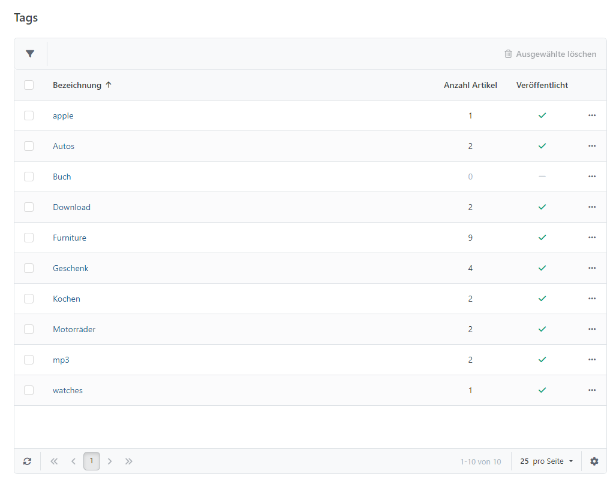
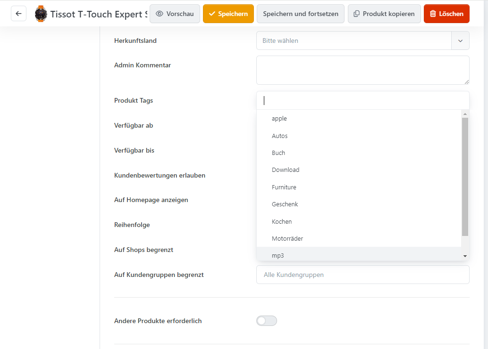
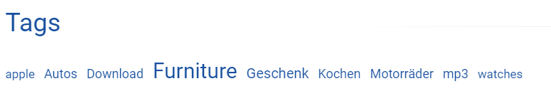

# Tags verwalten

Produkt-Tags gruppieren Produkte unabhängig von ihrer Warengruppe und werden auch in den Suchergebnissen berücksichtigt. Zum Bearbeiten oder Löschen navigieren Sie im Administrationsbereich zu **Katalog > Tags**.

## Anwendungsszenario

Ein Onlineshop für Motorradkleidung kann Artikel verschiedener Warengruppen – etwa Jacken, Helme und Mützen – über den Namen eines Rennfahrers verbinden. Dafür ist keine zusätzliche Warengruppe erforderlich: Ordnen Sie den Produkten denselben Tag zu. Der Tag erscheint unter den Produktdetails und führt Kunden per Klick zu allen entsprechend gekennzeichneten Produkten.

## Ein Tag erstellen

Um einem Produkt einen Tag zuzuordnen, öffnen Sie dessen Konfiguration und geben den gewünschten Begriff im Reiter **Allgemein** ein. Während der Eingabe schlägt Smartstore bereits vorhandene, passende Produkt-Tags vor.

Eine Tag-Cloud auf der Startseite hebt häufig verwendete Tags größer und fetter hervor. Sie können diese Anzeige unter **Konfiguration > Einstellungen > Katalog-Einstellungen**, Reiter **Allgemein** deaktiviert werden. Die Anzahl der angezeigten Tags wird unter dem Reiter **Produktlisten** festlegen.

