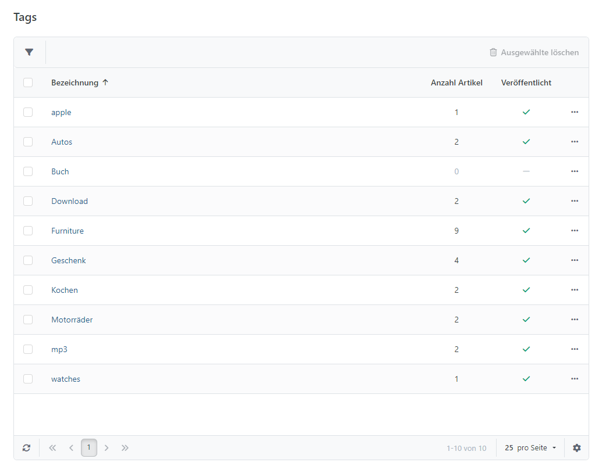
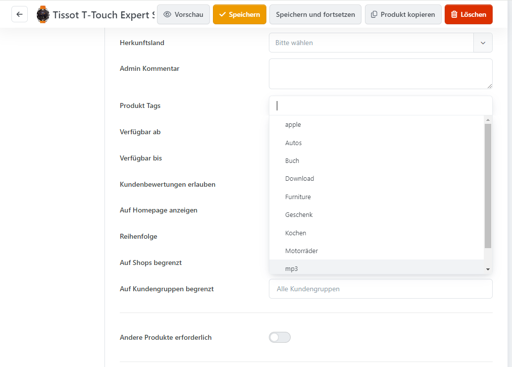
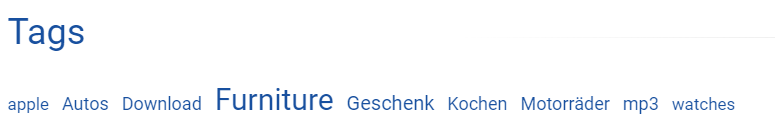

# Tags verwalten

Produkt-Tags gruppieren Produkte unabhängig von Warengruppen. Ein Klick auf einen angezeigten Tag führt im Shop zu den zugeordneten Produkten. Im Administrationsbereich finden Sie die Übersicht unter **Katalog > Tags**.

Dort können Sie Tags nach Namen und Veröffentlichungsstatus filtern. Ein Klick auf den Tagnamen öffnet die Bearbeitung für Namen, Übersetzungen und Veröffentlichungsstatus. Sie können Tags einzeln oder mehrere ausgewählte Tags löschen. Nicht veröffentlichte Tags werden Kunden im Shop nicht angezeigt.

## Anwendungsszenario

Ein Onlineshop für Motorradkleidung kann Jacken, Helme und Mützen über den Namen eines Rennfahrers verbinden, ohne eine zusätzliche Warengruppe anzulegen. Ordnen Sie den Produkten denselben Tag zu. Wenn die Anzeige von Produkt-Tags auf der Produktdetailseite aktiviert ist, erscheint der Tag dort und führt Kunden per Klick zu den entsprechend gekennzeichneten Produkten.

## Ein Tag erstellen

Um einem Produkt einen Tag zuzuordnen, öffnen Sie es in der Produktverwaltung und geben den Begriff im Reiter **Allgemein** im Feld Produkt-Tags ein. Während der Eingabe schlägt Smartstore bereits vorhandene, passende Tags vor. Einen neuen Tag legen Sie an, indem Sie einen neuen Begriff eingeben und das Produkt speichern.

Eine Tag-Cloud auf der Startseite stellt häufig verwendete Tags größer dar. Unter **Konfiguration > Einstellungen > Katalog-Einstellungen** können Sie die Anzeige im Reiter **Allgemein** deaktivieren und die Anzahl der angezeigten Tags im Reiter **Produktlisten** festlegen.

