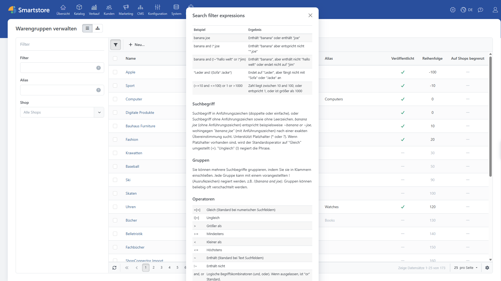

# Warengruppen organisieren

Öffnen Sie im Administrationsbereich **Katalog > Warengruppen**, um Warengruppen anzulegen, zu bearbeiten oder zu löschen. Über die Schaltflächen am oberen Rand wechseln Sie zwischen Listen- und Baumansicht. In der Listenansicht suchen und filtern Sie Warengruppen; in der Baumansicht ordnen Sie Warengruppen und Untergruppen per Drag-and-drop.

## Listenansicht

Filtern Sie die Listenansicht nach **Warengruppenname** oder **Alias**. Von hier aus können Sie Warengruppen außerdem als XML-Datei exportieren.

## Baumansicht

Die Baumansicht bildet die Warengruppenstruktur des Shop-Frontends und damit die Hauptnavigation ab. Ziehen Sie Warengruppen per Drag-and-drop an die gewünschte Position oder in eine andere übergeordnete Warengruppe.

## Ansicht der Warengruppendetails

Beim Anlegen oder Bearbeiten öffnet sich die Detailansicht der Warengruppe. Die zugehörigen Einstellungen sind auf mehrere Registerkarten verteilt. Über die Schaltflächen oben rechts zeigen Sie eine Vorschau an, speichern die Warengruppe oder löschen sie. Beim Löschen entscheiden Sie, ob Unterwarengruppen ebenfalls entfernt oder auf einer höheren Ebene erhalten bleiben.

### Registerkarte Allgemein

|                                           |                                                                                                                                                                                                                                                                                                                                                                                                                                                                                                        |
| ----------------------------------------- | ------------------------------------------------------------------------------------------------------------------------------------------------------------------------------------------------------------------------------------------------------------------------------------------------------------------------------------------------------------------------------------------------------------------------------------------------------------------------------------------------------ |
| Externer Link                             | Abweichender, externer Verweis für diese Warengruppe im Hauptmenü und in Warengruppen-Listings, z. B. auf eine Landingpage, die einen Rückverweis auf die Warengruppe enthält.                                                                                                                                                                                                                                                                                                                         |
| Name                                      | 
Dies ist der Standardname der Warengruppe, der dem Shopbesucher im Frontend Ihres Shops angezeigt wird, solange Sie nicht unterschiedliche Werte für andere Sprachen angegeben haben.  Für weitere Informationen zu Sprachen lesen Sie <a href="../../benutzer-handbuch/konfiguration/sprachen-verwalten.md">Sprachen verwalten</a>.
                                                                                                                                                      |
| Vollständiger Name                        | Dies ist der Standardwert für den vollständigen Namen, der als Titel auf der Warengruppenseite angezeigt wird.                                                                                                                                                                                                                                                                                                                                                                                         |
| Obere Beschreibung                        | Dies ist der Standardwert für die Beschreibung der Warengruppe, die dem Shopbesucher im Frontend Ihres Shops angezeigt wird. Das Beschreibungsfeld ist ebenfalls für mehrsprachige Ausgaben aktiviert. Über die Funktion „Andere Beschreibung anzeigen“ kann eine zusätzliche Warengruppenbeschreibung hinzugefügt werden, die dann unterhalb der Warengruppenprodukte angezeigt wird.                                                                                                                 |
| Badge-Text                                | Dies ist der Standardwert für den Badge-Text. Badges werden innerhalb von Menüs neben den Menüeinträgen dargestellt.                                                                                                                                                                                                                                                                                                                                                                                   |
| Badge-Style                               | Legt den Stil des Badges fest, das innerhalb von Menüs neben den Menüeinträgen dargestellt wird.                                                                                                                                                                                                                                                                                                                                                                                                       |
| Alias                                     | Ein optionaler, sprachneutraler Referenzname für die interne Nutzung.                                                                                                                                                                                                                                                                                                                                                                                                                                  |
| Design Vorlage                            | Die Designvorlage legt fest, wie die Warengruppe und ihre Produkte dem Shopbesucher angezeigt werden.                                                                                                                                                                                                                                                                                                                                                                                                  |
| Bild                                      | Das Bild wird im Frontend überall dort angezeigt, wo Warengruppen in einer Übersicht sichtbar sind, z. B. in der Übersicht der Untergruppen innerhalb einer übergeordneten Warengruppe.                                                                                                                                                                                                                                                                                                                |
| Übergeordnete Warengruppe                 | Hier können Sie die übergeordnete Warengruppe auswählen.                                                                                                                                                                                                                                                                                                                                                                                                                                               |
| Preisfilter                               | Legen Sie den Preisbereich für den Preisfilter des Shops fest. Unterschiedliche Preisbereiche trennen Sie mit einem Semikolon, z. B. „0-199;200-300;301;“ (301- bedeutet: ab 301 und teurer). Diese Einstellung wirkt sich auf das **Filter Sidebar Widget** aus, das auf der rechten Seite jeder Warengruppe angezeigt wird. Für weitere Informationen zum **Filter Sidebar Widget** lesen Sie [Mit dem Filter Sidebar Widget umgehen](produkte-verwalten/mit-dem-filter-sidebar-widget-arbeiten.md). |
| Auf der Homepage zeigen                   | Legt fest, ob die Warengruppe auf der Startseite Ihres Shops angezeigt wird. Die Warengruppen, die zur Anzeige auf der Homepage ausgewählt wurden, werden unterhalb des Einführungstextes auf der Startseite angezeigt.                                                                                                                                                                                                                                                                                |
| Veröffentlicht                            | Legt fest, ob die Warengruppe für Ihre Shopbesucher sichtbar ist.                                                                                                                                                                                                                                                                                                                                                                                                                                      |
| Reihenfolge                               | Legt die Reihenfolge fest, in der die Warengruppen innerhalb der übergeordneten Warengruppe angezeigt werden. Die Anzeigenreihenfolge wird automatisch angepasst, wenn Sie Ihre Warengruppen wie oben beschrieben in der Strukturansicht ordnen.                                                                                                                                                                                                                                                       |
| 
Standard Listendarstellung  
 | Legt fest, wie Produktlisten standardmäßig dargestellt werden sollen. Der Kunde kann die Darstellung im Shop ändern.                                                                                                                                                                                                                                                                                                                                                                                   |
| Kunde kann Listengröße ändern             | Kunden können die Listengröße mithilfe einer vorgegebenen Optionsliste ändern.                                                                                                                                                                                                                                                                                                                                                                                                                         |
| Optionen für die Listengröße              | Kommagetrennte Liste für optionale Listengrößenänderungen (z. B. 10, 5, 15, 20). Die erste Option ist die Standardgröße, wenn keine ausgewählt wurde.                                                                                                                                                                                                                                                                                                                                                  |
| Rabatte                                   | Legt die auf das Objekt anzuwendenden Rabatte fest. In dieser Registerkarte können Sie Rabatte für die jeweilige Warengruppe aktivieren. Denken Sie daran, dass hier nur Rabatte des Rabatttyps _Bezogen auf die Kategorien_ verwaltet werden können. Für weitere Informationen zu Rabatten lesen Sie bitte [Rabatte verwalten](../../benutzer-handbuch/marketing-promotion/rabatte-verwalten.md).                                                                                                     |
| Auf Shops begrenzt                        | Legt fest, ob der Eintrag nur für bestimmte Shops verfügbar ist. Für weitere Informationen zu mehreren Shops lesen Sie [Mit mehreren Shops arbeiten](../../benutzer-handbuch/allgemeine-konzepte/mit-mehreren-shops-arbeiten.md).                                                                                                                                                                                                                                                                      |
| Auf Kundengruppen begrenzt                | Legt fest, ob das Objekt nur für bestimmte Kundengruppen verfügbar ist. Für weitere Informationen zu Zugangsberechtigungen lesen Sie [Zugriffsbeschränkungen (ACL)](../../benutzer-handbuch/allgemeine-konzepte/zugriffsbeschrankungen-acl.md).                                                                                                                                                                                                                                                        |

### Registerkarte Suchmaschinen (SEO)

In dieser Registerkarte können Sie spezifische SEO-Werte für die Warengruppe festlegen, z. B. **Meta Title**, **Meta Keywords** oder einen SEO-freundlichen **URL-Alias**. Für weitere Informationen über die Felder in der Registerkarte **Suchmaschinen** lesen Sie bitte [SEO](../../benutzer-handbuch/allgemeine-konzepte/seo.md).

### Registerkarte Produkte

In dieser Registerkarte können Sie Ihrer Warengruppe bereits angelegte Produkte hinzufügen. Wenn Sie auf **Produkt hinzufügen** klicken, öffnet sich ein neues Fenster, das eine strukturierte Liste all Ihrer Produkte anzeigt. Hier können Sie mehrere Produkte auswählen und sie zu dieser Warengruppe hinzufügen. Sie können auch das Such-Widget verwenden, um nach einzelnen Produkten zu suchen.

### Registerkarte Mega Menu

In dieser Registerkarte wird die Konfiguration des Mega-Menu-Plugins vorgenommen. Für weitere Informationen zum Mega Menu lesen Sie bitte [das Mega Menu Plugin](../../benutzer-handbuch/plugins/mega-menu.md).

### Registerkarte ContentSlider

In dieser Registerkarte können Slider für die Warengruppe hinzugefügt werden. Für weitere Informationen zum ContentSlider lesen Sie [das ContentSlider Plugin](../../benutzer-handbuch/plugins/content-slider.md).

### Andere Registerkarten

Abhängig von den installierten Plugins kann es weitere Registerkarten geben. Für weitere Informationen zu diesen Registerkarten wenden Sie sich bitte an den Entwickler des Plugins.
