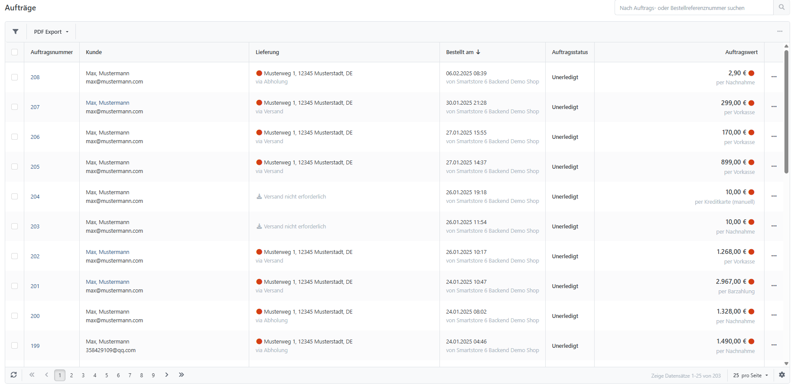
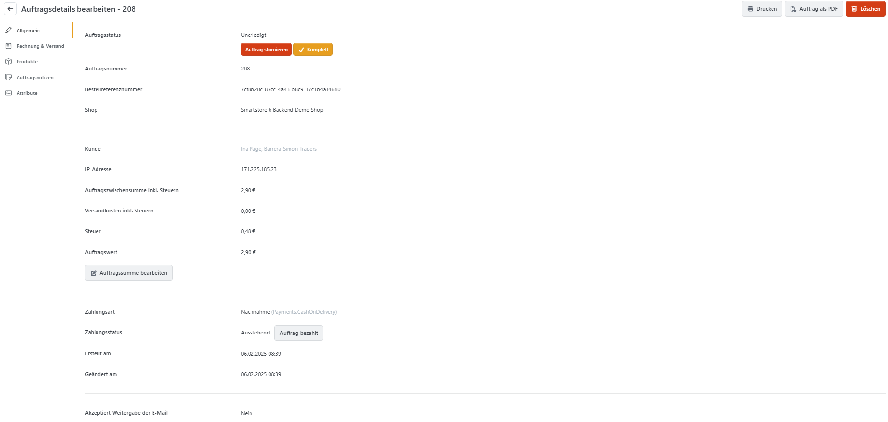
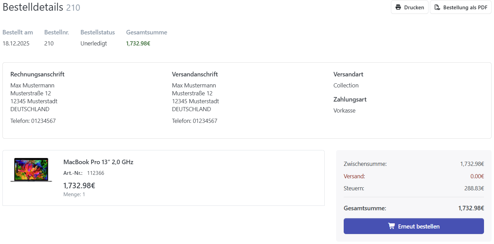

# Aufträge verwalten

Öffnen Sie zur Auftragsverwaltung im Administrationsbereich **Verkauf > Aufträge**. Die Tabelle lässt sich unter anderem nach Datum, Kunde, Auftrags-, Zahlungs- und Lieferstatus, Shop, Auftrags-GUID oder Auftragsnummer sortieren. Ist die Auftragsnummer bekannt, geben Sie sie in das vorgesehene Feld ein und klicken auf **Ausführen**. Alle oder ausgewählte Aufträge können Sie als PDF-, Excel- oder XML-Datei exportieren.

## Ansicht Auftragsdetails

### 

### Allgemein

Diese Registerkarte zeigt grundlegende Auftragsdaten wie Status und Auftragswert. Auftragsstatus und Auftragssumme können Sie hier bearbeiten.

### Rechnung & Versand

Hier sehen und bearbeiten Sie Rechnungs- und Lieferadresse. Außerdem werden Versandart und Lieferstatus angezeigt. Lieferungen und Teillieferungen verwalten Sie über die Tabelle **Lieferungen**. Weitere Informationen finden Sie unter [Sendungen verwalten](sendungen-verwalten.md).

### Produkte

Diese Registerkarte listet alle Produkte des Auftrags auf. Hier steuern Sie Rückrufe und bearbeiten Preise sowie Rabatte der bestellten Produkte. Weitere Informationen finden Sie unter [Retourenwünsche verwalten](retourenwunsche-verwalten.md).

### Auftragsnotizen

Auftragsnotizen dokumentieren einzelne Schritte des Bestellvorgangs, beispielsweise Auftragseingang oder Versandzeitpunkt. Im Bereich **Notiz zum Auftrag hinzufügen** Notizen erstellen, die im Login-Bereich für den Kunden sichtbar werden. Um dies zu tun, wählen Sie die Option **Für den Benutzer sichtbar,** aus, wenn der Kunde die Anmerkung in seinem Konto sehen soll.

### Attribute

In dieser Registerkarte sehen Sie alle Attribute, die für diese Bestellung angelegt wurden. Der Administrator des Shops kann hier zwar Werte hinzufügen, doch wurde diese Funktion ursprünglich dafür entwickelt, dass Entwickler Auftragsdaten speichern können (z. B.: Daten über die Zahlungsabwicklung über Gateways wie beispielsweise PayPal oder Sofortüberweisung).

### Andere Registerkarten

Abhängig von den in Ihrem Shop installierten Plugins kann es weitere Registerkarten geben. Für weitere Informationen zu diesen Registerkarten wenden Sie sich bitte an den Entwickler des Plugins.

## Die Kundenansicht

Kunden finden ihre Bestellungen unter Mein Konto > Bestellungen. Dort können sie Auftragsdetails anzeigen, ausdrucken, als PDF herunterladen oder eine Bestellung erneut ausführen.

