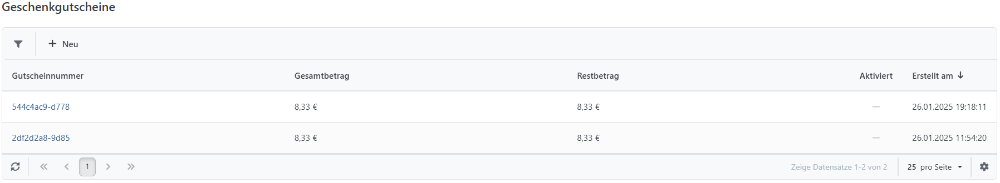
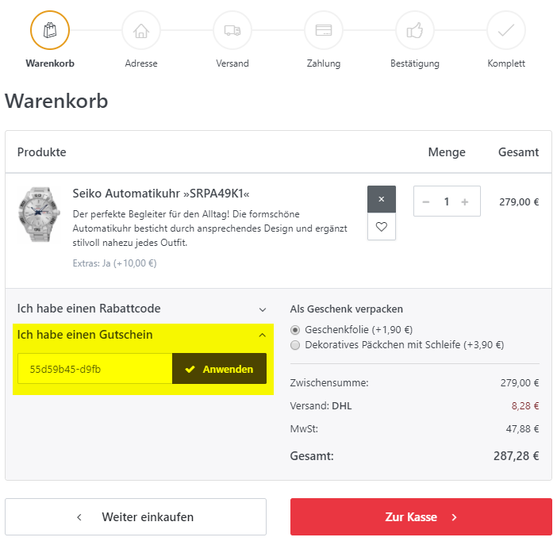

# Geschenkgutscheine verwalten

Geschenkgutscheine schaffen zusätzliche Kaufanreize und erreichen häufig neue Kunden, die den Gutschein als Geschenk erhalten.

## Wie Sie Geschenkgutscheine verwalten

Geschenkgutscheine werden als Produkte angelegt und in der Registerkarte Allgemein als Geschenkgutschein gekennzeichnet. Legen Sie fest, ob der Gutschein physisch oder virtuell ist. Bei virtuellen Gutscheinen sind keine Versandadressdaten erforderlich. Bevor ein gekaufter Gutschein im Checkout eingelöst werden kann, muss er aktiviert sein. Die automatische Aktivierung richtet sich nach den Einstellungen unter **Konfiguration > Einstellungen > Auftrags-Einstellungen**. Sie können auswählen, ob Sie die Geschenkgutscheine aktivieren möchten, wenn der Auftragsstatus **Unerledigt, Komplett** oder **Abgebrochen** erreicht. Zusätzlich können Sie einen Auftragsstatus für die automatische Deaktivierung festlegen. Alle gekauften Geschenkgutscheine verwalten Sie über **Verkauf > Geschenkgutscheine**.

## Wie Ihre Kunden Geschenkgutscheine einsetzen können

Informieren Sie den Empfänger nach der Aktivierung über **Empfänger benachrichtigen** über den generierten Gutscheincode. Der Code wird in der Warenkorbübersicht eingegeben und reduziert die Auftragssumme um den verfügbaren Gutscheinbetrag. Ein Restguthaben bleibt für weitere Einkäufe erhalten.

