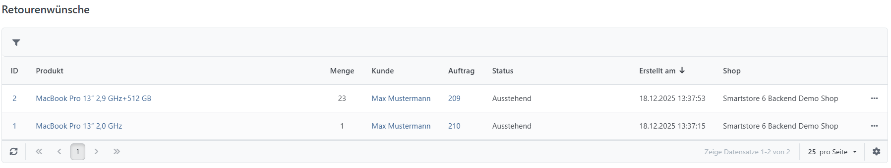
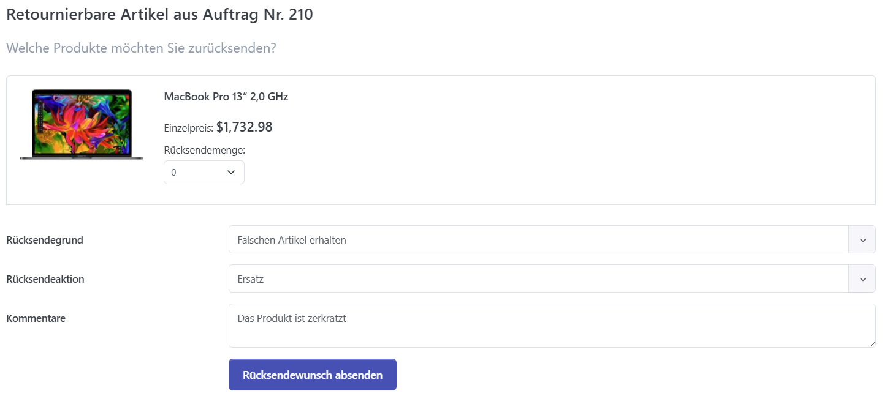
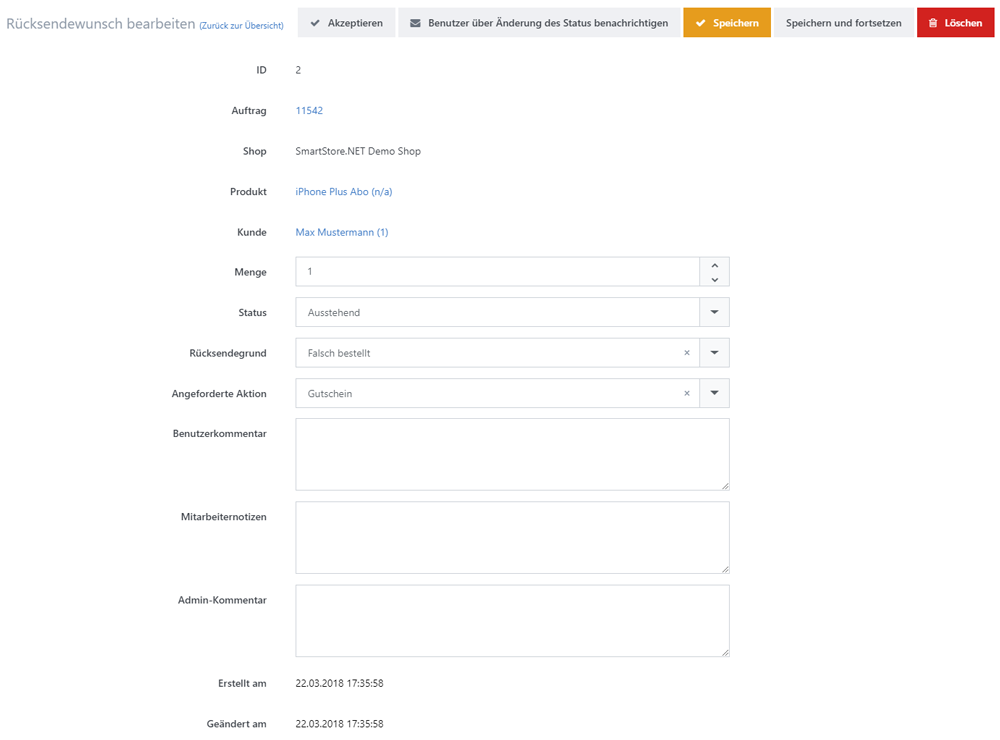

# Retourenwünsche verwalten

Kunden können über ihr Kundenkonto einen Retourenwunsch einreichen, beispielsweise bei einem Defekt, einer abweichenden Erwartung oder einem falsch gewählten Produktattribut. Die verfügbaren Retourenoptionen konfigurieren Sie unter **Konfiguration > Einstellungen > Auftrags-Einstellungen > Retoureneinstellungen**. Alle eingereichten Retourenwünsche verwalten Sie über **Verkauf > Retourenwünsche**.

## Die Kundendetailansicht

Ein Retourenwunsch ist erst möglich, wenn der zugehörige Auftrag den Status **Komplett** hat. Kunden wählen anschließend in ihrer Auftragsübersicht **Artikel zurücksenden**. Im folgenden Formular geben sie die betroffenen Artikel, den Retourengrund und die gewünschte Rücksendeaktion an: **Reparatur, Ersatz, Gutschein**.

## Die Administratoren-Detailansicht

In der Detailansicht können Sie den Retourenwunsch **Akzeptieren**, bearbeiten und den Kunden über den aktuellen Status informieren.

