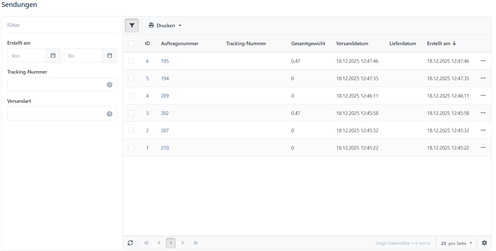
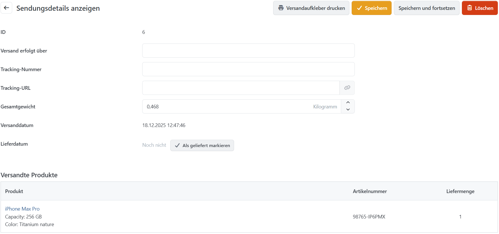

# Sendungen verwalten

Zu jeder Bestellung können Sie eine Sendung mit Versandzeitpunkt und Tracking-Nummer anlegen. So behalten Sie und Ihre Kunden den Versandstatus im Blick. Öffnen Sie dazu die Detailansicht der Bestellung und wechseln Sie zur Registerkarte **Versandinformation**. Die zentrale Sendungsverwaltung erreichen Sie über **Verkauf > Sendungen**. Für alle oder ausgewählte Sendungen können Sie außerdem **Versandaufkleber drucken**.

## Sendungsdetails

Die Detailansicht zeigt alle Produkte der Sendung. Hier hinterlegen Sie eine Tracking-Nummer und setzen den Sendungsstatus auf **Versandt** und **Geliefert** setzen. Sie können auch **Versandaufkleber erstellen,** und als PDF herunterladen.

