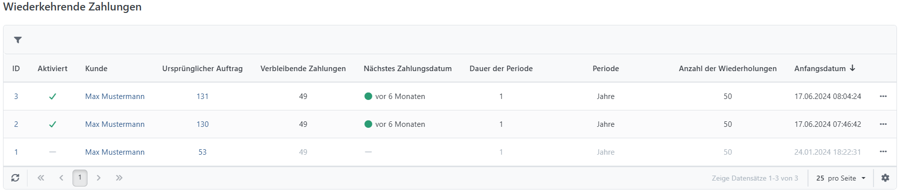
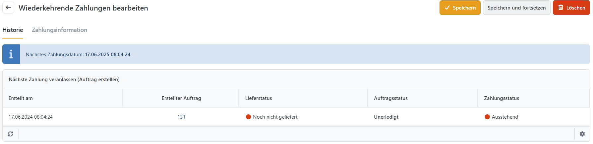

# Wiederkehrende Zahlungen verwalten

Wenn Sie Produkte als Abonnements konfiguriert haben, müssen Sie Zahlungen verwalten, die in regelmäßigen Abständen erneut erfolgen (für weitere Informationen zu wiederkehrenden Zahlungen lesen Sie bitte [Mit Abonnements umgehen](../katalog/produkte-verwalten/mit-abonnements-umgehen.md)). Sie können wiederkehrende Zahlungen verwalten, indem Sie zu **Verkauf > Wiederkehrende Zahlungen** navigieren.

## Wiederkehrende Zahlungen Detailansicht

In der Detailansicht der wiederkehrenden Zahlungen können Sie die Details einer wiederkehrenden Zahlung einsehen, ihre Einstellungen verändern und die Auftragshistorie (das **Archiv**) betrachten sowie wiederkehrende Zahlungen abbrechen (z. B. wenn Sie Ihre letzte Zahlung nicht erhalten haben). Außerdem können Sie die **Nächste Zahlung veranlassen (Auftrag erstellen)**.

