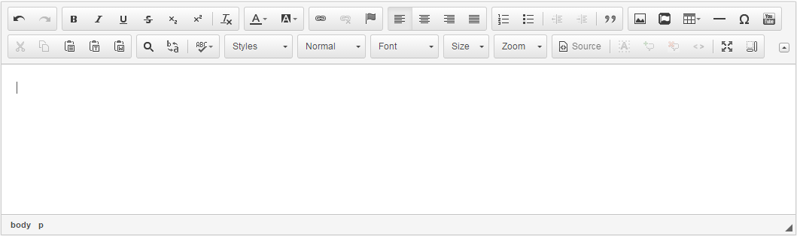

# Editing HTML Content

HTML content that will be displayed in the frontend can be edited in several locations within the administration area. You need to add or edit HTML content, for instance, when you [create your own topics](../../manage/content-management/managing-pages-topics.md) or when you add an in-depth description of your product to the product details view. By default, you use the _CKEditor_ for this task. You can also switch the HMTL editor to the lightweight _Summernote_. For more information on how to switch to _Summernote_.

