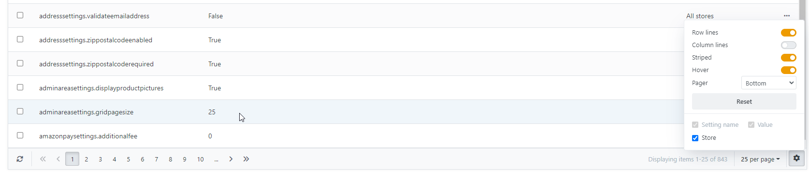
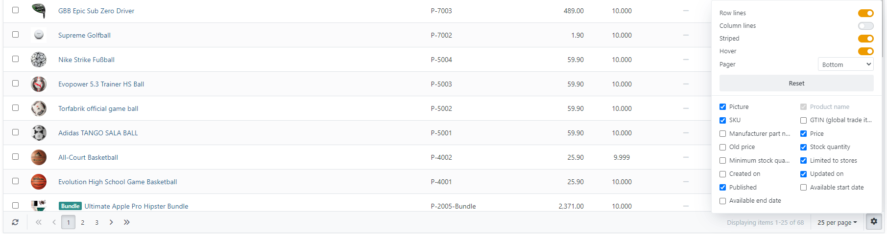

# The Data Grid

## Filtering the Grid

You can filter the entries that appear in the table view by pressing the filter icon on the left of the table view, if one is present. The displayed entries can be filtered with up to three combined criteria (name, value, store). The filter options that can be applied are displayed after clicking on the question mark:&#x20;

 _ Smartstore administration.png>)

The layout of the table view can be designed as desired. To do this, click on the cogwheel symbol at the bottom right.

## Product Chooser

In the administration area there are many places where you need to select a product from your existing catalog. You always do this with the same selection component. To find the product you want, there is an easy-to-use filter function on the left above the table where your products are displayed. Among other things, you can search for the product name or display all products of a certain product group, a certain manufacturer, a certain store or a certain product type.

The layout of the product view can also be designed as desired. To do this, click on the cogwheel icon at the bottom right.

