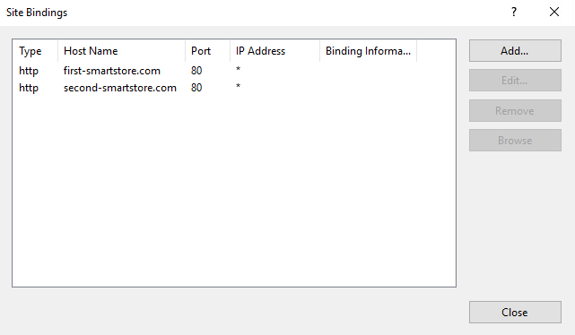

# Working with Multiple Stores

With multiple stores, you are able to categorize your choice of products according to target group. Each store will be accessible through its own domain and can be [configured individually](../../manage/configuration/general-settings-preferences/defining-the-scope-of-settings.md).

## Usage Scenario

Imagine you're running a store for a wide clothing range. In that case, you may want to set up separate stores for women, men, kids and perhaps one for every brand you're offering. With this setup, you can optimize the look and feel of your stores for each of your target groups by choosing different colors and layouts.

## Prerequisite

The IIS site of your store needs to be properly configured in IIS, so that all requested host names are mapped to your Smartstore installation. That can be achieved by adding a site binding for each host name.

## Creating a New Store

To create a new store, navigate to **Configuration > Stores** in the administration area and click on **Add New**. You can assign your own store logo, create a store name and enter the URL through which the store should be accessed. For further configuration values, see the table below.

| **Input field**              | **Description**                                                                                                                                                                                                                                                                                                                                                                                    |
| ---------------------------- | -------------------------------------------------------------------------------------------------------------------------------------------------------------------------------------------------------------------------------------------------------------------------------------------------------------------------------------------------------------------------------------------------- |
| Content Delivery Network URL | The URL of your CDN (Content Delivery Network) , e.g. [https://xxx.cloudfront.net](https://xxx.cloudfront.net) or [http://xxx.cloudflare.net](http://xxx.cloudflare.net). Setting this value will allow the site to serve static content such as media through the CDN.                                                                                                                            |
| SSL enabled                  | Activate this option if your store will be SSL secured.                                                                                                                                                                                                                                                                                                                                            |
| HOST values                  | 
The comma-separated list of possible HTTP_POST values (e.g. "<a href="http://yourstore.com">yourstore.com</a>,<a href="http://www.yourstore.com">www.yourstore.com</a>").  > [!INFO] > The host values must correspond with those entered in the site bindings of the IIS. They are responsible for the correct mapping of requests to your store.
                                 |
| ID of HTML body              | 
Allows the use of an individual CSS and javascript for a particular store. If you enter a value (e.g. <strong>my-first-shop)</strong> here, you have a unique identifier through which you can access the DOM-structure of this shop separately from your other configured stores.  <code>&#x3C;br>#my-first-shop table {&#x3C;br> border: 1px solid black;&#x3C;br>}&#x3C;br></code>
 |
| Display order                | 
The display order determines how your stores will be arranged in the internal configuration areas for multiple stores. 1 represents the top of the list.  > [!INFO] > ### Attention > For additionally created stores increase the order. Otherwise there may be problems with the TaskScheduler.
                                                                               |

## Adding Products & Categories to a Store&#x20;

By default, newly created products and categories will be displayed in all of your configured stores. When editing products or categories, there will be a tab in which you can restrict the display to a subset of the stores you have configured. To do so, you simply have to check the box **Limited To Stores** and choose the stores that should contain the product or category.&#x20;

## Configuring Settings in an Environment with Multiple Stores

You can define different settings for each of your configured stores. For more information, read the topic [Defining the Scope of Settings](../../manage/configuration/general-settings-preferences/defining-the-scope-of-settings.md).

## Configuring Plugins in an Environment with Multiple Stores

You can activate or deactivate plugins for certain stores. For more information, read the topic [Managing Plugins](../../manage/plugins/managing-plugins.md).
