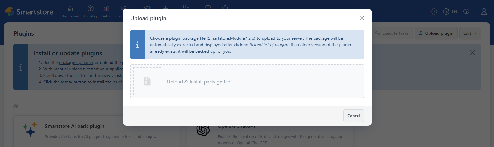
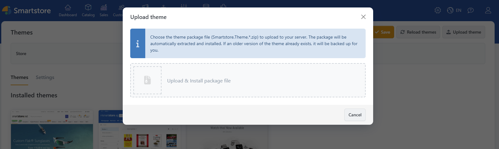
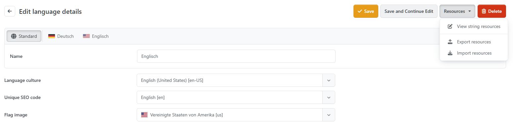

# How to Install an Extension

After you have completed the purchase, you can download the extension in its details view for an unlimited amount of time within the [Smartstore Community Marketplace](http://community.smartstore.com/index.php?/files/). The download will be carried out as a file with the extension **.zip** if it is a theme or a plugin. In case of a language pack, you download a file with the extension **.xml**.  
   
When you've downloaded the extension on your computer, you install it by visiting the admin area within your Smartstore Shop.

## Plugins

Choose the menu item **Plugins->Manage plugins** and click on the button **Upload Plugin**. Choose the zip file you've downloaded in the [Smartstore Community Marketplace](http://community.smartstore.com/index.php?/files/) and click on **Upload & Install**. The plugin has now been installed and can be configured in the plugin management area.

## Themes

Choose the menu item **Configuration>Themes** and click on the button **Upload Theme**. Choose the zip file you've downloaded in the [Smartstore Community Marketplace](http://community.smartstore.com/index.php?/files/) and click on **Upload & Install**. The theme  has now been installed and can be configured in the theme management area.

## Language packs

Choose the menu item **Configuration->Regional Settings->Languages**. If you haven't yet created the language you want to import, create it by clicking on the button **New** and visiting the details view of this language. Here, you need to click on the button **Import Resources**. Choose the xml file you've downloaded in the [Smartstore Translation Portal](https://translate.smartstore.com/) or generated yourself and click on **Import Resources**. The language can now be chosen within your shop by your customers as long as it has already been activated.

