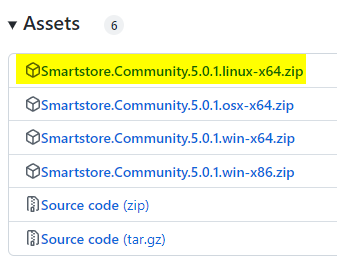

# Create modified Docker image

### Software prerequisites

- Installed Docker or Docker Desktop
- Ability to run shell scripts

Let's say we want to use the [Smartstore Community Edition Docker Image](https://github.com/smartstore/Smartstore/pkgs/container/smartstore-linux), but have a self-developed or third party plugin that we also want to use. How do we get the new plugin into the Docker image?

> [!INFO]
> The example is run under Windows, but it will be similar under Linux.

### Download the Community Edition

We download the release of the Community Edition from [GitHub](https://github.com/smartstore/Smartstore/releases). It is important that the versions of the release and the plugin are the identical.

For the Docker image we need the Linux release of Smartstore.



We **create a subfolder**, name is not relevant, I simply named the folder `build_my_docker_image`. Here we **create another folder** called `smartstore-linux-x64` and **unpack the contents of the file** into this folder.


We **place our own or third party plugin** in the `\Modules` folder in the `\smartstore-linux-x64` folder. **Not as a zip file, but unpacked.**


Now we need the Dockerfile and the script file with the instructions for creating the Docker image.

We **create an empty text file** in the `build_my_docker_image` **folder** with the file name `Dockerfile` (without an extension, just Dockerfile), **copy the following content** into it and **save the file**.

```
# -----------------------------------------------------------
# Creates a Docker image from an existing build artifact
# -----------------------------------------------------------

ARG ASPNET_TAG=7.0

FROM mcr.microsoft.com/dotnet/aspnet:${ASPNET_TAG}
EXPOSE 80
EXPOSE 443
ENV ASPNETCORE_URLS "http://+:80;https://+:443"

# Copy
ARG SOURCE=/smartstore-linux-x64

WORKDIR /app
COPY ${SOURCE} ./

# Install wkhtmltopdf
RUN apt update &&\
	apt -y install wget &&\
	wget https://github.com/wkhtmltopdf/packaging/releases/download/0.12.6-1/wkhtmltox_0.12.6-1.buster_amd64.deb &&\ 
	apt -y install ./wkhtmltox_0.12.6-1.buster_amd64.deb &&\
	rm ./wkhtmltox_0.12.6-1.buster_amd64.deb

ENTRYPOINT ["./Smartstore.Web", "--urls", "http://0.0.0.0:80"]
```

We repeat the whole thing for the file `dockerize.linux.nobuild.sh`. So we create a new text file, copy the following content into it and save the file.

```
docker build -t smartstore-linux-image -f Dockerfile .
echo 'Press enter to exit...'; read dummy;
```

With the `-t` switch, the image is "tagged", i.e. given a name. These can be changed by `smartstore-linux-image` as desired.

The result should look like this:


By running the file `dockerize.linux.nobuild.sh` we can **create the new image**.

