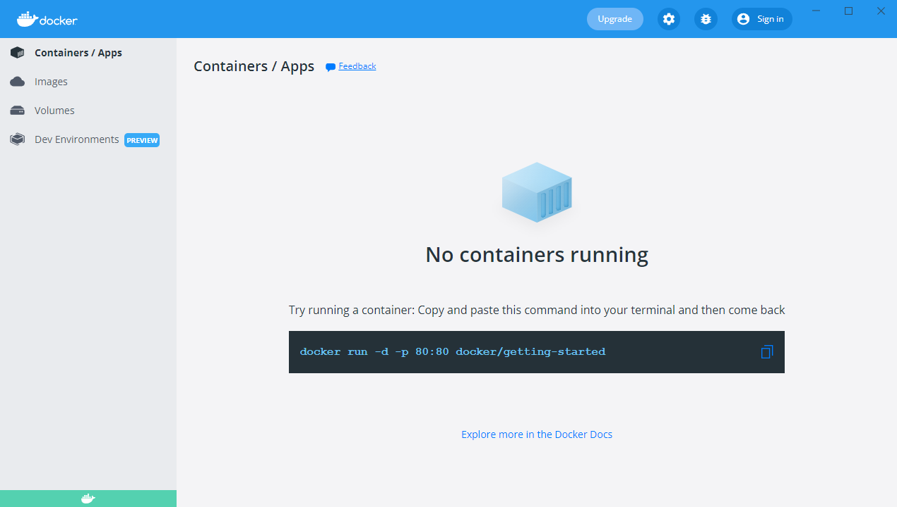
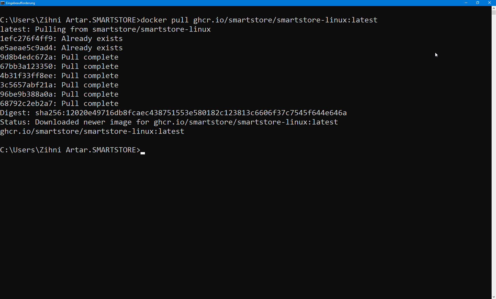
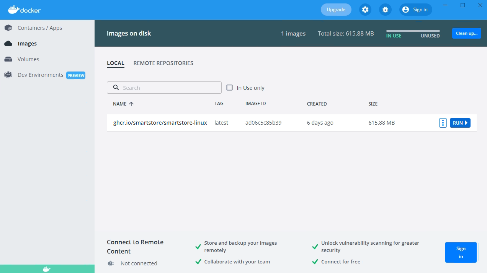
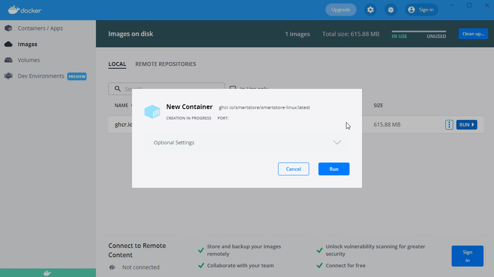

# Run Smartstore Docker Image on Windows

There are a few ways to run Docker Images on Windows. The simplest is with Docker Desktop for Windows.

Download and install **Docker Desktop for Windows** from [https://www.docker.com/products/docker-desktop/](https://www.docker.com/products/docker-desktop/) .

Open a **command line** window by pressing the **Windows key + R** and entering `cmd`.

Enter the following command in the command line and confirm the execution with the `Enter` key:

`docker pull ghcr.io/smartstore/smartstore-linux:latest`

Now the Smartstore Docker image is available in Docker Desktop under Images. To start the image, move the mouse to the line of the entry and click **RUN** on the right.

The dialogue for creating a new container appears:

Then click on the down arrow to go to the **Optional Settings**. Click on the plus sign and map the **local port 80** with the **container port 80**.

Now the container can be **started** with a click on **Run**.

Open any browser and enter **localhost or the local IP address** in the address bar. The installation start page of Smartstore opens.

