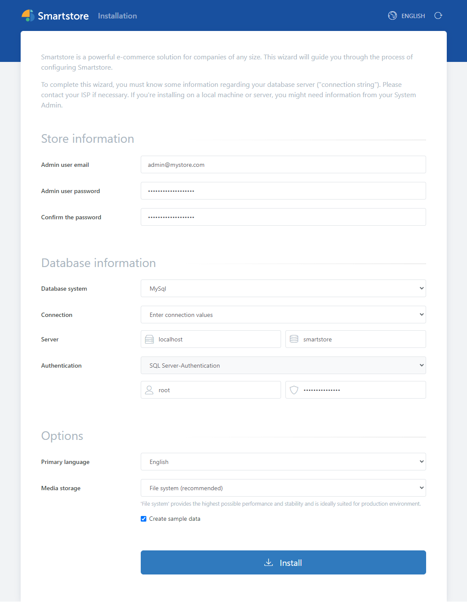

# Running Smartstore and Database together as Docker Containers

If you want to run a database instance directly with Smartstore as a Docker container, please proceed as follows.

- [Running Smartstore and MySQL together as Docker Containers](#anchor_docker_smartstore_mysql)
- [Running Smartstore and MS SQL together as Docker Containers](#anchor_docker_smartstore_mssql)

### Running Smartstore and MySQL together as Docker Containers

Create a new file in a text editor of your choice. Add the following lines to the file and save it as `docker-compose.yml`.

```
version: "3.4"
services:
  web:
    image: ghcr.io/smartstore/smartstore-linux
    container_name: web
    ports:
      - "80:80"
    depends_on:
      - db
    volumes:
      - "D:/mount/smtenants/mysql:/app/App_Data/Tenants"
  db:
    image: mysql
    container_name: mysql
    environment:
      #MYSQL_DATABASE: smartstore
      #MYSQL_USER: "root"
      MYSQL_PASSWORD: "Smartstore2022!"
      MYSQL_ROOT_PASSWORD: "Smartstore2022!"
    ports:
      - '3307:3306'
    expose:
      - '3306'
    volumes:
      - mysql:/var/lib/mysql

volumes:
  mysql:
```

Open a command window and go to the folder where the `docker-compose.yml` file you just created was saved. Execute the file with the following command:

`docker compose up`

A smartstore and a MySQL container are started up. The connection data to the mySQL server can also be found at the top of the code:

Database Name: `smartstore`  
MySQL Root Password: `Smartstore2022!`

The installation will look like this:



### Running Smartstore and MS SQL together as Docker Containers

Create a new file in a text editor of your choice. Add the following lines to the file and save it as `docker-compose.yml`.

```
services:
    web:
        image: ghcr.io/smartstore/smartstore-linux
        container_name: web
        ports:
            - "80:80"
        restart: unless-stopped
        depends_on:
            - db
        volumes:
            - "C:/mount/smtenants/mysql:/app/App_Data/Tenants"
    db:
        image: "mcr.microsoft.com/mssql/server"
        container_name: sqlserver
        environment:
            SA_PASSWORD: "Smartstore2022!"
            ACCEPT_EULA: "Y"
            MSSQL_PID: "Express"
        ports:
          - '1434:1433'
        expose:
          - '1433'
        volumes:
          - mssql_system:/var/opt/mssql/
          - mssql_user:/var/opt/sqlserver/
volumes:
  mssql_system:
  mssql_user:
```

Open a command window and go to the folder where the `docker-compose.yml` file you just created was saved. Execute the file with the following command:

`docker compose up`

A smartstore and a MS SQL Server container are started up. The connection data to the MS SQL Server can also be found at the top of the code:

Database Name: `smartstore`  
MS SQL Password for user sa: `Smartstore2022!`

The installation will look like this:


> [!INFO]
> Please be sure to change the default passwords and users on productive systems!