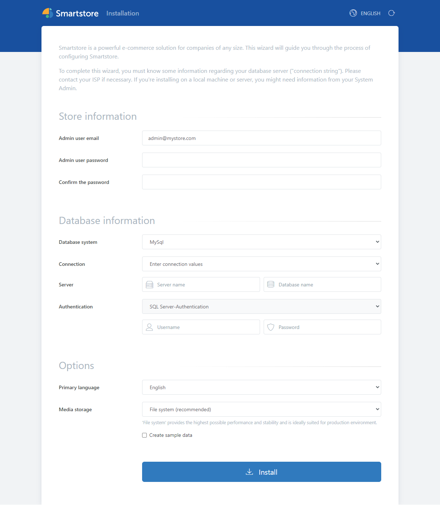

# Starting Smartstore installation

Please call up the Smartstore installation page by entering `<Server-IP>` or `localhost` in your browser.

At the top right of the page you have the option to change the *language to be used for the installation*. You can select the *language of the installed shop* at the bottom of the page. Further languages can be added in the backend after installation.

| **Fieldname** | **Description** | **Example** |
| --- | --- | --- |
| Admin user email | The e-mail address of the admin user |     |
| Admin user password | The password of the admin user |     |
| Confirm the password | Re-enter the password here |     |
| Database system | Select the destination database system here. Currently MS SQL Server and MySQL are supported |     |
| Connection | Select here whether you want to enter the data one-by-one or as a connectionstring | **MS SQL-Server one-by-one:**  Server name: mssqlexpress  Database name: smartstore  SQL Server-Authentification  Username: dbuser\_smartstore  Password: smartstore  **Connectionstring:**  DataConnectionString: Data Source=mssqlexpress;Initial Catalog=smartstore;Integrated Security=False;Persist Security Info=False;User ID=dbuser\_smartstore;Password=smartstore; |
| Server name | Enter the name or the IP address here (depending on how the database server can be reached and is set up). |     |
| Database name | Enter the name of the database here. If no database with this name exists, it will be created. |     |
| Authentification | Select how authentication is to take place at the database server. Depending on the database server and operating system, various selection options are available. |     |
| Username | Enter the user name for authentication at the database server for the database here. |     |
| Password | Enter the password for authentication at the database server for the database here. |     |
| Primary Language | Select the primary language of the shop here. You can add more languages after installation and also change the primary language. |     |
| Media Storage | Select where media files are to be stored. |     |
| Create sample data | Select whether demo data is to be created. Demo data includes some products, categories, manufacturers, etc. |     |

Once you have entered the complete database information, click *Install*. A message will appear asking you to *confirm* that you want to start installing Smartstore. When you click *Confirm*, Smartstore will begin installing your shop. Once the database is created and all plugins are installed, the installation will complete successfully and a success message will be displayed.