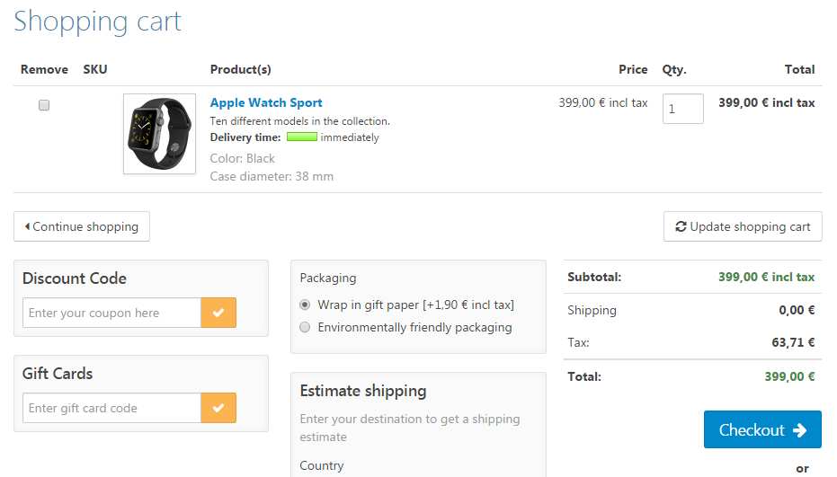
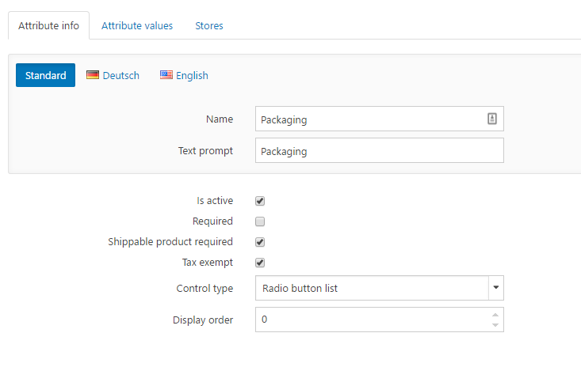

# Managing Checkout Attributes

You can manage checkout attributes by going to **Catalog > Checkout Attributes**.

## Usage Scenario

Imagine you're selling products that are likely to be presents (like jewelry or flowers). Then you might want to create an option for your customers to wrap the products they're currently buying into gift paper. Since the most of your products are suitable presents you should create a global option to accomplish this. **Checkout Attributes** are ideal for this purpose since they will be displayed in the first order summary in the checkout process and your customers can opt for them there.

## Creating a Checkout Attribute

When creating a checkout attribute first you create and configure the desired attribute and the you assign values that your customers can chose from during the checkout process.

### Attribute Info Properties

| Field                          | Description                                                                                                                                                                                                                                                                                                                                                                                                                                                                                                                                                                                                                                                                                                                                                                                                                                                                                                               |
| ------------------------------ | ------------------------------------------------------------------------------------------------------------------------------------------------------------------------------------------------------------------------------------------------------------------------------------------------------------------------------------------------------------------------------------------------------------------------------------------------------------------------------------------------------------------------------------------------------------------------------------------------------------------------------------------------------------------------------------------------------------------------------------------------------------------------------------------------------------------------------------------------------------------------------------------------------------------------- |
| **Name**                       | The name of the checkout attribute.                                                                                                                                                                                                                                                                                                                                                                                                                                                                                                                                                                                                                                                                                                                                                                                                                                                                                       |
| **Text Prompt**                | The prompt to chose one of the available values for this checkout attributes which will be displayed to your customers.                                                                                                                                                                                                                                                                                                                                                                                                                                                                                                                                                                                                                                                                                                                                                                                                   |
| **Is Active**                  | Determines if this checkout attribute is active in your shop.                                                                                                                                                                                                                                                                                                                                                                                                                                                                                                                                                                                                                                                                                                                                                                                                                                                             |
| **Required**                   | When an attribute is required, the customer must choose an appropriate attribute value before they can continue.                                                                                                                                                                                                                                                                                                                                                                                                                                                                                                                                                                                                                                                                                                                                                                                                          |
| **Shippable Product Required** | An option indicating whether shippable products are required in order to display this attribute.                                                                                                                                                                                                                                                                                                                                                                                                                                                                                                                                                                                                                                                                                                                                                                                                                          |
| **Tax Exempt**                 | Determines whether this option is tax exempt (tax will not be applied to this option at checkout).                                                                                                                                                                                                                                                                                                                                                                                                                                                                                                                                                                                                                                                                                                                                                                                                                        |
| **Control Type**               | 
Choose how to display your attribute values.  <strong>Options:</strong> - <strong>Drop-down list:</strong> Renders a drop-down list to let the customer choose one item out of the given attribute values. - <strong>Radio button list:</strong> Renders a radio button list to let the customer choose one item out of the given attribute values. - <strong>Checkboxes:</strong> Renders check boxes for each value to let the customer choose multiple attribute values. - <strong>Textbox:</strong> Renders a textbox. - <strong>Multiline textbox:</strong> Renders a multi-line textbox. - <strong>Date picker:</strong> Renders a date picker to let the customer choose a date. - <strong>File upload:</strong> Renders a file upload control to let the customer upload a file. - <strong>Color squares:</strong> Renders color squares to let the customer choose a color.
 |
| **Display Order**              | The checkout attribute display order. 1 represents the first item in the list.                                                                                                                                                                                                                                                                                                                                                                                                                                                                                                                                                                                                                                                                                                                                                                                                                                            |

### Attribute Value Properties

| Field                 | Description                                                                                    |
| --------------------- | ---------------------------------------------------------------------------------------------- |
| **Name**              | The name of the checkout attribute value.                                                      |
| **Price Adjustment**  | The price adjustment applied when choosing this attribute value e.g. '10' to add 10 dollars.   |
| **Weight Adjustment** | The weight adjustment applied when choosing this attribute value                               |
| **Pre-selected**      | Determines whether this attribute value is pre selected for the customer.                      |
| **Display Order**     | The display order of the attribute value. 1 represents the first item in attribute value list. |
