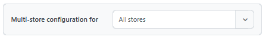
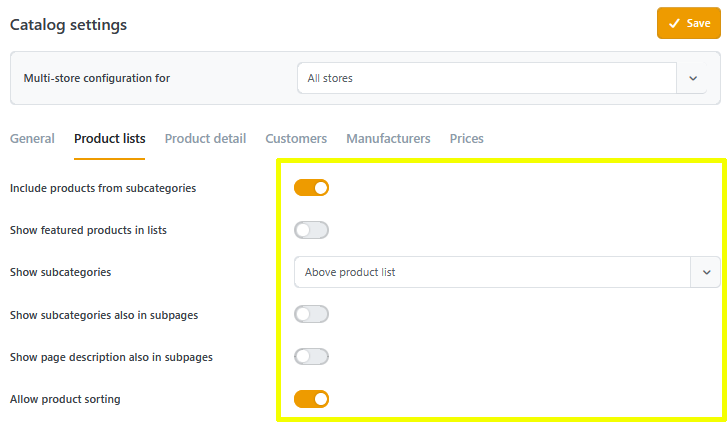
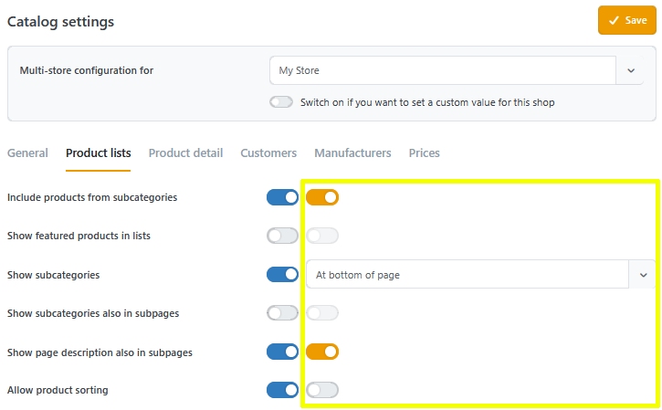
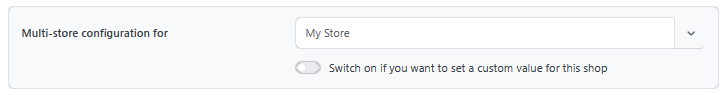
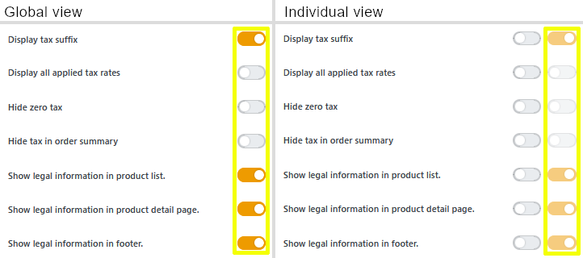

# Multi-Store Configuration

If the shop combines multiple store configurations, it is a **Multi-Store**.

## Store Selection

With Smartstore, users can define individual values per store for almost all settings. This is controlled via the store selector, which is located at the top of every corresponding settings page.

By default, the option "**All Stores**" is selected here. These values are used unless individual settings have been configured.

## Individual Settings

When selecting an individual store, an additional checkbox is added in front of every setting. This can be used to determine whether the setting should be defined separately for the selected store (active/blue) or if the global setting should be used (inactive/gray).


The individual setting cannot be edited if global mode is selected.


In the store selector, there is also the option to switch between "individual" and "global" for all untouched settings via a checkbox (below the dropdown menu). Values that have already been edited are not affected by this and remain at the set value.

### Exclusively for Experts?

Do not be unsettled if you see a settings page with twice as many switches as before in the Multi-Store configuration. The following applies here as well:

| Left Checkbox | Right Checkbox |
|---|---|
| Switch for individual setting | Switch for the value to be set |

