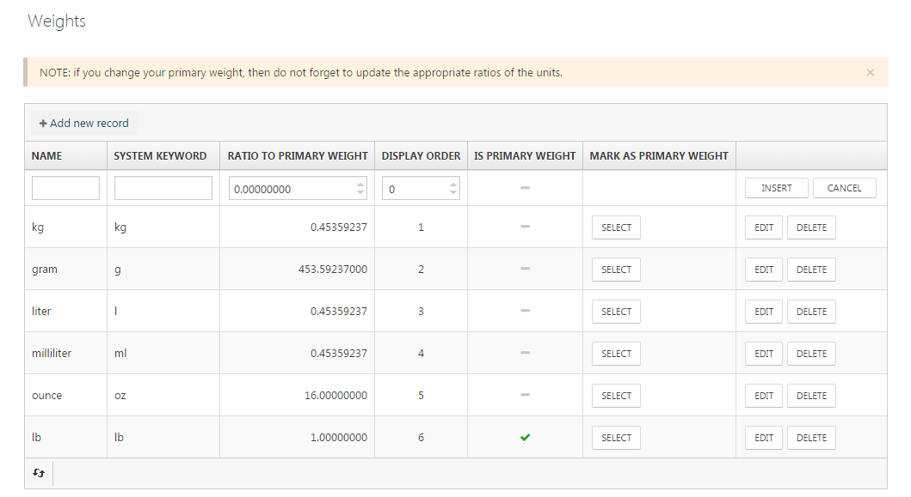
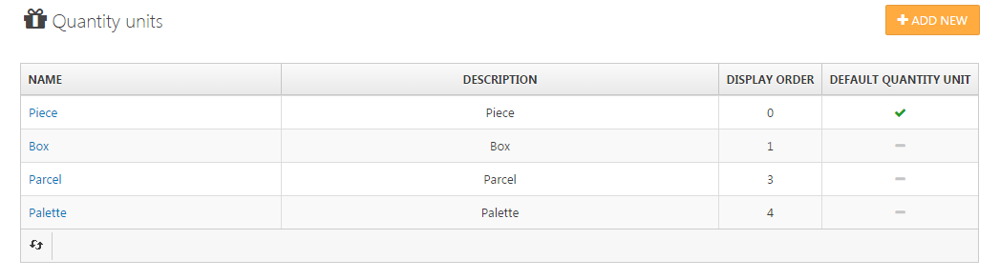
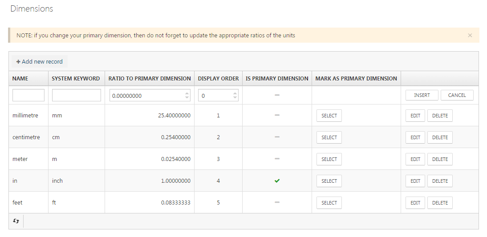

# Managing Weights, Units & Dimensions

## Managing Weights

You can manage weights by going to **Configuration > Lists > Weight**. The weight unit you use when configuring your products and shipping methods will always be the **Primary Weight**. The **Ratio to Primary Weight** will be used when weight values have to be converted into other weight units (e.g. if certain shipping methods need to transmit the weight value in a unit that differs from your **Primary Weight**).


If you change your **Primary Weight**, do not forget to update the appropriate ratios of the other units.


## Managing Quantity Units

You can manage quantity units by going to **Configuration > Lists > Quantity Units**. The quantity units you enter here can be assigned to products in the [Product Info Tab](../catalog/managing-products/creating-and-editing-products.md).&#x20;

## Managing Dimensions

You can manage dimensions by going to **Configuration > Lists > Dimensions**. The dimension unit which you use when configuring your products will always be the **Primary Dimension**. The **Ratio to Primary Dimension** will be used when dimension values have to be converted into other dimension units (e.g. if certain shipping methods need to transmit the dimension value in a unit that differs from your **Primary Dimension**).


If you change your **Primary Dimension**, then do not forget to update the appropriate ratios of the other units.


