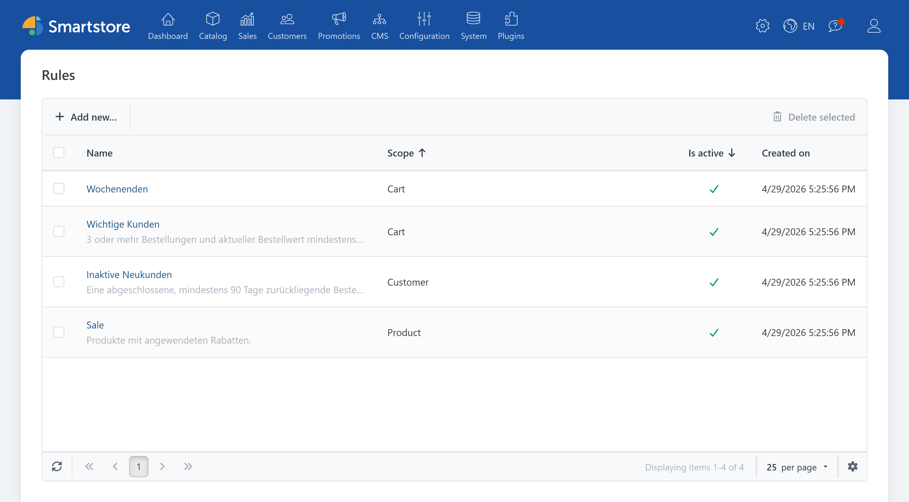
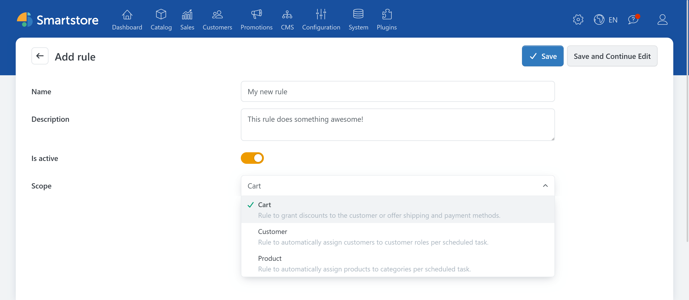
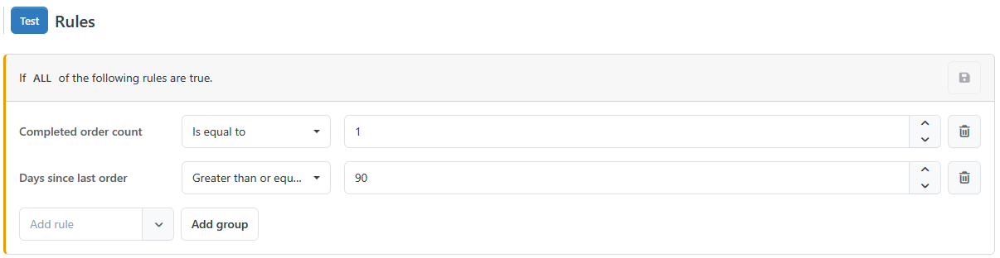

# Rules

> Easy to understand, ready to go

With **Rules**, you can assemble conditions for products, customers, and shopping carts directly in the administration panel. No programming knowledge is required. After creating the rule sets, you can use them for discounts, customer groups, categories, as well as shipping and payment methods.

**Rules** separate the condition from the action to be executed. A rule set, for example, determines when a customer is allowed to receive a discount. The amount and type of the discount are still defined in the discount settings.


**Rules** define under which conditions an action is applied. The desired action must be set up separately and then linked to the rule set.


## The central rule overview

Under **System &rarr; Rules**, you’ll find the central overview of all created rule sets. Here, cart, customer, and product rules are shown together.

The overview includes, among other things, the name, application scope (type), activation status, and the creation date of a rule set. By clicking the name, you can open an existing rule set for editing. Inactive rule sets remain visible in the overview, but they are not considered during evaluation.

New rule sets can also be created directly from this overview. When you create them, select the desired type.

In addition, you can access filtered overviews for each rule type:

- **Marketing &rarr; Cart rules**
- **Promotions &rarr; Customer rules**
- **Catalog &rarr; Product rules**

These views display only the rule sets of the selected type. They’re especially useful for day-to-day administration when you want to focus specifically on cart, customer, or product rules.

## What rule types are there?

Smartstore distinguishes three application scopes:

| Rule type | Typical use |
| --- | --- |
| **Cart rules** | Control discounts as well as available shipping or payment methods |
| **Customer rules** | Automatically assign customers to customer groups based on defined attributes |
| **Product rules** | Automatically assign products to categories based on their attributes |

The selected application scope determines which conditions are available as **Rules**. For instance, a cart rule can check the cart value, products included, or customer attributes. A product rule, on the other hand, works with product attributes such as manufacturer, price, stock, or tags.

## How a rule set is structured

A rule set consists of general information and the actual conditions. The general information includes:

- a meaningful name,
- an optional description,
- the activation status,
- and the application scope.

The description has no effect on evaluation. However, it helps you understand the purpose and usage of a rule set later.

Each condition usually consists of three parts:

1. the attribute to be checked,
2. a comparison operator,
3. and the desired comparison value.

A simple condition might look like this:

> **Cart subtotal** is greater than or equal to **100 euros**.

The three parts are: `Subtotal amount of cart` &plus; `Greater than or equal` &plus; `100`

Which comparison operators are offered depends on the selected attribute. For numeric values, size comparisons can be used. For text or selection lists, appropriate comparisons are available.

## Creating a rule set

1. Open **System &rarr; Rule Builder** or one of the filtered rule overviews.
2. Click **Add new**.
3. Enter a name for the rule set.
4. Add a short description if needed.
5. Activate the rule set.
6. Select the desired application scope (type).
7. Save the new rule set.

The actual conditions can only be added after the first save. After that, the selected application scope is permanently linked to the rule set and can no longer be changed.

## Defining conditions

After the first save, the rule editing area appears. Open **Add rule** and select the condition you want. Then set the comparison and the appropriate value.

For cart and customer rules, multiple conditions can be linked in different ways:

- **All rules must match:** Every condition in the rule set must be satisfied.
- **At least one rule must match:** It’s enough if one of the conditions is satisfied.

For more complex cart or customer rules, you can create additional groups. This lets you model different combinations of required and alternative conditions.

## Example: Discount for a cart value above a certain amount

A discount should only be granted if the cart subtotal is at least 100 euros.

To do this, create a cart rule with this condition:

> **Subtotal amount of cart** is greater than or equal to **100 euros**.

After saving, the rule set is assigned to a previously configured discount. **Rules** check the prerequisite conditions. The discount settings determine the discount amount, the calculation method, and other properties of the discount.

If the discount should also apply only to registered customers, you can add an additional condition. In this case, both conditions must be met.

## Testing rules

Use the **Test rules** feature to check which data matches the conditions. The test does not change any assignments, so it’s well suited for checking before using the rules in production.

Depending on the rule type, Smartstore shows different results:

- For a cart rule, it checks whether the current cart of the signed-in administrator meets the conditions.
- For a customer rule, it shows the number of matching customers.
- For a product rule, it determines the number of matching products.

A successful test result initially only means that matching data was found. For the rule to actually have an effect, the rule set must still be assigned to the intended discount, shipping method, payment method, customer group, or category.

## Applying rule sets

A rule set only takes effect once it’s linked to a suitable object.

Cart rules can be selected in the settings of discounts, shipping methods, and payment methods. During shop usage, the conditions are checked. In this way, Smartstore can decide whether the discount or the respective payment/shipping method may be offered.

Customer rules are assigned to a customer group. The matching customers can then be determined using the corresponding function or a scheduled task and added to the customer group.

Product rules are assigned to a category. Here, too, the assignment can be updated using the provided function or a scheduled task. This allows you to build categories that are maintained dynamically, where products are collected based on defined criteria.

In the rule set editing view, Smartstore also shows which objects the rule set has already been assigned to. This makes it easier to see where a change might have an impact.

## Example rule sets

**Rules** can be used for many different scenarios. Some typical examples are:

### Discount from a minimum order value

The discount should apply starting at a cart subtotal of 100 euros.

- **Application scope:** Cart rule
- **Linking:** All rules must match
- **Condition:** `Subtotal amount of cart` + `Greater than or equal to` + `100`
- **Use:** Assign the rule set to the desired discount.

### Weekend promotion

The discount should apply exclusively on Saturdays and Sundays.

- **Application scope:** Cart rule
- **Linking:** All rules must match
- **Condition:** `Weekday` + `In` + [`Saturday`, `Sunday`]
- **Use:** Assign the rule set to the discount for the weekend promotion.

### Discount for repeat customers

The discount should be offered to customers who have placed at least five orders or who have spent at least 1,000 euros in total.

- **Application scope:** Cart rule
- **Linking:** At least one rule must match
- **Condition 1:** `Number of orders` + `Greater than or equal to` + `5`
- **Condition 2:** `Amount spent` + `Greater than or equal to` + `1000`
- **Use:** Assign the rule set to the repeat-customer discount.

### Premium shipping

The shipping method should be offered starting at a cart subtotal of 250 euros, or when the total cart weight is at least 20 kilograms.

- **Application scope:** Cart rule
- **Linking:** At least one rule must match
- **Condition 1:** `Subtotal amount of cart` + `Greater than or equal to` + `250`
- **Condition 2:** `Weight of all products in the cart` + `Greater than or equal to` + `20`
- **Use:** Assign the rule set to the **Premium shipping** shipping method.

### Customer group for inactive customers

Customers should be considered inactive if they have at least one completed order and their last order was at least 180 days ago.

- **Application scope:** Customer rule
- **Linking:** All rules must match
- **Condition 1:** `Number of orders` + `Greater than or equal to` + `1`
- **Condition 2:** `Days since last order` + `Greater than or equal to` + `180`
- **Use:** Assign the rule set to the customer group **Inactive customers**. The assignment is made when the rules are run again, or via the corresponding scheduled task.

### Automatic promotion category

Products that have an assigned discount should automatically appear in a category for special offers.

- **Application scope:** Product rule
- **Linking:** All rules must match
- **Condition:** `Has discounts applied` + `Is equal to` + `Yes`
- **Use:** Assign the rule set to the category **Special offers**. Product assignment is updated when the rules are run again, or via the corresponding scheduled task.

### Payment by invoice

The payment method should be available to registered customers and members of a selected customer group.

- **Application scope:** Cart rule
- **Linking:** All rules must match
- **Condition:** `In customer role` + `Left contains ALL values from the right` + [`Registered`, `Invoice customers`]
- **Use:** Assign the rule set to the **Invoice** payment method.

### Automatic manufacturer category

All products from a specific manufacturer should automatically appear in their own category.

- **Application scope:** Product rule
- **Linking:** All rules must match
- **Condition:** `Manufacturer` + `In` + `Example manufacturer`
- **Use:** Assign the rule set to the desired manufacturer category. Product assignment is updated when the rules are run again, or via the corresponding scheduled task.