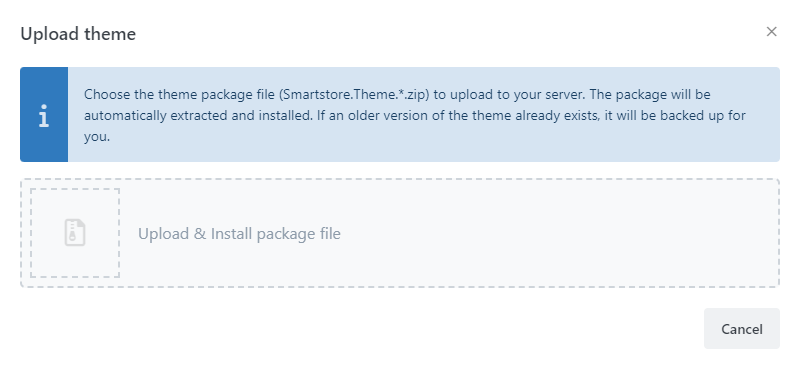
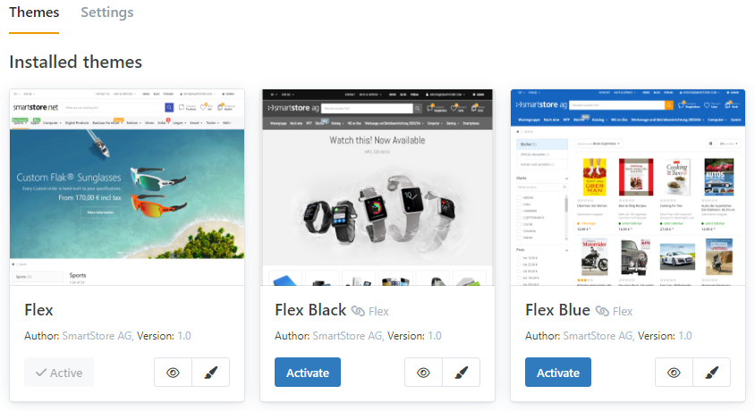
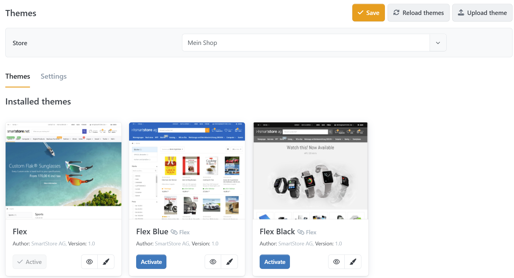
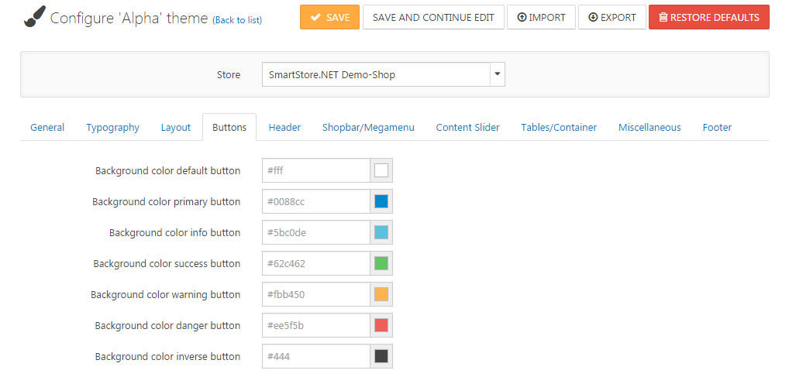
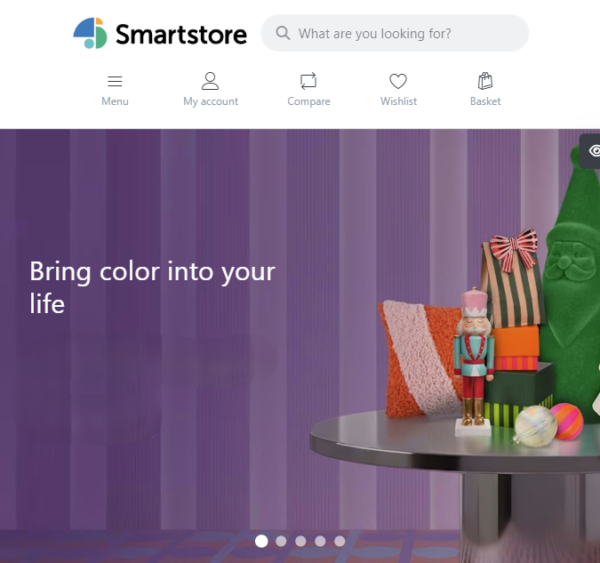
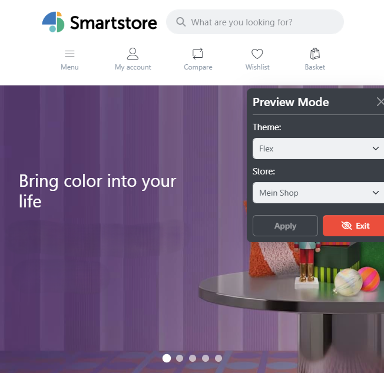

# Working with Themes

Themes in Smartstore define the design of your shop.

## How to Upload and Install a Theme

Smartstore is delivered with themes already installed. You can find more themes in the [Smartstore Marketplace](http://community.smartstore.com/index.php?/files/) from Smartstore itself and from third-party providers. Smartstore theme files have the Zip file format and the extension `.zip`.

Choose the menu item **Configuration > Themes** and click the **Upload Theme** button. Choose the Zip file that contains the theme.

The theme has now been uploaded and can be configured and activated in the theme management area.

## Manual Upload

You can also upload themes manually by uploading them to the `/Themes` directory. After the upload, reload the list of themes by clicking the **Reload Themes** button in the theme configuration area. Your new theme will then be displayed in the corresponding configuration area and is ready to be configured and used.

## How to Activate a Theme

There are two different types of themes. One defines the display of the desktop view, and the other defines the display of the mobile view which will automatically be displayed when a customer uses a mobile device to browse through your shop. One theme should be active for each of both types. To choose the default theme of your store, just click on the button **Activate**.

To configure the theme for your shop, go to **Configuration > Themes**.

## How to Configure a Theme

Themes provide several settings to make fine adjustments, thus allowing you to alter the appearance of your shop. To configure a theme, click on the little paint brush symbol in the theme box. You can configure different settings for each of the stores you have configured in Smartstore by using the store selector above the configuration area. You can define several colors, fonts, margins, layout settings and many more. Settings are provided by the theme itself and are therefore not general for all themes. So, the number of settings depends on the theme you're using. You can **Export & Import** your theme settings (in xml format). This way, you can safely edit your settings and always jump back to a previous state. You can also restore the default theme settings by clicking on **Restore Defaults**.

## Previewing a Theme

To preview a theme, click on the little eye symbol in the theme box. Your store will open in **Preview Mode**, showing the eye symbol on the left side of the browser. When you click on it, a sidebar widget will appear (as shown below), where you can choose one of your themes and one of your stores to be applied for the **Preview Mode**. You exit the preview mode by clicking on **Exit Preview Mode**.

| Collapsed                                        | Enhanced                                    |
| ------------------------------------------------ | ------------------------------------------- |
|  |  |

## Settings

| Option                                  | Description                                                                                                                                                                                                                                                   |
| --------------------------------------- | ------------------------------------------------------------------------------------------------------------------------------------------------------------------------------------------------------------------------------------------------------------- |
| Allow customers to select their own theme | Allows customers to select their own theme. When this option is enabled, your customers can select a theme in the footer from all themes installed in your store.                                                                                              |
| Save user theme in cookie               | If this option is not selected, the user's theme is linked to the customer account. This may be undesirable, for example, when multiple users share a guest account.                                                                                           |
| Enable asset bundling                   | Determines whether JS and CSS files are grouped together to speed up page rendering. Select **Auto** if bundling should depend on the debug setting in `web.config`.                                                                                           |
| Enable asset caching                    | Determines whether compiled JS and CSS files, such as Sass files, are cached in the file system to speed up application startup. Select **Auto** if caching should depend on the debug setting in `web.config`.                                                  |


**Developer Tip**

Disable resource bundling and caching in order to test and debug theme changes more easily.

