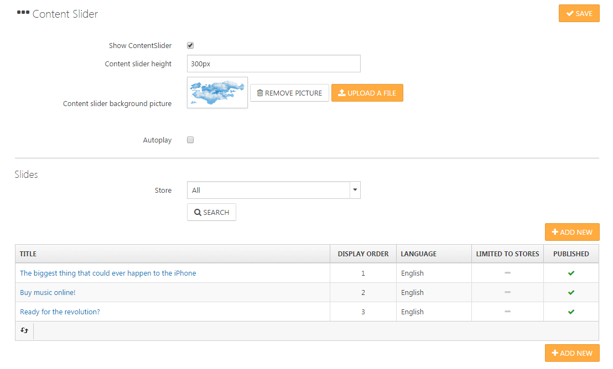
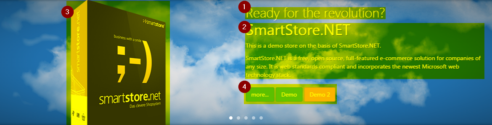

# Arranging the Content Slider

A content slider is a beautiful way to present important information to the visitors of your page. The visitor's eyes dwell on this area for a while during his very first visit to your shop. Therefore, you should place information here that entices the shop visitor (e.g. special offers).

## How to Configure the Content Slider

You can configure the content slider of your shop by navigating to **CMS > Content Slider** in the adminstration area of Smartstore. Here, you can specify the height and the background picture, and determine whether the content should slide automatically without user intervention.

The theme **Alpha** provides additional options to configure the display of the content slider such as font display, background color (which will be shown when you don't specify a background picture), the display of a radial gradient over the content of the slider and the option to determine whether the background picture should move with each slide (parallax effect). To configure these options, navigate to **Configuration > Themes > Alpha > Configure > Content Slider**.&#x20;

## How to Configure a Single Slide&#x20;

When adding or editing a single slide, you can specify a **Title**, a **Text**, and a **Picture** and configure several buttons which will automatically be rendered as the content of the slide (see graphic below). You also have to specify the language for the slide here. There are no localizations for single slides, so you have to add a slide for every language that's active in your shop if you want to display the same content in different languages. You can add up to three buttons to each slide. To add a button to a slide, you just need to activate it by checking the box **Published**. Then, enter the button **Text**, an absolute URL including the protocol (e.g.: [http://www.myshop.com/mypath](http://www.myshop.com/mypath)) and choose the **Button Type.** Available **Button Types** are _Primary, Info, Success, Warning, Danger, Inverse_ or _Link._

\{% hint style="info" % } A button's **URL** can either be fully qualified (including the _http_ or _https_ protocol), or absolute (e.g. ~~_/path/to/ressource_), where the leading tilde (~~) can be ommitted though. \{% endhint % }

\{% hint style="info" % } The colors for all these **Button Types** are configured in your theme configuration. For more information about theme configuration, read the topic [Working with Themes](../plugins-themes/working-with-themes.md). \{% endhint % }

1. Title&#x20;
2. Text
3. Picture
4. Button1, Button2, Button3
