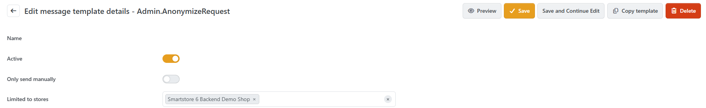
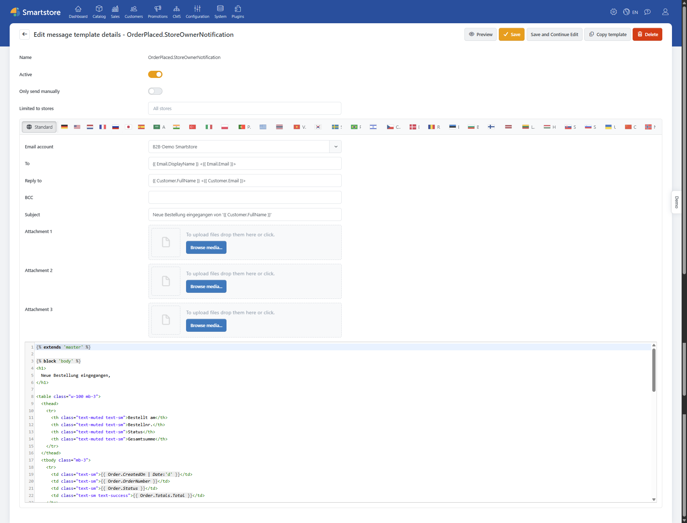
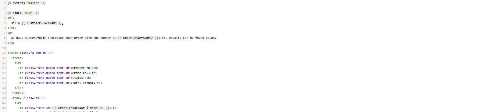
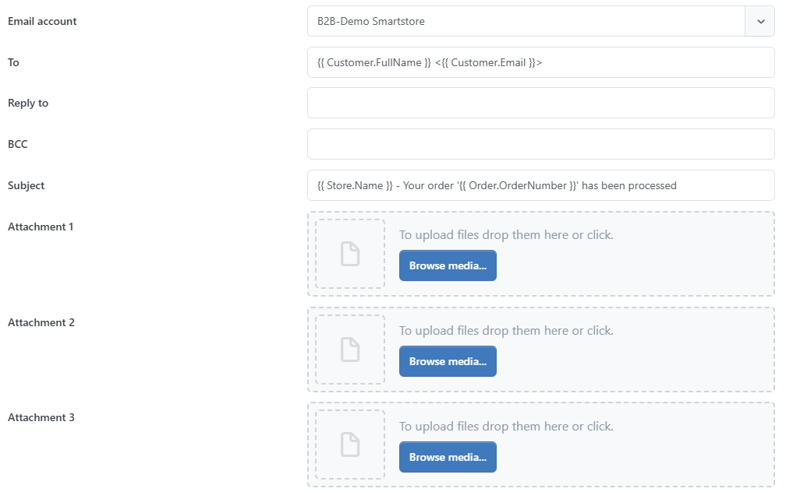
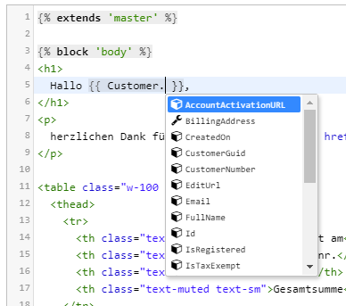

# Customize Message Templates

If you run a store, there are several occasions when you need to inform your customers about a specific event. For example, when an order is placed, the customer needs to receive a confirmation, otherwise, they will wonder if the order was successful. The store operator must also be informed immediately. In the event of a placed order, Smartstore sends automatic emails: one to the customer as an order confirmation and another to the store operator to notify them of the new order. Other events where emails are sent include customer registrations, newsletter subscriptions, product recommendations, etc. The emails are created by message templates that you can adapt to your needs. You can edit these templates by going to **CMS > Message Templates**.

## How to Configure a Message Template

You can configure a message template by simply clicking on the linked message template name.

The general settings are located in the **Info** tab. In the **Stores** tab, you can limit the use of a message template to specific stores. For example, you can first duplicate a message template using the **Copy template** function and then adjust it for individual stores if you use multiple stores. You can also use the **Copy template** function to create different message templates that are only activated at certain times, e.g., at Christmas. You can activate and deactivate the message templates via the **Active** checkbox.

Now you can specify which email account should be used to send the email (if you want to learn more about setting up email accounts in Smartstore, please read [Set up Email Accounts](../configuration/email-accounts.md)) as well as set up the subject line and a blind carbon copy (BCC). Furthermore, you can add up to three attachments to the message template, which will be attached to the email when sent. The content of the template is captured in an HTML editor, where you can edit the template directly. You can also capture language-dependent versions of the template for each language you have created in your shop. For further information on setting up languages, please read [Manage Languages](../configuration/manage-languages.md).

## Edit Template Texts

Template texts are written as 'liquid templates'. Liquid is an open-source template language developed by Shopify. Liquid creates a bridge between HTML and a data store in a very simple way, from which the data used in the template, such as orders and customer data, are obtained. This is done by accessing variables within the template with an easy-to-use and readable syntax.

## Accessing Data

You can access data such as the customer's name or shipping address using available objects and their properties.

Liquid objects are always indicated by double curly braces. In the template editor, all properties and methods of an object are displayed via Intellisense.

## Working with Placeholders

When configuring your message template, you may want to add information about the current process for which the template is used to the message. For example, if you are working on the template that informs your customer that an order has been successfully received, you should definitely write the order number in the email. For this reason, there are placeholders. You can place available placeholders anywhere in your template; these are resolved before the email is sent. The placeholder for the order number looks like this: \{{ Order.OrderNumber\}}.


#### Select placeholder

To insert a placeholder in your template, you can place the cursor anywhere in the HTML editor and insert the desired placeholder as described below.
At the desired position in the editor, type two opening curly braces followed immediately by a space and click on the selection **Order**. Then enter a dot and click on the option **OrderNumber** in the selection. Finally, save the changes.   
